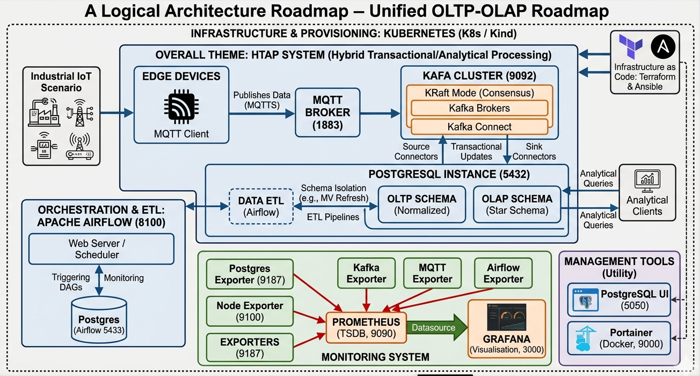

<div align="left">

|*Category*| *Service & Tech Stack*|
|--:|:--|
|*Data Core*|   <br>   |
|*Orchestration* |   |
|*Event Streaming* |    |
|*Lakehouse* |    |
|*Monitoring* |      |
|*Log Management*|    |
|*Cloud & Infra*|      |
|*DevOps & Security* |     |
|*Other*| <a href='https://github.com/Junwu0615/Platform Genesis'>   |

</div>

<br>

## *⭐ Platform Genesis ⭐*

```
* A Cloud-Native Infrastructure Project Focused on Automated Data Platform Engineering. 
* It Leverages IaC ( Terraform / Ansible ) to Orchestrate a Full-Stack Ecosystem.
* From IoT Ingestion ( Kafka / MQTT ) to HTAP Database Optimization .
* Full-Stack Observability ( ELK / Grafana / Prometheus / Superset ).
```

<br>

### *A.　System Structure*
|*Project Name*|*Role & Responsibilities*|*Key Tech Stack*|
|--:|:--|:--|
| PG-Infrastructure | **基礎設施即代碼 ( IaC ) 中心 :** 負責整個平台的生命週期管理，包含...<br>所有容器化服務配置、自動化網路架構、跨環境的部署邏輯 | `GCP` `K8s` `Terraform` `Ansible`<br>`Docker` `Makefile` |
| PG-APP-Core | **核心業務邏輯 ( 工廠情境 )** | `Python` |
| PG-Share-Lib | **跨模組通用底層庫 :** 封裝高度複用的邏輯，確保各組件間的標準化 | `EntryPoint` `KafkaConsumerManager` `KafkaProducerManager`<br>`MqttServer` `Logger` |
| PG-Instance | **邊緣裝置部署程式 :** 部署於邊緣端 ( Real-edge/IoT ) 輕量化執行單元<br>負責數據採集、本地事務處理 ( MQTT / SQLite HA )、即時傳輸 | `MQTT` `SQLite` |
| PG-Airflow-DAGs | **數據分析與調度中心 :** 定義 ETL 流程與數據血緣<br>負責 OLTP 到 OLAP 轉化、Auto Partition、OLAP 業務開發 | `Airflow` `DAGs` |

<br>

### *B.　Current Progress*

<details open>
<summary><b><i>　a.1.　Simple </i></b></summary>
<ul>

|**Item**|**Description**|**Time**|
|--:|:--|:--:|
| Create Project | - | 2026-03-20 |
| Add `PostgreSQL` | - | 2026-03-20 |
| Create OLTP DDL ( 6 ) | 3NF | 2026-03-21 |
| Add `Airflow` | for `OLAP` | 2026-03-21 |
| Add `PoWA` | for `Monitoring` | 2026-03-23 |
| Generic DB Benchmark | Docker Desktop vs. WSL2 | 2026-04-04 |
| Workload Benchmark | Design Benchmark | 2026-04-04 |
| Add `Monitoring` | `Postgres Exporter` + `Prometheus` + `Grafana` | 2026-04-04 |
| Add `Monitoring` | `Node Exporter` | 2026-04-05 |
| Create OLAP DDL ( 5 ) | Star Schema | 2026-04-06 |
| Add `Portainer` | for `Manage Containers` | 2026-04-11 |
| Add Makefile | for `docker-compose` | 2026-04-11 |
| Terraform | Declaration Config : `Docker Provider` | 2026-04-19 |
| Terraform | Config Transfer : `docker-compose` | 2026-04-19 |
| Ansible | node `init` & `config` | 2026-04-19 |
| Add Makefile | for `terraform + ansible` | 2026-04-19 |
| Terraform | Modularization | 2026-04-20 |
| Ansible | Modularization | 2026-04-20 |
| Add `IoT Platform` | `MQTT Broker` + `Apache Kafka` | 2026-04-25 |
| Multi-Instance | like real-edge : `v2` | 2026-04-28 |
| MQTT logic | for `cp` | 2026-04-28 |
| Kafka Connect | `source` : producer  | 2026-04-30 |
| Kafka logic | for `inst` | 2026-05-03 |
| Kafka Connect | `sink` : consumers | 2026-05-04 |
| Add `ELK` | - | 2026-05-05 |
| Redefine Project Name | `OLTP-OLAP-Unified-DB`<br>to `Platform Genesis` | 2026-05-08 |
| Project Breakdown | `5` Major Categories | 2026-05-08 |
| API Service logic | - | X |
| make `v2` Dockerfile | - | - |
| Create MV | Materialized View | - |
| Analytical Queries | - | - |
| Add `Gitlab` | for `CI` & `Manage Projects` | - |
| Add `Jenkins` | for `CD` | - |
| Add `Docker-Registry` | for `CI / CD` & `Manage Images` | - |
| Add `Debezium` | Change Data Capture | - |
| Add `Apache Iceberg` | Data Lake | - |
| Add `Apache Flink` | consumer of CDC | - |
| Build `Lakehouse` | - | - |
| Add `HashiCorp Vault` | Enterprise Key Management System | - |
| Add `Superset` | for `OLAP` | - |
| K8s | Beginner : `Minikube` | - |
| K8s | Advanced : `K3s` + `VMware` | - |
| K8s | Bottom Layer : `Kubeadm` + `VMware` | - |
| K8s | Public Cloud : `GKE` | - |
| Summary | - | - |

</ul>
</details>

<details>
<summary><b><i>　a.2.　Details </i></b></summary>
<ul>

|**Item**|**Description**|**Time**|
|--:|:--|:--:|
| Create Project | - | 2026-03-20 |
| Add `PostgreSQL` | - | 2026-03-20 |
| Define Process | - | 2026-03-20 |
| Define Event Story | - | 2026-03-21 |
| Define Project Directory | - | 2026-03-21 |
| Define Table DDL | - | 2026-03-21 |
| Create OLTP DDL ( 6 ) | 3NF | 2026-03-21 |
| Add `Airflow` | for `OLAP` | 2026-03-21 |
| DB Settings | Permission Settings | 2026-03-23 |
| Add `PoWA` | for `Monitoring` | 2026-03-23 |
| PoWA Web Login Failed | ⚠️no reason found yet | 2026-03-23 |
| New Role | Migration User | 2026-03-24 |
| Script | delete_data.py | 2026-03-24 |
| Script | drop_table.py | 2026-03-24 |
| Script | factory_config.yaml | 2026-03-24 |
| Script | init_factory_data.py | 2026-03-24 |
| Script | simulate_factory_stream.py | 2026-03-24 |
| Single to Batch Insert | batch sending | 2026-03-26 |
| Generate Rigorous<br>Static Data | - | 2026-03-26 |
| Rigorous Calibration<br>of Dynamic Data | 單一機台同時間只允許做一件事 /<br>排隊消化訂單 / 訂單生產週期戳記 | 2026-03-27 |
| Adjusting Contextual | ~~insert machine event :<br>machine_events~~ | 2026-03-28 |
| execute -> execute_batch | batch sending + batch submission :<br>不適用於目前模擬方式 | X |
| Adjusting Contextual | insert machine status :<br>machine_status_logs | 2026-03-30 |
| Increase Data Volume | - | 2026-03-30 |
| PoWA( Running Normally ) | - | 2026-03-30 |
| Try Again PoWA Web | ⚠️very difficult to deal with | 2026-03-30 |
| Generic DB Benchmark | Design Benchmark-1 | 2026-03-31 |
| Generic DB Benchmark | 64MB | 2026-03-31 |
| Fine-tuning<br>PostgreSQL Settings | `shm-size` | 2026-04-01 |
| Docker Engine | for `WSL2` | 2026-04-03 |
| Generic DB Benchmark | Design Benchmark-2 | 2026-04-03 |
| Generic DB Benchmark | Docker Desktop ( 64MB )<br>vs. WSL2 ( 16GB ) | 2026-04-04 |
| Workload Benchmark | Design Benchmark | 2026-04-04 |
| Add `Monitoring` | `Postgres Exporter` + `Prometheus` + `Grafana` | 2026-04-04 |
| Add `Monitoring` | `Node Exporter` | 2026-04-05 |
| Grafana Dashboard | Organize Observation Indicators | 2026-04-05 |
| WSL2 Settings | `.wslconfig` | 2026-04-06 |
| Create OLAP DDL ( 5 ) | Star Schema | 2026-04-06 |
| Partition Settings | `default_partition` | 2026-04-06 |
| Auto Partition | `dags/sql/auto_partition/*` | 2026-04-06 |
| OLTP to OLAP | `dags/sql/*` | 2026-04-06 |
| DAG | Build Coding Style | 2026-04-06 |
| DAG ETL Script | Fan-out Queue Pattern | 2026-04-06 |
| DAG | Try `Param` | 2026-04-07 |
| DAG | Try `Dataset` | 2026-04-08 |
| Add `Portainer` | for `Manage Containers` | 2026-04-11 |
| Docker Compose | Compose Modularization | 2026-04-11 |
| Add Makefile | for `docker-compose` | 2026-04-11 |
| Add Airflow Config UI | `Trigger w/ Config` | 2026-04-18 |
| DAG | update Coding Style | 2026-04-18 |
| Terraform | Declaration Config : `Docker Provider` | 2026-04-19 |
| Terraform | Config Transfer : `docker-compose` | 2026-04-19 |
| Ansible | node `init` & `config` | 2026-04-19 |
| Add Makefile | for `terraform + ansible` | 2026-04-19 |
| Terraform vs. Compose | Experience :<br>`狀態管理差異性 ; 復原配置崩潰 ; 提高 HA` | 2026-04-19 |
| Terraform & Ansible | Experience :<br>`Ansible 如何補足 Terraform 的不足` | 2026-04-19 |
| Terraform | Modularization | 2026-04-20 |
| Ansible | Modularization | 2026-04-20 |
| Add `IoT Platform` | `MQTT Broker` + `Apache Kafka` | 2026-04-25 |
| Simple Simulation | organizing old versions : `v1` | 2026-04-28 |
| Multi-Instance | like real-edge : `v2` | 2026-04-28 |
| MQTT logic | for `cp` | 2026-04-28 |
| Kafka Connect | `source` : producer  | 2026-04-30 |
| Kafka logic | for `inst` | 2026-05-03 |
| Kafka Connect | `sink` : consumers | 2026-05-04 |
| Add `ELK` | - | 2026-05-05 |
| ELK | Experience : `ELK` | 2026-05-05 |
| Define the Version Number<br>of each service  | settings to `.env` | 2026-05-05 |
| logging logic | mixed ( `ELK` + `logging` ) | 2026-05-06 |
| Encapsulation Entry | app.py | 2026-05-06 |
| logging logic | Logs Correct Paths<br>Based on Module Calls | 2026-05-07 |
| update `v2` logic | Apply the<br>New Underlying Module | 2026-05-07 |
| Redefine Project Name | `OLTP-OLAP-Unified-DB`<br>to `Platform Genesis` | 2026-05-08 |
| Project Breakdown | `5` Major Categories | 2026-05-08 |
| Quantitative Results 1 | OLTP Query Efficiency<br>Optimization ( Index / Partition ) | - |
| DAG | init.py + create_topic.py | - |
| Add `SQLite`<br>to Edge scripts  | Improve the HA<br>of Consumer Transactions | - |
| Security Message<br>Transmission | Encryption ( `kafka` + `mqtt` ) | - |
| API Service logic | - | X |
| make `v2` Dockerfile | - | - |
| Grafana Dashboard | `htap_grafana.json` | - |
| Create MV | Materialized View | - |
| Analytical Queries | - | - |
| Add `Gitlab` | for `CI` & `Manage Projects` | - |
| Add `Jenkins` | for `CD` | - |
| Add `Docker-Registry` | for `CI / CD` & `Manage Images` | - |
| Quantitative Results 2 | Automated Deployment of the Edge :<br>`Manual` vs. `CD -> Ansible` | - |
| Add `Debezium` | Change Data Capture | - |
| Add `Apache Iceberg` | Data Lake | - |
| Add `Apache Flink` | consumer of CDC | - |
| Build `Lakehouse` | - | - |
| Quantitative Results 3 | OLTP vs OLAP 核心業務解套演進 :<br>`Direct Read` vs. `MV` vs. `CDC` | - |
| Add `HashiCorp Vault` | Enterprise Key Management System | - |
| Add `Superset` | for `OLAP` | - |
| K8s | Beginner : `Minikube` | - |
| K8s | Advanced : `K3s` + `VMware` | - |
| K8s | Bottom Layer : `Kubeadm` + `VMware` | - |
| K8s | Experience :<br>`Pod` / `Service` / `Ingress` | - |
| K8s | Experience :<br>`Lens` / `k9s` / `Kubernetes Dashboard` | - |
| Quantitative Results 4 | `Compose` vs. `K8s` 高可用性比較測試 | - |
| K8s | Public Cloud : `GKE` | - |
| Summary | - | - |

</ul>
</details>


<br>


### *C.　Service Architecture*
- #### *c.1.　Data Core & Orchestration*
  |**Service**|**Description**|**Port**|
  |--:|:--|:--:|
  | **PostgreSQL** | Primary Business DB `OLTP` | [5432](http://127.0.0.1:5432) |
  | **PostgreSQL** | Metadata DB for Airflow | [5433](http://127.0.0.1:5433) |
  | **PgAdmin** | PostgreSQL Web Management UI | [5050](http://127.0.0.1:5050) |
  | **Apache Airflow** | Workflow Orchestration `OLAP` | [8100](http://127.0.0.1:8100) |
  | **Superset** | BI Visualization Dashboard `OLAP` | `TBD` |


- #### *c.2.　Event Streaming & IoT Platform*
  |**Service**|**Description**|**Port**|
  |--:|:--|:--:|
  | **MQTT Broker** | High-concurrency `IoT` Message Ingestion | [1883](http://127.0.0.1:1883) |
  | **Apache Kafka** | Distributed Streaming Platform `Backbone` | [9092](http://127.0.0.1:9092) |
  | **Kafka UI** | Topic & Cluster & Consumer Management | [9093](http://127.0.0.1:9093) |
  | **Schema Registry** | Centralized Schema Governance `Avro/JSON` | [8081](http://127.0.0.1:8081) |


- #### *c.3.　Lakehouse Architecture*
  |**Service**|**Description**|**Port**|
  |--:|:--|:--:|
  | **Debezium** | `CDC` ( Change Data Capture ) from Postgres | `TBD` |
  | **Apache Iceberg** | High-performance Table Format `Data Lake` | `TBD` |
  | **Apache Flink** | Stateful Computations over Data Streams | `TBD` |


- #### *c.4.　Monitoring & Logging*
  |**Service**|**Description**|**Port**|
  |--:|:--|:--:|
  | **Grafana** | Dashboard | [3000](http://127.0.0.1:3000) |
  | **Prometheus** | Metrics Time-Series DB | [9090](http://127.0.0.1:9090) |
  | **Node Exporter** | Host Resource Metrics | [9100](http://127.0.0.1:9100) |
  | **Postgres Exporter** | Database Performance Metrics | [9187](http://127.0.0.1:9187) |
  | **Elasticsearch** | Distributed Search Engine `ELK` | [9200](http://127.0.0.1:9200) |
  | **Logstash** | Log Processing Pipeline `ELK` | [9600](http://127.0.0.1:9600) |
  | **Kibana** | Log Exploration UI `ELK` | [5601](http://127.0.0.1:5601) |


- #### *c.5.　DevOps & Security*
  |**Service**|**Description**|**Port**|
  |--:|:--|:--:|
  | **Gitlab** | `Self-hosted SCM` `CI/CD` `Project Management` | `TBD` |
  | **Jenkins** | `Continuous Delivery` | `TBD` |
  | **Docker-Registry** | `Private Image Repository` | `TBD` |
  | **Portainer** | `Container Management` UI | [9000](http://127.0.0.1:9000) |
  | **HashiCorp Vault** | Advanced Secret & Key Management `KMS` | `TBD` |


<br>


### *C.　Command Platform ( Makefile Execute )*

<details>
<summary><b><i>　c.1.　Docker Compose</i></b></summary>
<ul>

```bash
cd docker-compose

# initialization
make init
make build

# depends on 'Compose' service
make up

# service shutdown
make down
```
</ul>
</details>

<br>

<details>
<summary><b><i>　c.2.　Terraform + Ansible + Compose </i></b></summary>
<ul>

```bash
cd docker-compose

# initialization
make init
make build
make setup

# depends on 'Compose' service
make postgresql
make airflow
make mqtt
make kafka
make elk

# depends on 'Terraform' + 'Ansible' services ( Monitoring + Portainer )
make all

# service shutdown
make down
make destroy
```
</ul>
</details>

<br>

<details>
<summary><b><i>　c.3.　K8s + Helm + Terraform + Ansible </i></b></summary>
<ul>

```bash
...
```
</ul>
</details>

<br>

<details open>
<summary><b><i>　c.4.　Other </i></b></summary>
<ul>

```bash
# Common
make ps
make prune
make get-chown-all
make list-configs
make refresh

# Airflow
make copy-dag

# Terraform + Ansible
make graph
make infra
make config
make reload

# Kafka Connect
make kafka-connect-create
make kafka-connect-upsert
make kafka-connect-status

# Kafka Cleanup
make kafka-connect-clean
make kafka-topic-clean
make kafka-schema-clean
make kafka-all-clean
```
</ul>
</details>

<br>


### *D.　Roadmap*
- 

<details>
<summary><b><i>　Project Tree </i></b></summary>
<ul>

  ```bash
  tree -I 'venv|.git|__pycache__|docs|logs|assets|kafka_data'
  tree -d -I 'venv|.git|__pycache__|docs|logs|assets|kafka_data'

  .
  ├── LICENSE
  ├── README.md
  ├── config
  ├── dags
  │   ├── OP_SQL.py
  │   ├── WF_AUTO_PARTITION.py
  │   ├── WF_A_DATASET.py
  │   ├── WF_B_DATASET.py
  │   ├── WF_CREATE_TABLE.py
  │   ├── WF_C_DATASET.py
  │   ├── __init__.py
  │   ├── config
  │   │   ├── __init__.py
  │   │   ├── constants.py
  │   │   └── dag_config.py
  │   ├── sql
  │   │   ├── __init__.py
  │   │   ├── auto_partition
  │   │   │   ├── fact_production.sql
  │   │   │   ├── machine_status_logs.sql
  │   │   │   └── production_records.sql
  │   │   ├── dim_date.sql
  │   │   ├── dim_machine.sql
  │   │   ├── dim_product.sql
  │   │   ├── fact_machine_status.sql
  │   │   ├── fact_production.sql
  │   │   └── models
  │   │       ├── olap
  │   │       │   ├── dim_date.sql
  │   │       │   ├── dim_machine.sql
  │   │       │   ├── dim_product.sql
  │   │       │   ├── fact_machine_status.sql
  │   │       │   └── fact_production.sql
  │   │       └── oltp
  │   │           ├── machine.sql
  │   │           ├── machine_events.sql
  │   │           ├── machine_status_logs.sql
  │   │           ├── product.sql
  │   │           ├── production_orders.sql
  │   │           └── production_records.sql
  │   └── utils
  │       ├── __init__.py
  │       └── dag_tool.py
  ├── docker-compose
  │   ├── Makefile
  │   ├── ansible
  │   │   ├── inventory.ini
  │   │   ├── playbook.yml
  │   │   └── roles
  │   │       └── monitoring
  │   │           ├── handlers
  │   │           │   └── main.yml
  │   │           ├── tasks
  │   │           │   └── main.yml
  │   │           ├── templates
  │   │           │   └── prometheus.yml.j2
  │   │           └── vars
  │   │               └── main.yml
  │   ├── docker
  │   │   ├── airflow
  │   │   │   ├── airflow-webserver.pid
  │   │   │   ├── airflow.cfg
  │   │   │   ├── config
  │   │   │   ├── dags ( copy `dags` )
  │   │   │   ├── deploy_dags.sh
  │   │   │   ├── docker-compose.yaml
  │   │   │   ├── plugins
  │   │   │   └── webserver_config.py
  │   │   ├── elk
  │   │   │   ├── docker-compose.yaml
  │   │   │   ├── elasticsearch.yaml
  │   │   │   └── logstash
  │   │   │       ├── logstash.yaml
  │   │   │       └── pipeline
  │   │   │           └── logstash.conf
  │   │   ├── iot-platform
  │   │   │   ├── config
  │   │   │   │   ├── connectors
  │   │   │   │   │   ├── sink
  │   │   │   │   │   │   ├── sink-inst-prod-orders.json
  │   │   │   │   │   │   ├── sink-inst-prod-records.json
  │   │   │   │   │   │   └── sink-inst-status-logs.json
  │   │   │   │   │   └── source
  │   │   │   │   │       └── source-cp-mach-order.json
  │   │   │   │   ├── mosquitto.conf
  │   │   │   │   └── passwd
  │   │   │   ├── dockerfile
  │   │   │   │   └── Dockerfile.kafka
  │   │   │   ├── kafka-compose.yaml
  │   │   │   └── mqtt-compose.yaml
  │   │   ├── monitoring
  │   │   │   ├── docker-compose.yaml
  │   │   │   ├── htap_grafana.json
  │   │   │   └── prometheus.yaml
  │   │   ├── portainer
  │   │   │   └── docker-compose.yaml
  │   │   ├── postgresql
  │   │   │   ├── Dockerfile
  │   │   │   ├── docker-compose.yaml
  │   │   │   └── init
  │   │   │       └── init.sql
  │   │   └── powa
  │   │       ├── Dockerfile
  │   │       ├── docker-compose.yaml
  │   │       └── init
  │   │           └── powa.sql
  │   ├── docker-compose.yaml
  │   ├── terraform
  │   │   ├── main.tf
  │   │   ├── modules
  │   │   │   ├── docker_container
  │   │   │   │   ├── main.tf
  │   │   │   │   ├── outputs.tf
  │   │   │   │   └── variables.tf
  │   │   │   ├── monitoring
  │   │   │   │   ├── main.tf
  │   │   │   │   ├── outputs.tf
  │   │   │   │   └── variables.tf
  │   │   │   └── portainer
  │   │   │       ├── main.tf
  │   │   │       ├── outputs.tf
  │   │   │       └── variables.tf
  │   │   ├── outputs.tf
  │   │   ├── terraform.tfstate
  │   │   ├── terraform.tfstate.backup
  │   │   ├── terraform.tfvars
  │   │   └── variables.tf
  │   └── wsl2
  ├── kubernetes
  │   ├── gke
  │   ├── k3s
  │   ├── kubeadm
  │   └── minikube
  ├── requirements.txt
  ├── shared
  │   ├── __init__.py
  │   ├── configs
  │   │   ├── __init__.py
  │   │   ├── constant.py
  │   │   └── settings.py
  │   ├── modules
  │   │   ├── __init__.py
  │   │   ├── entry.py
  │   │   ├── kafka_consumer.py
  │   │   ├── kafka_producer.py
  │   │   ├── log.py
  │   │   └── mqtt.py
  │   └── utils
  │       ├── __init__.py
  │       ├── env_config.py
  │       ├── postgres_tools.py
  │       └── tools.py
  └── src
      ├── __init__.py
      ├── core
      │   ├── __init__.py
      │   ├── models
      │   │   ├── __init__.py
      │   │   ├── simulator.py
      │   │   └── sink_format.py
      │   ├── v1
      │   │   ├── __init__.py
      │   │   ├── factory_config.yaml
      │   │   ├── init_factory_data.py
      │   │   └── simulate_factory_stream.py
      │   └── v2
      │       ├── __init__.py
      │       ├── api
      │       │   └── __init__.py
      │       ├── cp
      │       │   ├── __init__.py
      │       │   └── main.py
      │       ├── factory_config.yaml
      │       ├── inst
      │       │   ├── __init__.py
      │       │   └── main.py
      │       └── scripts
      │           ├── __init__.py
      │           ├── create_topic.py
      │           ├── init.py
      │           └── topics_config.json
      └── scripts
          ├── __init__.py
          ├── generic_benchmark
          │   ├── dashboard_benchmark.sql
          │   └── olap_benchmark.sql
          └── sql
              ├── auto_partition.py
              ├── delete_data.py
              └── drop_table.py
  ```
</ul>
</details>

<br>


### *D.　Summary*
- #### *d.1.　[OLTP-OLAP-Unified-DB](./docs/oltp-olap-unified-db.md)*
- #### *d.2.　Automated Deployment of the Edge*
- #### *d.3.　OLTP vs OLAP 核心業務解套演進*
- #### *d.4.　Compose vs. K8s 高可用性比較測試*


<br>


### *E.　Notice*
- #### *e.1.　[Service Startup Order](./docs/service_startup_order.md)*
- #### *e.2.　[WSL2 Startup Docker Engine](./docs/wsl2_startup_docker_engine.md)*
- #### *e.3.　[Terraform & Ansible](./docs/terraform_ansible.md)*
- #### *e.4.　[Kubernetes](./docs/k8s.md)*
- #### *e.5.　[About SQL Something Detail](./docs/sql.md)*


<br><br><br>