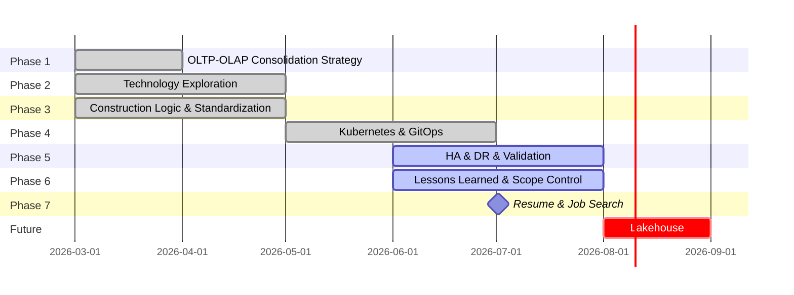

## *⭐ Platform Genesis ⭐*

 

> ##### *Platform Engineering Learning Sprint ( Mar 2026 – Present )*

> ##### *•　Self-built platform engineering environment focused on infrastructure automation, Kubernetes operations, GitOps delivery, observability, and reliability engineering.*
>
> ##### *•　The project evolved from an OLTP/OLAP data platform initiative into a platform engineering practice emphasizing automation, governance, recovery, and operational standardization.*

  

## *🚀　Key Achievements*

- ### *Infrastructure Automation*
  * #### *Built Repeatable Infrastructure Provisioning Using Terraform and Ansible*
  * #### *Automated Kubernetes Cluster bootstrap and Node Lifecycle Management*
  * #### *Implemented Multi-master K3s Architecture with HA Control Plane*

- ### *GitOps Delivery*
  * #### *Implemented GitLab CI + ArgoCD Deployment Workflow*
  * #### *Adopted Layered GitOps and App-of-Apps Architecture*
  * #### *Established Deployment Governance and Drift Control Validation*

- ### *Observability*
  * #### *Metrics collection Using Prometheus*
  * #### *Centralized Logging Using Loki and ELK*
  * #### *Distributed Tracing Using Tempo*
  * #### *Unified Visualization Using Grafana*

- ### *Reliability Engineering*
  * #### *Validated Workload Recovery Behavior*  
  * #### *Validated Node failure Recovery*
  * #### *Validated Control Plane Resiliency*
  * #### *Validated GitOps Recovery Workflows*
  * #### *Established Quantitative Validation Methodology*

  

## *📊　Selected Engineering Evidence*

| Area | Documentation |
|:--|:--|
| Deployment Delivery Baseline | [PED-7](./docs/Deployment-Delivery-Baseline.md) |
| Kubernetes Resiliency & Availability Validation | [PED-8](./docs/K8s-Resiliency-Availability-Validation.md) |
| Observability Platform Validation | [PED-9](./docs/Observability-Platform-Validation.md) |
| End-to-End DevOps Operating Model | [PED-11](./docs/End-to-End-DevOps-Operating-Model.md) |
| GitOps Deployment Governance Validation | [PED-12](./docs/GitOps-Deployment-Governance-Validation.md) |
| Platform Evolution & Architecture Journey | [Full Project History](./docs/Platform-Evolution.md) |

  

## *🏗　Core Platform Capabilities*

| Domain | Technologies |
|:--|:--|
| Infrastructure | `Terraform` `Ansible` `Libvirt` `Automated Provisioning` |
| Kubernetes | `HA Control Plane` `Scheduling` `Recovery Validation` |
| GitOps | `GitLab CI` `Argo CD` `App-of-Apps` `Drift Control` |
| Observability | `Metrics` `Logs` `Traces` `Alerting` |
| Security | `Vault-based Secret Management` |
| Data Platform | `PostgreSQL` `Airflow` `Kafka` |
| Reliability | `Recovery Testing` `Governance Validation` |

  

## *📁　Repository Structure*

| Repository | Purpose |
|:--|:--|
| [*PG-Infrastructure*](https://github.com/Junwu0615/PG-Infrastructure) |  *Infrastructure as Code & Platform Automation* |
| [*PG-APP-Core*](https://github.com/Junwu0615/PG-APP-Core) |  *Application Services & Workload Simulation*  |
| [*PG-Shared-Lib*](https://github.com/Junwu0615/PG-Shared-Lib) |  *Shared Components & Framework Utilities* |
| [*PG-Edge-Container*](https://github.com/Junwu0615/PG-Edge-Container) |  *Edge Runtime Deployment* |
| [*PG-Airflow-DAGs*](https://github.com/Junwu0615/PG-Airflow-DAGs) |  *Data Orchestration Workflows* |

  

## *⚖️　Engineering Philosophy*
> *•　Building individual technologies is relatively straightforward.*
>
> *•　Building an operationally sustainable platform is significantly harder.*
>
> *•　Platform Genesis focuses on integrating infrastructure automation, Kubernetes operations, GitOps workflows, observability, governance, and reliability validation into a cohesive engineering system.*

  

## *📚　Further Reading*

> *⛏　Platform Genesis v1.0　[ Platform Foundation Release • Status: In Progress ]*
>
> *🚀　Platform Genesis v2.0　[ Data Platform & Lakehouse Expansion • Status: Future Work ]*
> 
> *🛎️️　[Platform Evolution & Full Project History](./docs/Platform-Evolution.md)*

[//]: # (> *⛏　Platform Genesis v1.0　[ Platform Foundation Release　•　Status: Feature Completed Jul 2026 ]*)

   