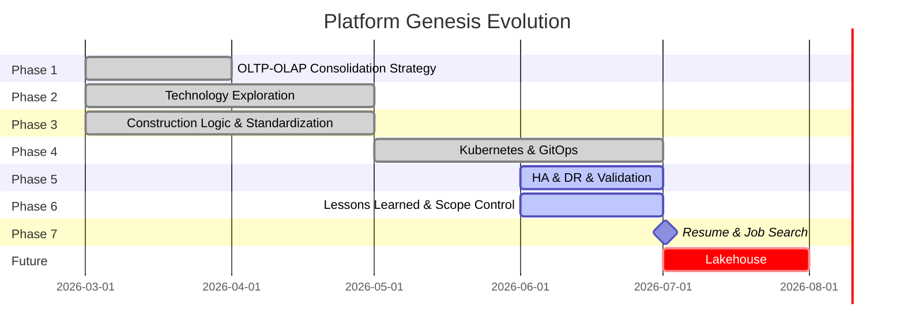

## *⭐ Platform Genesis ⭐*

 

> ##### *Platform Engineering Learning Sprint ( Mar 2026 – Present )*
>
> ##### *A self-built platform engineering environment focused on infrastructure automation, Kubernetes operations, GitOps delivery, observability, and quantitative validation. The project evolved from an OLTP/OLAP data platform initiative into a broader platform engineering practice emphasizing reliability, governance, recovery, and operational standardization.*

 

## *🚀　Key Achievements*

- ### *Infrastructure Automation*
  * #### *Built repeatable infrastructure provisioning using Terraform and Ansible*
  * #### *Automated Kubernetes cluster bootstrap and node lifecycle management*
  * #### *Implemented multi-master K3s architecture with HA control plane*

- ### *GitOps Delivery*
  * #### *Implemented GitLab CI + ArgoCD deployment workflow*
  * #### *Adopted Layered GitOps and App-of-Apps architecture*
  * #### *Established deployment governance and drift control validation*

- ### *Observability*
  * #### *Metrics: Prometheus*
  * #### *Logging: Loki + ELK*
  * #### *Tracing: Tempo*
  * #### *Visualization: Grafana*

- ### *Reliability Engineering*
  * #### *Node failure recovery validation*
  * #### *Workload recovery validation*
  * #### *Control plane resiliency validation*
  * #### *GitOps recovery validation*
  * #### *Deployment governance validation*

 

## *📊　Platform Engineering Deliverables ( PED )*

| ID | Deliverable | Status |
|:--|:-- |:--:|
| [PED-1](./docs/DB-RBAC.md) | *Database RBAC* | ✅ |
| [PED-2](./docs/Database-Environment-Benchmark.md) | *Database Environment Benchmark* | ✅ |
| [PED-3](./docs/OLTP-OLAP-Consolidation-Strategy.md) | *OLTP-OLAP Consolidation Strategy* | 🚧 |
| [PED-4](./docs/Database-Query-Performance-Optimization.md) | *Database Query Performance Optimization* | 🚧 |
| [PED-5](./docs/Evolution-of-Core-Data-Architecture.md) | *Core Data Architecture Evolution* | 🚧 |
| [PED-6](./docs/Application-Workload-Performance-Analysis.md) | *Application Workload Analysis* | 🚧 |
| [PED-7](./docs/Deployment-Delivery-Baseline.md) | *Deployment Delivery Baseline* | ✅ |
| [PED-8](./docs/K8s-Resiliency-Availability-Validation.md) | *Kubernetes Resiliency & Availability Validation* | ✅ |
| [PED-9](./docs/Observability-Platform-Validation.md) | *Observability Platform Validation* | 🚧 |
| [PED-10](./docs/Vault.md) | *Vault Secret Management & Distribution* | 🚧 |
| [PED-11](./docs/End-to-End-DevOps-Operating-Model.md) | *End-to-End DevOps Operating Model* | ✅ |
| [PED-12](./docs/GitOps-Deployment-Governance-Validation.md) | *GitOps Deployment Governance Validation* | ✅ |

 

## *🏗　Architecture Domains*

[//]: # (| Domain | Technologies |)

[//]: # (| :-- | -- |)

[//]: # (| Infrastructure | `Terraform` `Ansible` `VMware` `Libvirt` |)

[//]: # (| Container Platform | `Docker` `Kubernetes` `K3s` |)

[//]: # (| GitOps | `GitLab CI` `ArgoCD` |)

[//]: # (| Observability | `Prometheus` Grafana` `Loki` `Tempo` |)

[//]: # (| Data Platform | `PostgreSQL` `Airflow` |)

[//]: # (| Event Streaming | `Kafka` `MQTT` |)

[//]: # (| Security | `Vault` |)

[//]: # (| Future Expansion | `Debezium` `Iceberg` `Flink` `MinIO` |)

|*Category*| *Service & Tech Stack*|
|--:|:--|
|*Data Core*|      |
|*Orchestration* |   |
|*Event Streaming* |    |
|*Lakehouse* |     |
|*Monitoring* |     |
|*Log Management*|    |
|*Cloud & Infra*|      |
|*DevOps & Security* |       |
|*Other*| <a href='https://github.com/Junwu0615/Platform Genesis'>     |

 

## *📁　Repository Structure*

| Repository | Purpose |
| :-- | :-- |
| [*PG-Infrastructure*](https://github.com/Junwu0615/PG-Infrastructure) |  *Infrastructure as Code & Automation* |
| [*PG-APP-Core*](https://github.com/Junwu0615/PG-APP-Core) |  *Business Logic & Simulation Engine*  |
| [*PG-Shared-Lib*](https://github.com/Junwu0615/PG-Shared-Lib) |  *Shared Framework Components* |
| [*PG-Edge-Container*](https://github.com/Junwu0615/PG-Edge-Container) |  *Edge Runtime Deployment* |
| [*PG-Airflow-DAGs*](https://github.com/Junwu0615/PG-Airflow-DAGs) |  *Data Orchestration* |

 

## *🔍　Engineering Highlights*

- ### *Kubernetes*
  * #### *Multi-master control plane*
  * #### *Lease re-election validation*
  * #### *Affinity / Anti-affinity scheduling*
  * #### *HPA scaling validation*
  * #### *NFS-backed persistent workloads*

- ### *GitOps*
  * #### *App-of-Apps architecture*
  * #### *ApplicationSet automation*
  * #### *Environment-based deployment model*
  * #### *Drift detection and reconciliation*

- ### *Infrastructure*
  * #### *Terraform modularization*
  * #### *Ansible role-based architecture*
  * #### *Automated VM provisioning*
  * #### *HA cluster bootstrap*

 

## *⚖️　Lessons Learned & Evolution*
> *Platform Genesis began as an attempt to address a practical data*
> *infrastructure challenge: consolidating OLTP and OLAP workloads*
> *into a unified architecture.*
>
> *As the project evolved, the scope naturally expanded beyond data*
> *engineering into infrastructure automation, Kubernetes operations,*
> *GitOps workflows, observability, secret management, and reliability*
> *validation.*
>
> *Through continuous implementation and validation, the project*
> *gradually shifted from technology exploration toward architecture*
> *convergence and operational standardization.*
>
> *The most important lesson learned was that building individual*
> *components is relatively straightforward; integrating them into a*
> *maintainable, highly available, and operationally sustainable*
> *platform is significantly more challenging.*
>
> *As a result, the current focus has shifted from expanding the*
> *technology stack to improving reliability, reducing operational*
> *complexity, and establishing production-oriented engineering*
> *practices.*

 

> *⛏　Platform Genesis v1.0　|　Platform Foundation Release　|　Status: In Progress*
>
> *🚀　Platform Genesis v2.0　|　Data Platform & Lakehouse Expansion　|　Status: Future Work*
> 
> *📚　Further Reading　|　[Platform Evolution & Full Project History](./docs/Platform-Evolution.md)*

[//]: # (> *⛏　Platform Genesis v1.0　|　Platform Foundation Release　|　Status: Feature Complete &#40; 2026-07 &#41;*)

   