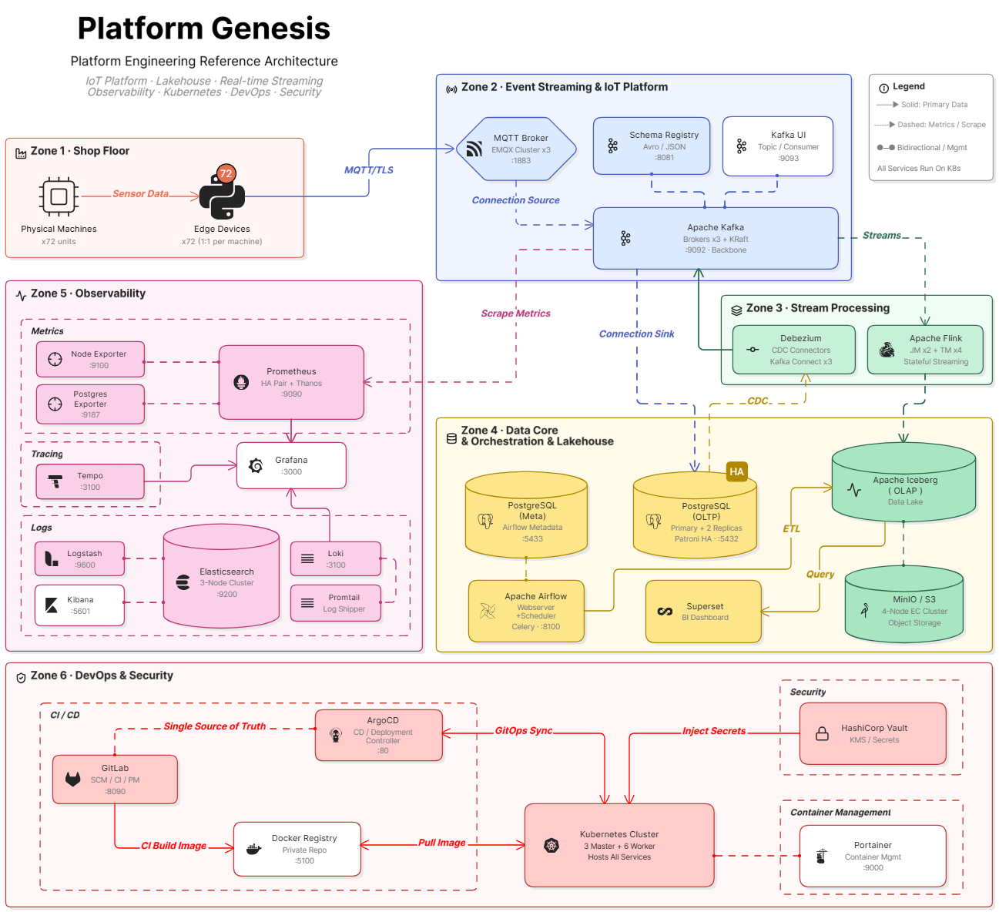

## *⭐ Platform Genesis ⭐*

  

## *🚀　Key Achievements*

- ### *Infrastructure Automation*
  * #### *Built Repeatable Infrastructure Provisioning Using Terraform and Ansible*
  * #### *Automated Kubernetes Cluster bootstrap and Node Lifecycle Management*
  * #### *Implemented Multi-master K3s Architecture with HA Control Plane*

- ### *GitOps Delivery*
  * #### *Implemented GitLab CI + ArgoCD Deployment Workflow*
  * #### *Adopted Layered GitOps and App-of-Apps Architecture*
  * #### *Established Deployment Governance and Drift Control Validation*

- ### *Observability*
  * #### *Metrics collection Using Prometheus*
  * #### *Centralized Logging Using Loki and ELK*
  * #### *Distributed Tracing Using Tempo*
  * #### *Unified Visualization Using Grafana*

- ### *Reliability Engineering*
  * #### *Validated Workload Recovery Behavior*  
  * #### *Validated Node failure Recovery*
  * #### *Validated Control Plane Resiliency*
  * #### *Validated GitOps Recovery Workflows*
  * #### *Established Quantitative Validation Methodology*

  

## *📊　Selected Engineering Evidence*

| _Engineering Capability_ | _Type_ | _Documentation_ |
|:--|:--|:--|
| _⭐ Platform Delivery_ | `Platform Core` | [_PED-7_](./docs/Deployment-Delivery-Baseline.md) |
| _⭐ Platform Reliability_ | `Platform Core` | [_PED-8_](./docs/K8s-Resiliency-Availability-Validation.md) |
| _Platform Observability_ | `Platform Service` | [_PED-9_](./docs/Observability-Platform-Validation.md) |
| _Platform Security_ | `Platform Service` | [_PED-10_](./docs/Vault.md) |
| _Platform Operations_ | `Platform Integration` | [_PED-11_](./docs/End-to-End-DevOps-Operating-Model.md) |
| _⭐ Platform Governance_ | `Platform Core` | [_PED-12_](./docs/GitOps-Deployment-Governance-Validation.md) |

  

## *🏗　Core Platform Capabilities*

| _Domain_ | _Capabilities_ |
|:--|:--|
| _Infrastructure_ | `Terraform` `Ansible` `Libvirt` `Automated Provisioning` |
| _Kubernetes_ | `HA Control Plane` `Scheduling` `Recovery Validation` |
| _GitOps_ | `GitLab CI` `Argo CD` `App-of-Apps` `Drift Control` |
| _Observability_ | `Metrics` `Logs` `Traces` `Alerting` |
| _Security_ | `Vault-based Secret Management` |
| _Data Platform_ | `PostgreSQL` `Airflow` `Kafka` |
| _Reliability_ | `Recovery Testing` `Governance Validation` |

  

## *🌌　Platform Genesis Universe*
> *The Evolution of Platform Engineering Platform Genesis is a multi-phased engineering journey,* 
> *building from a solid Cloud Native foundation into an intelligent operational ecosystem.*

| _Module_ | _Status_ | _Theme_ | _Scope_ |
|:--|:--:|:--|:--|
| ⛏　[*PG-Core*](https://github.com/Junwu0615/PG-Core) | In Progress | *Cloud Native Platform* | `Kubernetes` `GitOps` `Observability` `Infrastructure as Code` `Secrets Management` |
| 🚝　[*PG-Synapse*](https://github.com/Junwu0615/PG-Synapse) | Future Work | *Data Platform* | `Airflow` `Kafka` `CDC` `Iceberg` `Lakehouse` |
| 🌐　[*PG-Cortex*](https://github.com/Junwu0615/PG-Cortex) | Future Work |  *AI Platform* | `MLflow` `Kubeflow` `Ray` `LLMOps` `Model Serving` |
| 🚀　[*PG-Sentinel*](https://github.com/Junwu0615/PG-Sentinel) | Future Work |  *Intelligent Operations Platform*| `AIOps` `Chaos Engineering` `Reliability` `Auto Remediation` |

  

## *📁　Platform Genesis Repository*

| _Repository_ | _Purpose_ |
|:--|:--|
| [*PG-Infrastructure*](https://github.com/Junwu0615/PG-Infrastructure) |  *Infrastructure as Code & Platform Automation* |
| [*PG-APP-Core*](https://github.com/Junwu0615/PG-APP-Core) |  *Application Services & Workload Simulation*  |
| [*PG-Shared-Lib*](https://github.com/Junwu0615/PG-Shared-Lib) |  *Shared Components & Framework Utilities* |
| [*PG-Edge-Container*](https://github.com/Junwu0615/PG-Edge-Container) |  *Edge Runtime Deployment* |
| [*PG-Airflow-DAGs*](https://github.com/Junwu0615/PG-Airflow-DAGs) |  *Data Orchestration Workflows* |

  

## *⚖️　Engineering Philosophy*
> *•　Building individual technologies is relatively straightforward.*
>
> *•　Building an operationally sustainable platform is significantly harder.*
>
> *•　Platform Genesis focuses on integrating infrastructure automation, Kubernetes operations, GitOps workflows, observability, governance, and reliability validation into a cohesive engineering system.*

   