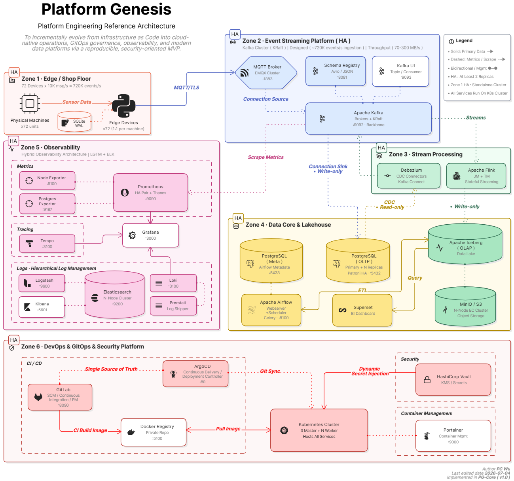

## *⭐ Platform Genesis ⭐*

  

## *🚀　Key Achievements*
> _Implemented in **PG-Core ( v1.0 )**_

- ### *Infrastructure Automation*
  * #### *Built Repeatable Infrastructure Provisioning Using Terraform and Ansible*
  * #### *Automated Kubernetes Cluster bootstrap and Node Lifecycle Management*
  * #### *Implemented Multi-master K3s Architecture with HA Control Plane*

- ### *GitOps Delivery*
  * #### *Implemented GitLab CI + ArgoCD Deployment Workflow*
  * #### *Adopted Layered GitOps and App-of-Apps Architecture*
  * #### *Established Deployment Governance and Drift Control Validation*

- ### *Observability*
  * #### *Metrics collection Using Prometheus*
  * #### *Centralized Logging Using Loki and ELK*
  * #### *Distributed Tracing Using Tempo*
  * #### *Unified Visualization Using Grafana*

- ### *Reliability Engineering*
  * #### *Validated Workload Recovery Behavior*  
  * #### *Validated Node failure Recovery*
  * #### *Validated Control Plane Resiliency*
  * #### *Validated GitOps Recovery Workflows*
  * #### *Established Quantitative Validation Methodology*

  

## *📊　Selected Engineering Evidence*
> _Implemented in **PG-Core ( v1.0 )**_

| _Engineering Capability_ | _Type_ | _Documentation_ |
|:--|:--|:--|
| _**⭐ Platform Delivery**_ | _**Platform Core**_ | _**[PED-7](./docs/Deployment-Delivery-Baseline.md)**_ |
| _**⭐ Platform Reliability**_ | _**Platform Core**_ | _**[PED-8](./docs/K8s-Resiliency-Availability-Validation.md)**_ |
| _**Platform Observability**_ | _**Platform Service**_ | _**[PED-9](./docs/Observability-Platform-Validation.md)**_ |
| _**Platform Security**_ | _**Platform Service**_ | _**[PED-10](./docs/Vault.md)**_ |
| _**Platform Operations**_ | _**Platform Integration**_ | _**[PED-11](./docs/End-to-End-DevOps-Operating-Model.md)**_ |
| _**⭐ Platform Governance**_ | _**Platform Core**_ | _**[PED-12](./docs/GitOps-Deployment-Governance-Validation.md)**_ |

  

## *🏗　Core Platform Capabilities*
> _Implemented in **PG-Core ( v1.0 )**_

| _Domain_ | _Capabilities_ |
|:--|:--|
| _**Infrastructure**_ | `Terraform` `Ansible` `Libvirt` `Automated Provisioning` |
| _**Kubernetes**_ | `HA Control Plane` `Scheduling` `Recovery Validation` |
| _**GitOps**_ | `GitLab CI` `Argo CD` `App-of-Apps` `Drift Control` |
| _**Observability**_ | `Metrics` `Logs` `Traces` `Alerting` |
| _**Security**_ | `Vault-based Secret Management` |
| _**Data Platform**_ | `PostgreSQL` `Airflow` `Kafka` |
| _**Reliability**_ | `Recovery Testing` `Governance Validation` |

  

## *🌌　Platform Genesis Universe*
> _Platform Genesis is an engineering ecosystem composed of multiple_
> _platform modules, each extending the Cloud Native foundation_
> _toward Data Engineering, AI Engineering, and Autonomous Operations._

| _Module_ | _Status_ | _Domain_ | _Core Technologies_ |
|--:|:--|:--|:--|
| ⭐ _**PG-Core ( v1.0 )**_ | _**[In Progress](https://github.com/Junwu0615/PG-Core)**_ | _**⛏ Cloud Native Platform**_ | `Kubernetes` `GitOps` `Observability` `Infrastructure as Code` `Secrets Management` |
| _**PG-Synapse ( v2.0 )**_ | _**[Future Work](https://github.com/Junwu0615/PG-Synapse)**_ | _**🚝 Data Platform**_ | `Airflow` `Kafka` `CDC` `Iceberg` `Lakehouse` |
| _**PG-Cortex ( v3.0 )**_ | _**[Future Work](https://github.com/Junwu0615/PG-Cortex)**_ | _**🌐 AI Platform**_ | `MLflow` `Kubeflow` `Ray` `LLMOps` `Model Serving` |
| _**PG-Sentinel ( v4.0 )**_ | _**[Future Work](https://github.com/Junwu0615/PG-Sentinel)**_ | _**🚀 Intelligent Operations Platform**_ | `AIOps` `Chaos Engineering` `Reliability` `Auto Remediation` |
| ⭐ _**PG-Analytics**_ | _**[Hot Update](https://github.com/Junwu0615/PG-Analytics)**_ | _**📊 Repository Analytics Platform**_ | `GitHub Traffic` `Repository Metrics` `Growth Trend` `Historical Statistics` |

  

## *📁　Platform Genesis Repository*
> _Supporting repositories that provide reusable platform components,_
> _infrastructure automation, shared libraries, and workload implementations_
> _across the entire Platform Genesis ecosystem._

| _Repository_ | _Purpose_ |
|:--|:--|
| _**[PG-Infrastructure](https://github.com/Junwu0615/PG-Infrastructure)**_ |  _**Infrastructure as Code & Platform Automation**_ |
| _**[PG-APP-Core](https://github.com/Junwu0615/PG-APP-Core)**_ |  _**Application Services & Workload Simulation**_  |
| _**[PG-Shared-Lib](https://github.com/Junwu0615/PG-Shared-Lib)**_ |  _**Shared Components & Framework Utilities**_ |
| _**[PG-Edge-Container](https://github.com/Junwu0615/PG-Edge-Container)**_ |  _**Edge Runtime Deployment**_ |
| _**[PG-Airflow-DAGs](https://github.com/Junwu0615/PG-Airflow-DAGs)**_ |  _**Data Orchestration Workflows**_ |

  

## *⚖️　Engineering Philosophy*
> *•　Building individual technologies is relatively straightforward.*
>
> *•　Building an operationally sustainable platform is significantly harder.*
>
> *•　Platform Genesis focuses on integrating infrastructure automation, Kubernetes operations, GitOps workflows, observability, governance, and reliability validation into a cohesive engineering system.*

   