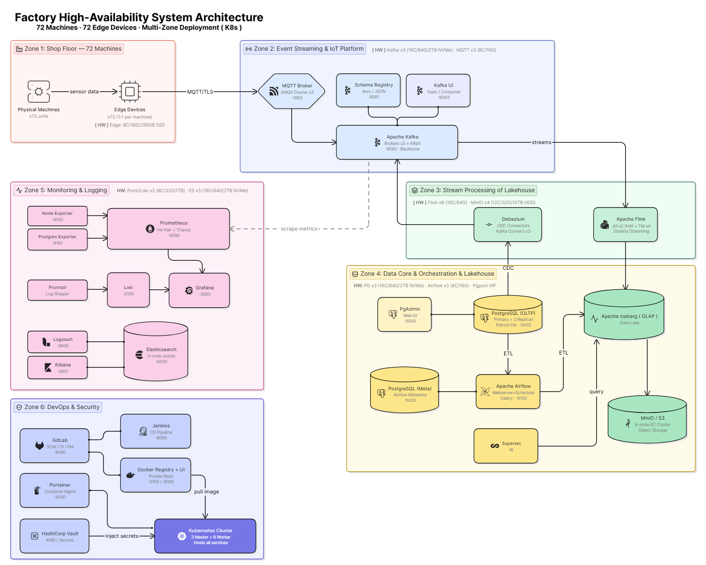

<div align="left">

|*Category*| *Service & Tech Stack*|
|--:|:--|
|*Data Core*|   <br>  |
|*Orchestration* |   |
|*Event Streaming* |    |
|*Lakehouse* |     |
|*Monitoring* |     |
|*Log Management*|    |
|*Cloud & Infra*|      |
|*DevOps & Security* |       |
|*Other*| <a href='https://github.com/Junwu0615/Platform Genesis'>     |

</div>

<br>

## *⭐ Platform Genesis ⭐*
> *Cloud-Native Data Platform PoC*



[//]: # (```)

[//]: # (* An Enterprise-Grade, Cloud-Native Blueprints Focused on Production-Ready )

[//]: # (  Data Platform Engineering & DataOps.)

[//]: # (  )
[//]: # (* Declarative Infrastructure: Full-Lifecycle Cluster Orchestration powered )

[//]: # (  by IaC &#40;Terraform & Ansible&#41; across Hybrid environments.)

[//]: # (  )
[//]: # (* Resilient Data Ingestion: Industrial Edge-to-Cloud telemetry streaming )

[//]: # (  implemented via High-Availability MQTT & Apache Kafka.)

[//]: # (  )
[//]: # (* Database Evolution: High-performance database modeling optimizing workload )

[//]: # (  transactions across 3NF &#40;OLTP&#41;, Star Schema &#40;OLAP&#41;, and HTAP architectures.)

[//]: # (  )
[//]: # (* Enterprise Observability: Production-scale monitoring and hierarchical )

[//]: # (  telemetry management powered by ELK Stack, Loki, Prometheus, and Grafana.)

[//]: # (```)

<br>

### *A.　PG Structure*
|*Project Name*|*Responsibilities*|*Tech Stack*|
|--:|:--|:--|
| [Platform Genesis](https://github.com/Junwu0615/Platform-Genesis) | **Homepage :**<br>Construction Records & Quantitative Testing | - |
| [PG-Infrastructure](https://github.com/Junwu0615/PG-Infrastructure) | **IaC & Automation :**<br>Orchestrates environment lifecycles via<br>Terraform, Ansible, and Makefiles. | `GKE` `K8s` `Terraform` `Ansible`<br>`Docker` `Makefile` |
| [PG-APP-Core](https://github.com/Junwu0615/PG-APP-Core) | **Business & Stream Logic :**<br>Core engine for multi-version factory simulations,<br>stream processing, and data infrastructure optimization. | `PG-Shared-Lib` `Python` |
| [PG-Shared-Lib](https://github.com/Junwu0615/PG-Shared-Lib) | **Core Library :**<br>Provides standardized,<br>high-reusability modules across the ecosystem. | `EntryPoint` `Logger` `MqttServer`<br>`KafkaConsumerManager`<br>`KafkaProducerManager` |
| [PG-Edge-Container](https://github.com/Junwu0615/PG-Edge-Container) | **Edge Deployment :**<br>Lightweight IoT units for data acquisition<br>and real-time MQTT/SQLite HA processing. | `PG-APP-Core` `MQTT` `SQLite` |
| [PG-Airflow-DAGs](https://github.com/Junwu0615/PG-Airflow-DAGs) | **Data Orchestration :**<br>Manages ETL pipelines, data lineage,<br>and OLTP-to-OLAP transformations. | `Airflow` `DAGs` |

<br>

### *B.　Project Progress*

<details>
<summary><b><i>　b.1.　Simple </i></b></summary>
<ul>

|**Item**|**Description**|**Time**|
|--:|:--|:--:|
| Create Project | - | 2026-03-20 |
| Add `PostgreSQL` | - | 2026-03-20 |
| Add `Airflow` | for `OLAP` | 2026-03-21 |
| Value of Deliverables 1 | Role-Based Access Control | 2026-04-01 |
| Value of Deliverables 2 | `Docker Desktop` vs. `WSL2` | 2026-04-04 |
| Add `Monitoring` | - | 2026-04-04 |
| Terraform | Modularization | 2026-04-20 |
| Ansible | Modularization | 2026-04-20 |
| Add `IoT Platform` | `MQTT Broker` + `Apache Kafka` | 2026-04-25 |
| K8s | Beginner : `Minikube` | 2026-05-09 |
| K8s | Advanced : `K3d` | 2026-05-10 |
| K8s | Advanced : `K3s` + `VMware` | 2026-05-10 |
| Build `Hierarchical`<br>`Log Management` | `Loki` + `ELK` | 2026-05-14 |
| Build `GitOps` | `GitLab CI` + `ArgoCD` | 2026-06-05 |
| Value of Deliverables 7 | Automated Deployment of the Edge :<br>`Manual` vs. `GitOps` | - |
| Value of Deliverables 8 |  `K8s Infrastructure` :<br>High Availability Comparison Test | - |
| Value of Deliverables 9 | Observability Platform | - |
| Value of Deliverables 11 | DevOps Process | - |
| Value of Deliverables 3 | OLTP-OLAP-Unified-DB | - |
| Value of Deliverables 4 | Query Efficiency Optimization<br>`Before` vs. `After` | - |
| Build `Lakehouse` | - | - |
| Value of Deliverables 5 | Evolution of Database Core Business :<br>`Direct Read` vs. `MV` vs. `CDC` | - |
| Value of Deliverables 6 | Workload Benchmark | - |
| Add `HashiCorp Vault` | Enterprise Key Management System | `TBD` |
| Value of Deliverables 10 | Vault Distribution Key | `TBD` |
| K8s | Bottom Layer : `Kubeadm` + `VMware` | `TBD` |
| K8s | Public Cloud : `GKE` | `TBD` |

</ul>
</details>

<details>
<summary><b><i>　b.2.　Details </i></b></summary>
<ul>

<br>

<details>
<summary><b><i>　b.2.1　Project Journey </i></b></summary>
<ul>

|**Item**|**Description**|**Time**|
|--:|:--|:--:|
| Create Project | - | 2026-03-20 |
| Define Process | - | 2026-03-20 |
| Define Event Story | - | 2026-03-21 |
| Define Project Directory | - | 2026-03-21 |
| Define Table DDL | - | 2026-03-21 |
| Create OLTP DDL ( 6 ) | 3NF | 2026-03-21 |
| Create OLAP DDL ( 5 ) | Star Schema | 2026-04-06 |
| Redefine Project Name | `OLTP-OLAP-Unified-DB`<br>to `Platform Genesis` | 2026-05-08 |
| Project Breakdown | `5` Major Categories | 2026-05-08 |

</ul>
</details>


<details>
<summary><b><i>　b.2.2　Code </i></b></summary>
<ul>

|**Item**|**Description**|**Time**|
|--:|:--|:--:|
| Script | delete_data.py | 2026-03-24 |
| Script | drop_table.py | 2026-03-24 |
| Script | factory_config.yaml | 2026-03-24 |
| Script | init_factory_data.py | 2026-03-24 |
| Script | simulate_factory_stream.py | 2026-03-24 |
| Single to Batch Insert | batch sending | 2026-03-26 |
| Generate Rigorous<br>Static Data | - | 2026-03-26 |
| Rigorous Calibration<br>of Dynamic Data | 單一機台同時間只允許做一件事 /<br>排隊消化訂單 / 訂單生產週期戳記 | 2026-03-27 |
| Adjusting Contextual | ~~insert machine event :<br>machine_events~~ | 2026-03-28 |
| execute → execute_batch | batch sending + batch submission :<br>不適用於目前模擬方式 | X |
| Adjusting Contextual | insert machine status :<br>machine_status_logs | 2026-03-30 |
| Increase Data Volume | - | 2026-03-30 |
| Auto Partition | `dags/sql/auto_partition/*` | 2026-04-06 |
| OLTP to OLAP | `dags/sql/*` | 2026-04-06 |
| DAG | Build Coding Style | 2026-04-06 |
| DAG ETL Script | Fan-out Queue Pattern | 2026-04-06 |
| DAG | Try `Param` | 2026-04-07 |
| DAG | Try `Dataset` | 2026-04-08 |
| Docker Compose | Compose Modularization | 2026-04-11 |
| Add Makefile | for `docker-compose` | 2026-04-11 |
| Add Airflow Config UI | `Trigger w/ Config` | 2026-04-18 |
| DAG | update Coding Style | 2026-04-18 |
| Add Makefile | for `terraform + ansible` | 2026-04-19 |
| Terraform | Modularization | 2026-04-20 |
| Ansible | Modularization | 2026-04-20 |
| Simple Simulation | organizing old versions : `v1` | 2026-04-28 |
| API Service logic | - | X |
| Multi-Instance | like real-edge : `v2` | 2026-04-28 |
| MQTT logic | for `cp` | 2026-04-28 |
| Kafka Connect | `source` : producer  | 2026-04-30 |
| Kafka logic | for `inst` | 2026-05-03 |
| Kafka Connect | `sink` : consumers | 2026-05-04 |
| Define the Version Number<br>of each service  | settings to `.env` | 2026-05-05 |
| logging logic | mixed ( `ELK` + `logging` ) | 2026-05-06 |
| Encapsulation Entry | app.py | 2026-05-06 |
| logging logic | Logs Correct Paths<br>Based on Module Calls | 2026-05-07 |
| update `v2` logic | Apply the<br>New Underlying Module | 2026-05-07 |
| Import Shared Lib | - | 2026-05-13 |
| Add `SQLite`<br>to Edge scripts  | Improve the HA<br>of Consumer Transactions | 2026-05-13 |
| loki logic | - | 2026-05-14 |
| `IS_KUBERNETES` | 布林注入強制轉換配置 | 2026-05-14 |
| make `v2` Dockerfile | - | 2026-05-14 |
| lint `CI` | 推送前自動檢測 `.pre-commit-config.yaml` | 2026-05-18 |
| lint `CI` | 語法檢查 `black` `flake8` ... | 2026-05-18 |
| test `CI` | common tests scripts | 2026-05-18 |
| build `CI` | - | 2026-05-19 |
| deploy `CI` | - | 2026-05-20 |
| Python-Tempo Logic | - | - |
| DAG | init.py + create_topic.py | - |
| Grafana Dashboard | `htap_grafana.json` | - |
| Create MV | Materialized View | - |
| Analytical Queries | - | - |
| Security Message :<br>`Message Queue Layer` | Encryption ( `kafka` + `mqtt` ) | `TBD` |
| Security Message :<br>`Software Layer` | 非對稱加密 | `TBD` |

</ul>
</details>


<details>
<summary><b><i>　b.2.3　Infra </i></b></summary>
<ul>

|**Item**|**Description**|**Time**|
|--:|:--|:--:|
| Add `PostgreSQL` | - | 2026-03-20 |
| Add `Airflow` | for `OLAP` | 2026-03-21 |
| Add `PoWA` | for `Monitoring` | 2026-03-23 |
| Docker Engine | for `WSL2` | 2026-04-03 |
| Add `Monitoring` | `Postgres Exporter` | 2026-04-04 |
| Add `Monitoring` | `Prometheus` | 2026-04-04 |
| Add `Monitoring` | `Grafana` | 2026-04-04 |
| Add `Monitoring` | `Node Exporter` | 2026-04-05 |
| Add `Portainer` | for `Manage Containers` | 2026-04-11 |
| Add `IoT Platform` | `MQTT Broker` | 2026-04-25 |
| Add `IoT Platform` | `Apache Kafka` | 2026-04-25 |
| Add `ELK` | for `Manage Log` | 2026-05-05 |
| K8s | Beginner : `Minikube` | 2026-05-09 |
| K8s | Advanced : `K3d` | 2026-05-10 |
| K8s | Advanced : `K3s` + `VMware` | 2026-05-10 |
| Add `Monitoring` | `Loki` | 2026-05-12 |
| Add `Gitlab` | for `CI` & `Manage Projects` | 2026-05-12 |
| Add `Jenkins` | for `CD` | 2026-05-12 |
| Add `Docker Registry` | for `CI/CD` & `Manage Images` | 2026-05-12 |
| Build `Hierarchical`<br>`Log Management` | `Loki` + `ELK` | 2026-05-14 |
| Build `CD` | `CD` → `Airflow DAGs` | 2026-05-20 |
| Build `WSL2 Homelab` | `Chrome` → `Windows:8080`<br>→ `WSL2:80` → `ingress-nginx` | 2026-05-25 |
| Update Migration Matrix | `Hybrid deployment` | 2026-05-26 |
| Add `ArgoCD` | for `CD` | 2026-05-28 |
| Build `GitOps` | `GitLab CI` + `ArgoCD` | 2026-06-05 |
| Build `CD` | `CD` → `Edge Container` | - |
| Add `Debezium` | Change Data Capture | - |
| Add `Apache Iceberg` | Data Lake | - |
| Add `Apache Flink` | consumer of CDC | - |
| Add `MinIO` | Object Storage | - |
| Build `Lakehouse` | - | - |
| Add `Superset` | for `OLAP` | - |
| Add `HashiCorp Vault` | Enterprise Key Management System | `TBD` |
| K8s | Bottom Layer : `Kubeadm` + `VMware` | `TBD` |
| K8s | Public Cloud : `GKE` | `TBD` |

</ul>
</details>


<details>
<summary><b><i>　b.2.4　Experience </i></b></summary>
<ul>

|**Item**|**Description**|**Time**|
|--:|:--|:--:|
| PoWA Web Login Failed | ⚠️no reason found yet | 2026-03-23 |
| DB Settings | Permission Settings | 2026-03-23 |
| New Role | Migration User | 2026-03-24 |
| PoWA( Running Normally ) | - | 2026-03-30 |
| Try Again PoWA Web | ⚠️very difficult to deal with | 2026-03-30 |
| Fine-tuning<br>PostgreSQL Settings | `shm-size` | 2026-04-01 |
| Grafana Dashboard | Organize Observation Indicators | 2026-04-05 |
| WSL2 Settings | `.wslconfig` | 2026-04-06 |
| Partition Settings | `default_partition` | 2026-04-06 |
| Terraform | Declaration Config : `Docker Provider` | 2026-04-19 |
| Terraform | Config Transfer : `docker-compose` | 2026-04-19 |
| Ansible | node `init` & `config` | 2026-04-19 |
| Terraform vs. Compose | Experience :<br>`狀態管理差異性 ; 復原配置崩潰 ; 提高 HA` | 2026-04-19 |
| Terraform & Ansible | Experience :<br>`Ansible 如何補足 Terraform 的不足` | 2026-04-19 |
| ELK | Experience : `ELK` | 2026-05-05 |
| K8s | Experience :<br>`Pod` `Node` `Helm` `Kubectl` `Deployment`<br>`Service` `Ingress` `Secret` `ConfigMap`<br>`NameSpaces` `PVC` `SVC` ... | 2026-05-09 |
| K8s | Experience : MiniKube | 2026-05-09 |
| K8s | Experience : Ansible 初始化節點 | 2026-05-10 |
| K8s | Experience : K3d | 2026-05-10 |
| VM | Experience : Manual Create Oracle VM | 2026-05-10 |
| K8s | K3s + VM | 2026-05-10 |
| VM | 開源全生命週期自動化堆疊<br>`Terraform` `Ansible` `libvirt` | 2026-05-10 |
| K8s | Experience : 水平擴充 ( Horizontal Scaling ) | 2026-05-10 |
| VM | Experience : 以 Ping 自動喚醒 VM 防止深度睡眠 | X |
| VM | Terraform 安裝基礎設施 | 2026-05-11 |
| K8s | Experience : 簡化 kubectl 指令 | 2026-05-12 |
| VM | 橫向擴展 Node | 2026-05-12 |
| K8s | Experience : 高可用單一實例 ( HA Singleton ) | 2026-05-12 |
| K8s | Experience : Edge & Service 分離標籤 | 2026-05-12 |
| K8s | Experience : `k9s` | 2026-05-12 |
| CI/CD | Experience : Git-Runner | 2026-05-19 |
| CI/CD | Experience : ⚠️ Airflow 熱更新 | 2026-05-20 |
| VM | Terraform `Gateway` | 2026-05-24 |
| K8s | Experience :<br>Win → `Portproxy` → WSL2 | 2026-05-25 |
| K8s | Experience : `ingress-nginx` | 2026-05-25 |
| K8s | Experience : `OOM Kill` | 2026-05-25 |
| GitOps | update tree `App-of-Apps` | 2026-05-28 |
| GitOps | Experience : `Layered GitOps` | 2026-05-29 |
| GitOps | Build : `Observability` `Grafana` | 2026-05-30 |
| GitOps | Build : `Observability` `Prometheus` | 2026-05-30 |
| GitOps | Build : `Observability` `Prometheus Stack` | 2026-05-30 |
| GitOps | Build : `Observability` `Promtail` | 2026-05-31 |
| GitOps | `Helm Values 渲染大坑` → 退至穩定版 | 2026-05-31 |
| GitOps | Build : `Observability` `Loki` | 2026-05-31 |
| K8s | Experience : `Fluent Bit ( DaemonSet )` | 2026-05-31 |
| GitOps | Build : `Observability` `Tempo` | 2026-06-01 |
| GitOps | Experience : values 渲染大法 | 2026-06-03 |
| GitOps | Build : `Databases` `Postgresql` | 2026-06-03 |
| K8s | Experience : `ApplicationSet` | 2026-06-05 |
| GitOps | update tree `Automated Multi-Tenant`<br>`Environment Provisioning` | 2026-06-05 |
| GitOps | Ingress-Nginx `切換 Namespace 環境坑` | 2026-06-06 |
| K8s | 親和/反親合標籤設置 | 2026-06-06 |
| VM | Terraform `Master` 多節點設置 | 2026-06-06 |
| GitOps | Build : `Observability` `Postgres Exporter` | 2026-06-07 |
| GitOps | Build : `Platform` `Registry` | 2026-06-07 |
| GitOps | Vanishing 6H `Bitnami 腳本底層對底線 _ 敏感性` | 2026-06-08 |
| GitOps | Build : `PG-Apps` `cp` | 2026-06-10 |
| GitOps | Build : `PG-Apps` `inst` | 2026-06-10 |
| GitOps | Build : `Storage` `nfs` | - |
| K8s | Experience : NFS 儲存機制 ( SQLite ) | - |
| GitOps | Build : `Security` `Vault` | `TBD` |
| GitOps | Maintain 2 repo ( `CI` + `CD` ) | `TBD` |

</ul>
</details>


<details>
<summary><b><i>　b.2.5　Value of Deliverables </i></b></summary>
<ul>

|**Item**|**Description**|**Time**|
|--:|:--|:--:|
| Role-Based Access Control | [Value of Deliverables 1](./docs/RBAC.md) | 2026-04-01 |
| 透過通用工具進行<br>資料庫極限測試 | [Value of Deliverables 2](./docs/Generic-Benchmark.md)<br>`Docker Desktop` vs. `WSL2` | 2026-04-04 |
| 單一實例實現 HTAP | [Value of Deliverables 3](./docs/OLTP-OLAP-Unified-DB.md) | - |
| 資料庫查詢優化比較測試 | [Value of Deliverables 4](./docs/DB-Optimization.md)<br>`Before` vs. `After` | - |
| 資料庫核心業務解套演進 | [Value of Deliverables 5](./docs/Evolution-of-Database-Core.md)<br>`Direct Read` vs. `MV` vs. `CDC` | - |
| 透過監控系統<br>觀察業務系統瓶頸 | [Value of Deliverables 6](./docs/Workload-Benchmark.md)<br>Workload Benchmark | - |
| CI/CD `K8s` | [Value of Deliverables 7](./docs/CI-CD.md)<br>`Manual` vs. `GitOps` | - |
| 基礎設施高可用性測試 `K8s` |  [Value of Deliverables 8](./docs/HA.md) | - |
| 可觀測性平台 `K8s` | [Value of Deliverables 9](./docs/Observability-Platform.md)<br>`Logging` `Metrics` `Tracing` `Alert Manager` | - |
| Vault 分發密鑰 `K8s` | [Value of Deliverables 10](./docs/Vault.md) | `TBD` |
| DevOps 流程 `K8s` | [Value of Deliverables 11](./docs/DevOps.md)<br>`Code Review` `PR` `TEST` `STAGE` `PROD` | - |


</ul>
</details>


</ul>
</details>


<br>


### *C.　Implement*

<details open>
<summary><b><i>　c.1.　Service Support Form </i></b></summary>
<ul>

```
O = 已實現
X = 已棄用
- = 未實現
* = Homelab 記憶體 OOM Kill ( 折衷改為 Docker Compose ) → 不遷移
△ = 省作業時間 ( 部分與重型服務的 Docker Compose 綑綁 ) → 不遷移
``` 

|**Service**|**Docker**|**Terraform<br>( Docker )**|**MiniKube**|**K3d**|**K3s**|**K3s<br>Migration**|**Kubeadm**|**GKE**|
|--:|:--:|:--:|:--:|:--:|:--:|:--:|:--:|:--:|
| **PostgreSQL** | O | - | O | O | O | O | - | - |
| **PgAdmin** | O | X | X | X | X | X | X | X |
| **PoWA** | X | X | X | X | X | X | X | X |
| **Apache Airflow** | O | - | - | - | - | * | - | - |
| **Superset** | O | - | - | - | - | * | - | - |
| **MQTT Broker** | O | - | - | - | - | △ | - | - |
| **Apache Kafka** | O | - | - | - | - | * | - | - |
| **Kafka UI** | O | - | - | - | - | △ | - | - |
| **Schema Registry** | O | - | - | - | - | △ | - | - |
| **Debezium** | O | - | - | - | - | △ | - | - |
| **MinIO** | O | - | - | - | - | △ | - | - |
| **Apache Iceberg** | O | - | - | - | - | * | - | - |
| **Apache Flink** | O | - | - | - | - | * | - | - |
| **Postgres Exporter** | O | O | - | - | - | O | - | - |
| **Node Exporter** | O | O | - | - | - | O | - | - |
| **Prometheus** | O | O | - | - | - | O | - | - |
| **Grafana** | O | O | - | - | - | O | - | - |
| **Loki** | O | - | - | - | - | O | - | - |
| **Promtail** | O | - | - | - | - | O | - | - |
| **Tempo** | X | - | - | - | - | O | - | - |
| **Elasticsearch** | O | - | - | - | - | * | - | - |
| **Logstash** | O | - | - | - | - | * | - | - |
| **Kibana** | O | - | - | - | - | * | - | - |
| **Gitlab** | O | - | - | - | - | * | - | - |
| **Jenkins** | X | X | X | X | X | X | X | X |
| **ArgoCD** | X | - | - | - | - | O | - | - |
| **Harbor** | X | X | X | X | X | X | X | X |
| **Docker Registry** | O | - | - | - | - | O | - | - |
| **Docker Registry UI** | X | X | X | X | X | X | X | X |
| **Portainer** | O | O | - | - | O | △ | - | - |
| **HashiCorp Vault** | O | - | - | - | - | O | - | - |

</ul>
</details>

<details>
<summary><b><i>　c.2.　Tree </i></b></summary>
<ul>

```bash
tree -I 'venv|.git|__pycache__|docs|logs|assets|kafka_data|charts'

.
├── PG-APP-Core
│   ├── LICENSE
│   ├── README.md
│   ├── requirements.txt
│   └── src
│       ├── __init__.py
│       ├── core
│       │   ├── __init__.py
│       │   ├── models
│       │   │   ├── __init__.py
│       │   │   ├── simulator.py
│       │   │   └── sink_format.py
│       │   ├── v1
│       │   │   ├── __init__.py
│       │   │   ├── factory_config.yaml
│       │   │   ├── init_factory_data.py
│       │   │   └── simulate_factory_stream.py
│       │   └── v2
│       │       ├── __init__.py
│       │       ├── api
│       │       │   └── __init__.py
│       │       ├── cp
│       │       │   ├── __init__.py
│       │       │   └── main.py
│       │       ├── factory_config.yaml
│       │       ├── inst
│       │       │   ├── __init__.py
│       │       │   └── main.py
│       │       └── scripts
│       │           ├── __init__.py
│       │           ├── create_topic.py
│       │           ├── init.py
│       │           └── topics_config.json
│       └── scripts
│           ├── __init__.py
│           ├── generic_benchmark
│           │   ├── dashboard_benchmark.sql
│           │   └── olap_benchmark.sql
│           └── sql
│               ├── auto_partition.py
│               ├── delete_data.py
│               └── drop_table.py
├── PG-Airflow-DAGs
│   ├── LICENSE
│   ├── README.md
│   └── dags
│       ├── OP_SQL.py
│       ├── WF_AUTO_PARTITION.py
│       ├── WF_A_DATASET.py
│       ├── WF_B_DATASET.py
│       ├── WF_CREATE_TABLE.py
│       ├── WF_C_DATASET.py
│       ├── __init__.py
│       ├── configs
│       │   ├── __init__.py
│       │   ├── constants.py
│       │   └── dag_config.py
│       ├── sql
│       │   ├── __init__.py
│       │   ├── auto_partition
│       │   │   ├── fact_production.sql
│       │   │   ├── machine_status_logs.sql
│       │   │   └── production_records.sql
│       │   ├── dim_date.sql
│       │   ├── dim_machine.sql
│       │   ├── dim_product.sql
│       │   ├── fact_machine_status.sql
│       │   ├── fact_production.sql
│       │   └── models
│       │       ├── olap
│       │       │   ├── dim_date.sql
│       │       │   ├── dim_machine.sql
│       │       │   ├── dim_product.sql
│       │       │   ├── fact_machine_status.sql
│       │       │   └── fact_production.sql
│       │       └── oltp
│       │           ├── machine.sql
│       │           ├── machine_events.sql
│       │           ├── machine_status_logs.sql
│       │           ├── product.sql
│       │           ├── production_orders.sql
│       │           └── production_records.sql
│       └── utils
│           ├── __init__.py
│           └── dag_tool.py
├── PG-Edge-Container
│   ├── LICENSE
│   ├── Makefile
│   ├── README.md
│   ├── docker
│   │   ├── cp
│   │   │   ├── Dockerfile
│   │   │   ├── data
│   │   │   └── src ( copy `PG-APP-Core` )
│   │   └── inst
│   │       ├── Dockerfile
│   │       ├── data
│   │       │   ├── kafka_consumer_local.db
│   │       │   ├── kafka_consumer_local.db-shm
│   │       │   └── kafka_consumer_local.db-wal
│   │       └── src ( copy `PG-APP-Core` )
│   └── k8s
├── PG-Infrastructure
│   ├── LICENSE
│   ├── README.md
│   └── infra
│       ├── docker-compose
│       │   ├── Makefile
│       │   ├── ansible
│       │   │   ├── inventory.ini
│       │   │   ├── playbook.yml
│       │   │   └── roles
│       │   │       └── monitoring
│       │   │           ├── handlers
│       │   │           │   └── main.yml
│       │   │           ├── tasks
│       │   │           │   └── main.yml
│       │   │           ├── templates
│       │   │           │   └── prometheus.yml.j2
│       │   │           └── vars
│       │   │               └── main.yml
│       │   ├── docker
│       │   │   ├── airflow
│       │   │   │   ├── config
│       │   │   │   ├── deploy_dags.sh
│       │   │   │   ├── docker-compose.yaml
│       │   │   │   └── plugins
│       │   │   ├── elk
│       │   │   │   ├── docker-compose.yaml
│       │   │   │   ├── elasticsearch.yaml
│       │   │   │   └── logstash
│       │   │   │       ├── logstash.yaml
│       │   │   │       └── pipeline
│       │   │   │           └── logstash.conf
│       │   │   ├── gitlab
│       │   │   │   ├── config
│       │   │   │   ├── data
│       │   │   │   └── docker-compose.yaml
│       │   │   ├── iot-platform
│       │   │   │   ├── config
│       │   │   │   │   ├── connectors
│       │   │   │   │   │   ├── sink
│       │   │   │   │   │   │   ├── sink-inst-prod-orders.json
│       │   │   │   │   │   │   ├── sink-inst-prod-records.json
│       │   │   │   │   │   │   └── sink-inst-status-logs.json
│       │   │   │   │   │   └── source
│       │   │   │   │   │       └── source-cp-mach-order.json
│       │   │   │   │   ├── mosquitto.conf
│       │   │   │   │   └── passwd
│       │   │   │   ├── dockerfile
│       │   │   │   │   └── Dockerfile.kafka
│       │   │   │   ├── kafka-compose.yaml
│       │   │   │   └── mqtt-compose.yaml
│       │   │   ├── jenkins
│       │   │   │   └── docker-compose.yaml
│       │   │   ├── monitoring
│       │   │   │   ├── docker-compose.yaml
│       │   │   │   ├── htap_grafana.json
│       │   │   │   ├── loki-config.yaml
│       │   │   │   ├── prometheus.yaml
│       │   │   │   └── promtail-config.yaml
│       │   │   ├── portainer
│       │   │   │   └── docker-compose.yaml
│       │   │   ├── postgresql
│       │   │   │   ├── Dockerfile
│       │   │   │   ├── docker-compose.yaml
│       │   │   │   └── init
│       │   │   │       └── init.sql
│       │   │   ├── powa
│       │   │   │   ├── Dockerfile
│       │   │   │   ├── docker-compose.yaml
│       │   │   │   └── init
│       │   │   │       └── powa.sql
│       │   │   └── registry
│       │   │       └── docker-compose.yaml
│       │   ├── docker-compose.yaml
│       │   ├── gitlab-runner
│       │   │   └── config.toml
│       │   ├── terraform
│       │   │   ├── main.tf
│       │   │   ├── modules
│       │   │   │   ├── docker_container
│       │   │   │   │   ├── main.tf
│       │   │   │   │   ├── outputs.tf
│       │   │   │   │   └── variables.tf
│       │   │   │   ├── monitoring
│       │   │   │   │   ├── main.tf
│       │   │   │   │   ├── outputs.tf
│       │   │   │   │   └── variables.tf
│       │   │   │   └── portainer
│       │   │   │       ├── main.tf
│       │   │   │       ├── outputs.tf
│       │   │   │       └── variables.tf
│       │   │   ├── outputs.tf
│       │   │   ├── terraform.tfvars
│       │   │   └── variables.tf
│       │   └── wsl2
│       ├── gcp
│       ├── k3d ( `omission` )
│       ├── k3s ( `omission` )
│       ├── k3s_migration
│       │   ├── Makefile
│       │   ├── archive ( `omission` )
│       │   ├── bootstrap
│       │   │   ├── ansible
│       │   │   │   ├── ansible.cfg
│       │   │   │   ├── group_vars
│       │   │   │   │   └── all.yml
│       │   │   │   ├── inventory.ini
│       │   │   │   └── playbooks
│       │   │   │       ├── deploy_k3s.yml
│       │   │   │       ├── gateway.yml
│       │   │   │       ├── init_nodes.yml
│       │   │   │       ├── power_manage.yml
│       │   │   │       └── site.yml
│       │   │   └── terraform
│       │   │       ├── cloud_init.cfg
│       │   │       ├── env_tfvars
│       │   │       │   └── homelab-test.tfvars
│       │   │       ├── inventory.tftpl
│       │   │       ├── main.tf
│       │   │       ├── outputs.tf
│       │   │       ├── terraform.tfstate
│       │   │       ├── terraform.tfstate.backup
│       │   │       └── variables.tf
│       │   ├── gitlab-tree
│       │   │   ├── README
│       │   │   ├── app-manifests
│       │   │   ├── docker-services
│       │   │   ├── infra-live
│       │   │   ├── infra-modules
│       │   │   └── platform-docs
│       │   ├── infra-live
│       │   │   ├── applications
│       │   │   │   ├── databases
│       │   │   │   │   └── postgresql
│       │   │   │   ├── observability
│       │   │   │   │   ├── logging
│       │   │   │   │   │   ├── loki
│       │   │   │   │   │   └── promtail
│       │   │   │   │   ├── metrics
│       │   │   │   │   │   ├── exporters
│       │   │   │   │   │   │   ├── node-exporter
│       │   │   │   │   │   │   └── postgres-exporter
│       │   │   │   │   │   └── prometheus
│       │   │   │   │   ├── tracing
│       │   │   │   │   │   └── tempo
│       │   │   │   │   └── visualization
│       │   │   │   │       └── grafana
│       │   │   │   ├── pg-apps
│       │   │   │   │   ├── cp
│       │   │   │   │   └── inst
│       │   │   │   ├── platform
│       │   │   │   │   ├── argocd
│       │   │   │   │   └── registry
│       │   │   │   ├── security
│       │   │   │   │   └── vault
│       │   │   │   └── storage
│       │   │   │       └── nfs
│       │   │   ├── argocd
│       │   │   │   ├── applications
│       │   │   │   └── projects
│       │   │   ├── bootstrap
│       │   │   │   └── cluster
│       │   │   │       ├── argocd
│       │   │   │       │   ├── ingress.yaml
│       │   │   │       │   ├── namespace.yaml
│       │   │   │       │   ├── repo-secret.yaml
│       │   │   │       │   ├── root-app.yaml
│       │   │   │       │   └── values.yaml
│       │   │   │       ├── cert-manager
│       │   │   │       │   ├── cluster-issuer.yaml
│       │   │   │       │   ├── namespace.yaml
│       │   │   │       │   └── values.yaml
│       │   │   │       ├── ingress-nginx
│       │   │   │       │   ├── namespace.yaml
│       │   │   │       │   └── values.yaml
│       │   │   │       ├── namespaces
│       │   │   │       │   ├── databases.yaml
│       │   │   │       │   ├── observability.yaml
│       │   │   │       │   ├── pg-apps.yaml
│       │   │   │       │   ├── platform.yaml
│       │   │   │       │   ├── security.yaml
│       │   │   │       │   └── storage.yaml
│       │   │   │       ├── scripts
│       │   │   │       │   └── bootstrap-cluster.sh
│       │   │   │       └── sealed-secrets
│       │   │   │           ├── namespace.yaml
│       │   │   │           └── values.yaml
│       │   │   ├── environments
│       │   │   │   └── homelab
│       │   │   │       ├── prod
│       │   │   │       ├── stage
│       │   │   │       └── test
│       │   │   ├── policies
│       │   │   └── templates
│       │   ├── scripts
│       │   │   └── vm-power.sh
│       │   └── win_hosts
│       ├── kubeadm
│       └── minikube ( `omission` )
├── PG-Shared-Lib
│   ├── LICENSE
│   ├── README.md
│   ├── requirements.txt
│   ├── setup.cfg
│   ├── setup.py
│   ├── shared
│   │   ├── __init__.py
│   │   ├── configs
│   │   │   ├── __init__.py
│   │   │   ├── constant.py
│   │   │   └── settings.py
│   │   ├── modules
│   │   │   ├── __init__.py
│   │   │   ├── entry.py
│   │   │   ├── kafka_consumer.py
│   │   │   ├── kafka_producer.py
│   │   │   ├── log.py
│   │   │   └── mqtt.py
│   │   └── utils
│   │       ├── __init__.py
│   │       ├── env_config.py
│   │       ├── postgres_tools.py
│   │       └── tools.py
│   └── shared.egg-info
│       ├── PKG-INFO
│       ├── SOURCES.txt
│       ├── dependency_links.txt
│       ├── requires.txt
│       └── top_level.txt
└── Platform-Genesis
    ├── LICENSE
    ├── Makefile
    └── README.md
```

</ul>
</details>

<br>

### *D.　Lessons Learned & Outlook*
> The Platform Genesis initiative serves as an ambitious exploration of 
> cloud-native data ecosystems. While the initial PoC scope was broad—spanning 
> from edge telemetry to lakehouse analytics—the reality of single-developer 
> maintenance has necessitated a shift in focus. The primary challenge remains 
> the consolidation of these diverse technologies into a unified, high-availability 
> architecture. Moving forward, the focus will narrow from horizontal expansion to 
> optimizing system stability and automating the reconciliation processes, 
> ensuring that each component contributes directly to a production-ready standard.

<br><br><br>