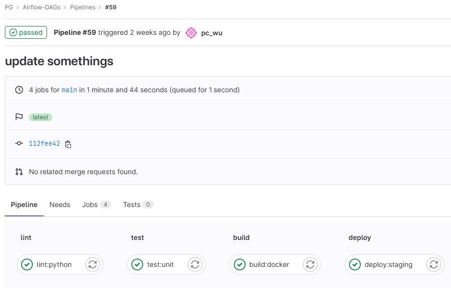
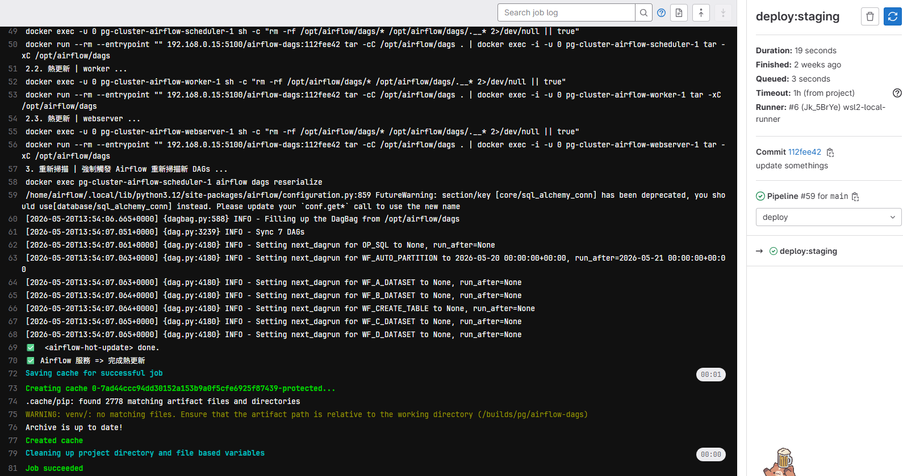
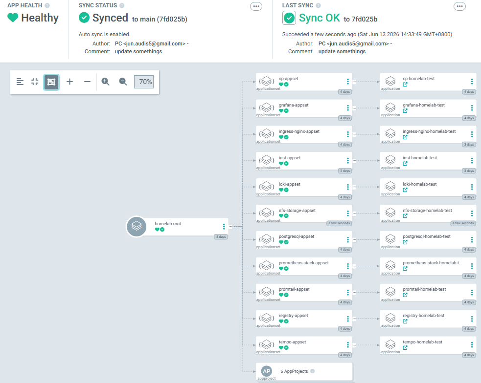
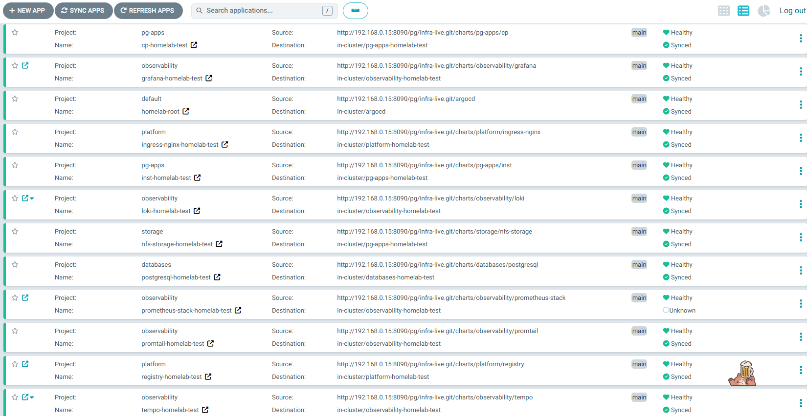
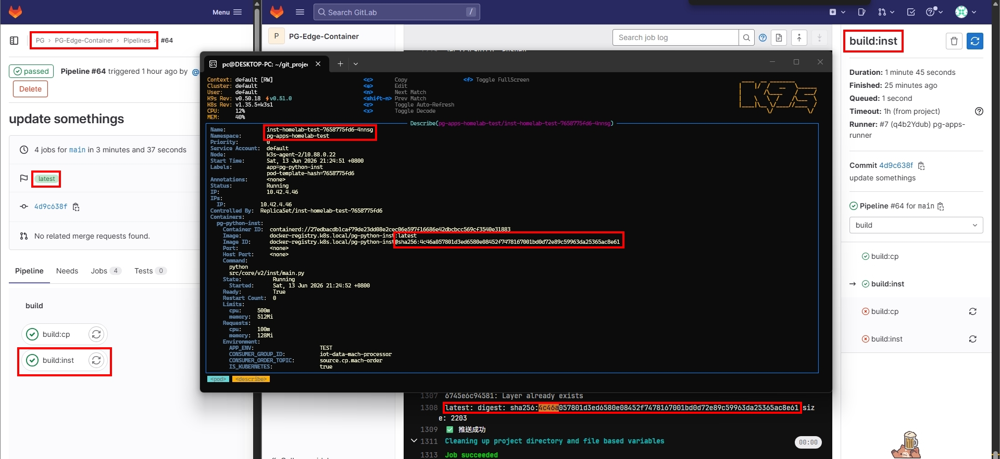

## *⭐ K8s - Deployment Delivery Baseline ⭐*

### *A.　Delivery Model Comparison*

<br>

<details>
<summary><b><i>　a.1.　Tradition </i></b></summary>
<ul>

<br>

<details>
<summary><b><i>　I.　Explain </i></b></summary>
<ul>

```
# 實現方式:
    • [1] Gitlab CI
    • [2] Gitlab CI + Jenkins
    
# 優劣特性: 
    • Pipeline-Driven
    • Imperative Workflow
    • 適用於小型團隊與 Legacy 環境
    • 可支援平台 ( VM / Docker / K8s )
    • 需自行維護 Deploy Script
    • Rollback 通常依賴 Pipeline
    • 相對唯一事實 → Deploy State 分散
        - 分散於 Git, CI Pipeline, Cluster
        - 難以確認哪個版本實際運行中
            Git Repository : v1.2
            CI Pipeline    : v1.3
            K8s Cluster    : v1.1
    • 權限管理較複雜 → 延伸安全性問題
        - CI Pipeline 需持有 K8s Deploy 權限
        - GitLab Runner 通常需存放 KubeConfig 或 Token
    • 其他:
        - Gitlab Runner: 可依賴 K8s Pod 啟動一次性 || 簡易 docker 啟動

# Work Flow:

    Git Push
      ↓
    GitLab CI
      ↓
    Build Image
      ↓
    Push Registry
      ↓
    Update values.yaml
      ↓
    K8s Apply
      ↓
    Pod Service Running
```

</ul>
</details>

<details open>
<summary><b><i>　II.　Showcase </i></b></summary>
<ul>




</ul>
</details>

</ul>
</details>


<details>
<summary><b><i>　a.2.　GitOps </i></b></summary>
<ul>

<br>

<details>
<summary><b><i>　I.　Explain </i></b></summary>
<ul>

```
# 實現方式:
    • [1] Gitlab CI + ArgoCD

# 優劣特性:
    • State-Driven
    • Declarative Workflow
        - 需要嚴格定義結構樹 ( Env Ver / Helm Chart / App / ... )
    • 適合中大型團隊
    • 可支援平台 ( K8s )
    • Drift Detection
    • Deploy Audit Trail
    • 僅需定義 Build Pipeline
        - 僅需定義 Build Pipeline → Image Build 與 Deploy 解耦
        - Deploy 由 ArgoCD 自動同步 → 不直接操作 K8s
    • Rollback 流程標準化 → Git Revert 即可恢復至指定版本
    • Single Source of Truth ( Git )
        - K8s 狀態可追溯
    • Centralized RBAC ( 權限集中於 ArgoCD ) → 安全性較高
    • Disaster Recovery
    • 開發維運實質上不分家
        - 降低人工介入需求
        - 提高開發團隊自主交付能力

# Work Flow:

    Git Push
      ↓
    GitLab CI
      ↓
    Build Image
      ↓
    Push Registry
      ↓
    Update values.yaml
      ↓
    ArgoCD Detect Drift
      ↓
    Sync
      ↓
    K8s Apply
      ↓
    Pod Service Running
    
    
# Disaster Recovery:

    Cluster 壞掉
      ↓
    重建 Cluster
      ↓
    安裝 ArgoCD
      ↓
    Sync Git
      ↓
    恢復服務


# Rollback:

    Git Revert ( ≠ 真正恢復完成 )
      ↓
    Git Push
      ↓
    Argo Sync
      ↓
    Rolling Update
```

</ul>
</details>

<details open>
<summary><b><i>　II.　Showcase </i></b></summary>
<ul>





</ul>
</details>


</ul>
</details>

<br>

### *B.　Quantitative*
- #### *b.1.　Experimental Conditions*
    ```
    【 量測邊界說明 】
     1. 本階段純粹比較 CD ( 持續部署 ) 之生命週期，映像檔之編譯、打包與 CI 管道執行等待時間，兩案皆扣除不計入。
     2. Manual 情境： 未導入任何軟體層面管道輔助，採傳統模式以第三方遠端軟體逐台登入裝置、傳檔、手動調整 Config 並執行。
        → 過往真實經歷有遇到如此極端作業環境 ( 基礎設施幾乎無搭建 )
        ⭐ 藉由當時情境 → 導入新方案後帶來的整體交付提升為何 ?
     3. GitOps 情境： 採用 ArgoCD 自動化聲明式部署。
  
  
    【 測試環境 】
     Node Count        : 6
     Application       : pg-python-inst
     Replica           : 1
     Image Size        : 296 MB
         ↓
    【 測試工具 】
     Git Repository    : Gitlab
     Images Repository : Docker Registry
     GitOps Tool       : ArgoCD
         ↓
    【 測試次數 】
     Manual Deploy     : 10 次
     GitOps Deploy     : 10 次
         ↓
    【 取平均值 】
    ```

- #### *b.2.　單次部署量測　( 純粹 CD )*
    ```
    【 數據補充 】
     Manual:  85 sec → 本機映像檔編譯與打包
         vs. 
     GitOps: 105 sec → Gitlab CI 管道執行等待
    ```

    | Item | Manual ( sec ) | GitOps ( sec ) |
    |:--:|--:|--:|
    | 登入裝置 | 15 | 0 |
    | 傳輸檔案 | 20 | 0 |
    | 修改設定 | 60 | 0 |
    | 執行部署 | 20 | 0 |
    | 驗證健康狀態 | 30 | 30 |
    | 人工測試環節 | 60 | 60 |
    | 服務恢復時間 | 20 | 15 |
    | 總耗時 | 225 | 105 |

- #### *b.3.　多節點擴展測試 ( 呈 b.2. )*
    ```
    【 多節點擴展測試 】→ ⭐ 基於單節點實測結果推估
  
     數據為單次 * N → 理想狀態下 ( 不加計人為失誤與疲勞恢復成本 ) 的理論線性推估值
           ↓
    【 人類疲勞係數 】連續手動登入、修改、部署 72 台機器，不可能保持跟第 1 台一模一樣的 3.75 分鐘極速，
     後期一定會因為疲勞、眼花、打錯字、切換成本、人工確認時間增加、導致時間拉長 ... 實際耗時通常高於理論線性推估值
    ```

    | Node | Manual ( min ) | GitOps ( min ) |
    |--:|--:|--:|
    | 1 | 3.75 | 1.75 |
    | 3 | 11.25 | 1.75 |
    | 6 | 22.50 | 1.75 |
    | 12 | 45.00 | 1.75 |
    | 72 | 270.00 | 1.75 |

- #### *b.4.1.　方案導入後 : 可能性風險變化*
    | Risk Item | Manual | GitOps |
    |--:|:--:|:--:|
    | 忘記更新 Config | 高 | 低 |
    | 操作錯誤 | 高 | 極低 |
    | 部署版本錯誤 | 中 | 低 |
    | 無法追溯 | 高 | 低 |
    | 未經授權修改 | 中 | 低 |
    | 關鍵人員依賴 | 高 | 低 |
    | 非工作時段介入需求 | 中 | 低 |

- #### *b.4.2.　方案導入後 : 操作步驟下降*
    | Item | Manual | GitOps |
    |--:|:--:|:--:|
    | Git Push<br>( 程式碼/設定變更 ) | Y | Y |
    | 本機執行 Docker Build | Y | N |
    | 手動推送映像檔至私庫 | Y | N |
    | 登入遠端裝置 | Y | N |
    | 手動建立/調整目錄<br>( Pull File ) | Y | N |
    | 手動修改部署明細 | Y | N |
    | 手動執行部署命令 | Y | N |
    | 監聽健康狀態 | Y | Y |
    | 實地檢查地端儲存與寫入狀態 | Y | Y |
    | 更新基礎設施版本紀錄 | Y | N |
    | 操作步驟數 | 10 | 3 |
    | 降低比例(%) | 0 | 70 |

- #### *⭐ b.4.3.　大多數實際業界情況*
    | Item | SSH | CI/CD | GitOps |
    |--:|:--:|:--:|:--:|
    | Build | Manual | Auto | Auto |
    | Deploy | Manual | Gitlab CI | ArgoCD |
    | Rollback | Manual | Pipeline | Git Revert |
    | Drift Detect | N | N | Y |
    | Audit Trail | 部分 | 部分 | 完整 |
    | Recovery | Manual | Manual | Auto |

- #### *⭐ b.4.4.　部署管道成熟度矩陣*
    | Capability | SSH | CI/CD | GitOps |
    |--:|:--:|:--:|:--:|
    | 自動化部署<br>( Automated Deploy ) | ❌ | ✅ | ✅ |
    | Git 可追溯性<br>( Git Traceability ) | ❌ | △ | ✅ |
    | 漂移檢測<br>( Drift Detection ) | ❌ | ❌ | ✅ |
    | 自我修復<br>( Self Healing ) | ❌ | ❌ | ✅ |
    | 災難復原<br>( Disaster Recovery ) | △ | △ | ✅ |
    | RBAC 集中化<br>( RBAC Centralization ) | ❌ | △ | ✅ |

- #### *⭐ b.5.　配置漂移恢復 ( Drift Recovery )*
    ```
    【 Situation 】replicas: 5 ≠ git define
    【 Action 】kubectl scale deployment inst-homelab-test -n pg-apps-homelab-test --replicas=5
       ↓
    【 GitOps 自我修復 】
      經由命令列惡意竄改叢集狀態。ArgoCD 透過雙向監聽控制器（In-cluster Controller），
      於 3 秒內 即時偵測到基礎設施狀態與 Git 倉庫（Single Source of Truth）不符（OutOfSync），
      並在秒級內強制觸發自動對齊（Self-Healing），完全無需人工介入，於 1 分鐘內
      將受干擾的 Pod 數量完美還原。
    ```
    | Item | Manual | GitOps |
    |--:|:--:|:--:|
    | Drift Detect<br>( 漂移檢測 ) | Manual | 3 sec |
    | Auto Heal Start<br>( 自動修復開始 ) | Manual | 5 sec |
    | Recover Complete<br>( 恢復時間 ) | Not fixed | < 60 sec |


- #### *⭐ b.6.　Baseline Findings*
    | Item | Manual → GitOps |
    |--:|:--|
    | 平均部署時間下降 | 99.3%<br>( 270 min → 1.75 min ) |
    | 人為操作步驟下降 | 70%<br>( 10 步 → 3 步 ) |
    | Deploy 權限管理集中 | Deploy 權限集中化 ( 移除個人 KubeConfig / 直接 Cluster 存取權限<br>/ 部署操作統一經由 ArgoCD RBAC 控管 )<br><br>• 補充 Gitlab 尚有權限 ( Registry / Repo / Pipeline ) |
    | Drift 自動修復 | Y<br>( 秒級偵測 : < 1 min 完成自動復原 ) |
    | Rollback 時間下降 | 95%<br>( 由 3.75 min 降至 < 1 min Git Revert ) |
    | 多節點部署效率提升 | 線性成本 → 固定成本 |
    
    ```
    CI/CD 主目的是為了解決 ...
     • 部署頻率 ( Deployment Frequency ) ↑
     • 交貨時間 ( Lead Time ) ↓
     • 恢復時間 ( Recovery Time ) ↓

    在多節點環境中 ...
     • 由人工逐節點操作轉為 K8s + GitOps 聲明式交付後，
     • 【 基於單節點實測結果推估 】部署時間由 270 分鐘，下降至 1.75 分鐘
       → 節省約 99.3% 維運時間
  
     • 人工操作步驟由 10 步降至 3 步
       → 降低步驟比例 70 %
       → 顯著降低維運風險與人為操作成本
  
    此外 GitOps 提供 ...
     • 多節點部署由線性人工成本 → 固定化聲明式交付流程
     • Single Source of Truth → K8s 狀態可追溯
     • Drift Detection → 秒級偵測配置漂移
     • Self Healing → 1 分鐘內自動恢復至 Git 定義狀態
     • Deploy Audit Trail → 所有變更皆可於 Git 追溯
     • Centralized RBAC → 移除個人叢集憑證依賴
     • Disaster Recovery → 可透過 Git 狀態快速重建服務
    ```


<br><br><br>