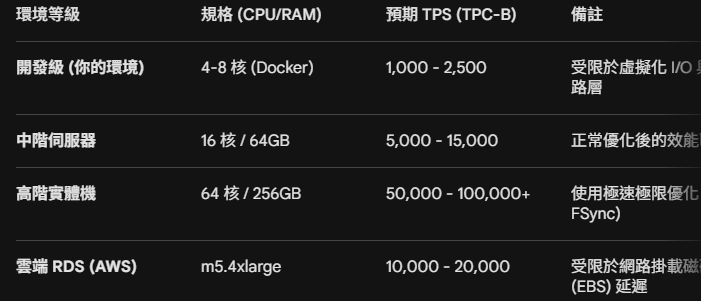
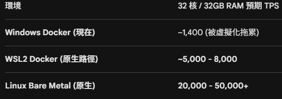

## *Benchmark Methods*

<br>

### *★　OLTP 壓力測試 ( Write )*
  ```
  測試特徵 :
  大量 INSERT / UPDATE
  短 transaction
  高 concurrency
  
  指標 :
  TPS (Transactions Per Second)
  p95 / p99 latency
  lock wait
  WAL write rate
  CPU usage
  IO write throughput
  
  常用工具 :
  ⭐ pgbench
  sysbench
  HammerDB
  
  常見 benchmark :
  TPC-C
  ```

<br>

### *★　OLAP 壓力測試 ( Read )*
  ```
  測試特徵 :
  大量 SELECT
  complex query
  aggregation
  scan / join
  
  指標 :
  QPS (Queries Per Second)
  query latency
  scan throughput
  CPU utilization
  memory usage
  
  常見 benchmark :
  ⭐ TPC-H
  TPC-DS
  ```

<br>

### *★　HTAP 壓力測試 ( Mix )*
  ```
  同時跑 :
  transaction workload
  analytic workload
  
  觀察 :
  OLTP TPS drop
  OLAP latency spike
  buffer cache eviction
  IO contention
  
  常見 benchmark :
  ⭐ CH-BenCHmark
  ```

<br>

### *★　Generic DB Benchmark Result*
- #### *[shm_size 64 MB](../docs/DB-Generic-Result-1.md) ( Docker Desktop )*
- #### *[shm_size 16 GB](../docs/DB-Generic-Result-2.md) ( WSL2 )*
- #### *業界基準單機性能*
- 
- #### *Windows 系統硬環境限制*
- 

<br><br><br>