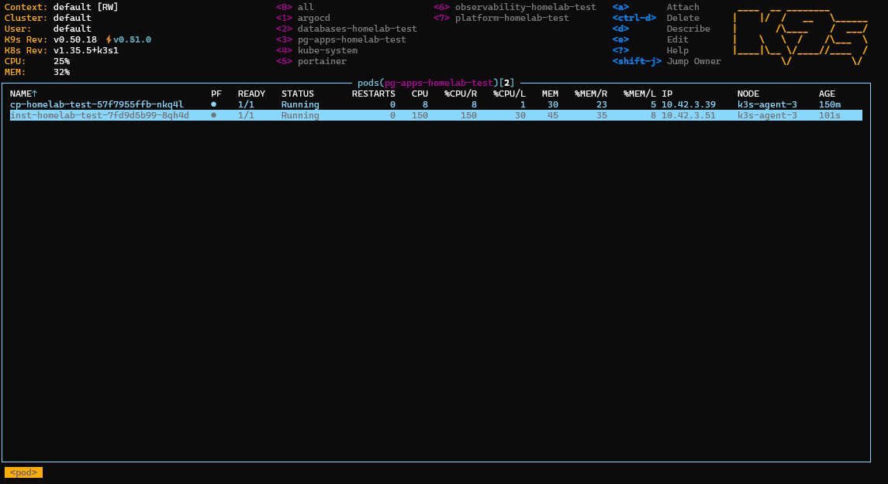

## *⭐ GitOps Deployment Governance Validation ⭐*

<br>

### *Document*

<details>
<summary><b><i>　I.　Quantitative Format </i></b></summary>
<ul>

```
Tier ??? : ???

Failure Scenario
 • 描述故障模型
 • 說明實際模擬的風險事件

Objective
 • 驗證 XXX 能力
 • 驗證 XXX 是否符合預期行為

Scope
 • 本次驗證範圍
 • 涵蓋元件
 • 不涵蓋元件

Situation
 • 測試前狀態
 • Cluster State
 • Application State

Action
 • 執行動作
 • 故障注入方式
 • 操作指令

Metrics
 • Recovery Time
 • Recovery Point
 • Detection Latency
 • Reconciliation Time
 • Availability
 • Failed Requests
 • Error Rate
 • Data Loss
 • Consistency
 • Throughput Impact

Pass Criteria
 • 通過標準
 • 預期行為
 • 可接受門檻

Evidence
 • kubectl output
 • ArgoCD Screenshot
 • Grafana Dashboard
 • Prometheus Metrics
 • Application Screenshot
 • Logs

Observation
 • 現象描述
 • 系統行為分析
 • 與預期是否一致

⚠️ Risk Assessment [ Unknown / Not Evaluated / Low / Medium / High ]
 • Availability Risk ....... Low
 • Operational Risk ........ Low
 • Data Integrity Risk ..... Low

Result
 • 實際量測結果
 • 指標數值
 • Timeline
 
Limitation
 • 測試環境限制
 • 樣本數限制
 • 工作負載限制

Known Limitation
 • 架構限制
 • 未覆蓋情境
 • 尚未驗證項目


Validation
 • ✅ PASS
 • ❌ FAIL
 • 📝 PLANNED
 • ⚪ NOT EVALUATED
 • ⛔ NOT APPLICABLE
 • 🗑️ SKIP ( OVERLAPPED )
```

</ul>
</details>


<details>
<summary><b><i>　II.　Quantitative List </i></b></summary>
<ul>

```
Tier 1 : State Reconciliation
 • ✅ 漂移檢測 : Drift Detection
 • ✅ 自動修復 : Auto Heal


Tier 2 : Deployment Lifecycle
 • ✅ 發布錯誤版本 : Git Rollback
    • target object: Images
 • ✅ 錯誤配置 : Configuration Rollout Failure
    • target object: Ingress / ConfigMap / Service
    • 配置錯誤 : → 發布 → 故障 → 發現 → 修復
 • 📝 漸進式部署 : Progressive Deployment
    • 打算多開 N 個指定應用 Pod 按照百分比漸進更新
 • ⚪ 多環境擴展 : Multi-Environment Promotion


Tier 3 : Platform Recovery
 • ✅ 一鍵集群啟動 : Cluster Bootstrap
 • ⚪ 災難復原 : Disaster Recovery


Tier 4 : Repository Governance
 • ✅ 多環境配置隔離 : Multi-Environment Configuration Isolation
    • 變更不同環境設定檔不會影響到其餘環境
 • ✅ GitOps 儲存庫設計 : GitOps Repository Architecture Validation
 
 
Tier 5 : Operational Governance
 • ⚪ 可審計性 : Auditability
 • ⚪ 變更審批工作流程 : Change Approval Workflow
 • 🗑️ 配置回滾 : Configuration Rollback
    • 和 Tier 2 : Configuration Rollout Failure 高度重複
      - [未知狀況] 打算先回到穩定版本 所以用 Git Rollback
      - [已知狀況] 所以直接從源頭修正配置 所以直接重新提交 Git Push
 
 
 
Quantitation Coverage
 • ✅ PASS .................. 7
 • ❌ FAIL .................. 0
 • 📝 PLANNED ............... 1
 • ⚪ NOT EVALUATED ......... 4
 • ⛔ NOT APPLICABLE ........ 0
 • 🗑️ SKIP ( OVERLAPPED ) ... 1
   Coverage ................. 53%
```

</ul>
</details>


<br>


### *★　Tier 1 : State Reconciliation*

<details>
<summary><b><i>　Drift Detection </i></b></summary>
<ul>

```
Failure Scenario
 • 叢集配置漂移
 • 在 GitOps 工作流程之外修改資源狀態
 • 期望狀態和實際狀態變得不一致

Objective
 • 驗證 ArgoCD 是否能偵測 Cluster 與 Git Repository 間的狀態偏移
 • 驗證未經 Git 提交流程的變更是否能被標記為 OutOfSync

Scope
 • ArgoCD
 • Kubernetes Deployment
 • Git Repository

Situation
 • Application 已正常運行
 • ArgoCD Status = Synced / Healthy
 • Git Repository 為最新版本

Action
 • 使用 kubectl scale 修改 Deployment Replica  → replicas 從 1 調整為 5
   kubectl scale deployment cp-homelab-test -n pg-apps-homelab-test --replicas=5
      
 • 不更新 Git Repository

Metrics
 • Detection Latency
 • Drift Identification Accuracy
 • Sync Status Transition Time

Pass Criteria
 • ArgoCD 正確偵測 Drift
 • Application 狀態變更為 OutOfSync
 • Drift 可於 UI 與 CLI 被觀察到
 • Detection Latency < 30 sec

Evidence
 • ArgoCD Application Status
 • kubectl get deployment
 • ArgoCD UI Screenshot

Observation
 • Cluster State 與 Desired State 發生偏離
 • ArgoCD 成功將 Application 標記為 OutOfSync
 • 未觀察到誤判情況

⚠️ Risk Assessment
 • Availability Risk ........ Low
 • Operational Risk ......... Low
 • Data Integrity Risk ...... None

Result
 • Detection Latency ........ 2 sec
 • Drift Identification ..... ✅
 • Sync Status .............. OutOfSync

Limitation
 • 僅驗證 Deployment Replica Drift
 • 未驗證 CRD 與 StatefulSet

Known Limitation
 • 未驗證跨 Cluster GitOps 管理情境
 • 未驗證大規模 Resource Drift


Validation: ✅ PASS
```

<details>
<summary><b><i>　🎬　Demo ( Drift Detection → Auto Heal ) </i></b></summary>
<ul>


</ul>
</details>


</ul>
</details>

<details>
<summary><b><i>　Auto Heal </i></b></summary>
<ul>

```
Failure Scenario
 • 叢集配置漂移
 • 在 GitOps 工作流程之外修改資源狀態
 • 期望狀態和實際狀態變得不一致
 • 未經授權的操作變更仍保留在叢集中
 
Objective
 • 驗證 ArgoCD Auto Sync 與 Self-Heal 機制是否能自動修復 Drift
 • 驗證系統是否能將實際狀態恢復至 Git Repository 定義之 Desired State
 • 驗證修復過程是否不需人工介入

Scope
 • ArgoCD
 • Kubernetes Deployment
 • Git Repository
 • State Reconciliation

Situation
 • Application 已正常運行
 • ArgoCD Status = Synced / Healthy
 • Auto Sync 已啟用
 • Self Heal 已啟用
 • Deployment Replica = 1

Action
 • 使用 kubectl scale 修改 Deployment Replica → replicas 從 1 調整為 5
   kubectl scale deployment cp-homelab-test -n pg-apps-homelab-test --replicas=5

 • 不更新 Git Repository
 • 觀察 ArgoCD 是否自動執行 Reconciliation

Metrics
 • Detection Latency
 • Reconciliation Time
 • Recovery Time
 • Availability
 • Consistency

Pass Criteria
 • ArgoCD 成功偵測 Drift
 • Application 狀態轉為 OutOfSync
 • ArgoCD 自動觸發 Reconciliation
 • Replica 數量恢復至 Git 定義值
 • Recovery Time < 60 sec
 • 全程不需人工介入

Evidence
 • ArgoCD Application Status
 • ArgoCD Sync History
 • kubectl get deployment
 • kubectl describe deployment
 • ArgoCD UI Screenshot

Observation
 • Replica 被手動調整後，Application 狀態變為 OutOfSync
 • ArgoCD 自動啟動 Reconciliation
 • Deployment Replica 恢復至 Git Repository 定義值
 • Application 狀態重新回到 Synced / Healthy
 • 全流程無需人工執行 Sync 或 Rollback

⚠️ Risk Assessment
 • Availability Risk ......... Low
 • Operational Risk .......... Low
 • Data Integrity Risk ....... None

Result
 • Detection Latency ......... 2 sec
 • Reconciliation Time ...... 42 sec
 • Recovery Time ............ 44 sec
 • Availability ............. Maintained
 • Consistency .............. Restored

Limitation
 • 僅驗證 Deployment Replica Drift
 • 未驗證 StatefulSet
 • 未驗證 Persistent Volume 相關資源

Known Limitation
 • 未驗證 CRD Drift Recovery
 • 未驗證 Secret Rotation 情境
 • 未驗證跨 Namespace 大規模 Drift
 • 未驗證 Multi-Cluster GitOps 管理情境


Validation: ✅ PASS
```


<details>
<summary><b><i>　🎬　Demo ( Drift Detection → Auto Heal ) </i></b></summary>
<ul>


</ul>
</details>


</ul>
</details>


<br>


### *★　Tier 2 : Deployment Lifecycle*

<details>
<summary><b><i>　Git Rollback </i></b></summary>
<ul>

```
Failure Scenario
 • 部署引用了不存在的映像標籤
 • 新工作負載無法啟動並進入 ImagePullBackOff 狀態
 • 由於發布工件無效，服務升級失敗

Objective
 • 驗證 GitOps 部署流程於錯誤版本發佈後，是否能透過 Git Commit Rollback 快速恢復至上一個穩定版本
 • 驗證 ArgoCD Reconciliation 機制是否能正確同步回滾結果
 • 驗證回滾過程是否維持服務一致性與資料完整性
 
Scope
 • Git Repository
 • ArgoCD Application
 • Kubernetes Deployment
 • Container Image Version
 
Situation
 • Application 正常運作
 • Deployment Image Tag 指向穩定版本
 • ArgoCD Application 狀態為 Synced / Healthy
 • Kafka 與相關資料流正常運行
  
Action
 • 修改 Helm Values 將 Image Tag 更新為不存在版本 tags=v99
 • Commit 並 Push 至 Git Repository
 • ArgoCD 自動同步後觸發 Deployment 更新
 • Pod 因無法拉取映像檔進入 ImagePullBackOff
 • 於 ArgoCD UI 執行 Rollback 至前一版 Git Commit
 
Metric
 • Detection Latency
 • Reconciliation Time
 • Recovery Time
 • Availability
 • Failed Requests
 • Error Rate
 • Data Loss
 • Consistency
 
Pass Criteria
 • 壞版本可被快速識別並停止部署
 • Rollback 後 Deployment 成功恢復至上一穩定版本
 • Pod 全數恢復 Ready 狀態
 • Recovery Time < 15 sec
 • 無資料遺失或資料一致性問題
 
Evidence
 • ArgoCD Rollback History
 • ArgoCD Application Status
 • kubectl rollout history deployment
 • kubectl get pods
 • K9s Workload Status
 • Application Health Check

Observation
 • 壞版本部署後，Pod 無法拉取映像檔並進入 ImagePullBackOff
 • Rollback 指令下達後，ArgoCD 立即觸發 Reconciliation
 • Deployment 成功恢復至前一穩定版本
 • Kafka 與應用程式資料流未觀察到異常
 • 本測試驗證的是 Infrastructure / Deployment Rollback，
   不涵蓋 Application-Level Transaction Rollback

⚠️ Risk Assessment
 • Availability Risk ......... Low
 • Operational Risk .......... Low
 • Data Integrity Risk ....... Low
 
Result
 • Detection Latency ......... 2 sec
 • ⭐ Recovery Time .......... 8 sec
 • Availability .............. Service Restored
 • Data Loss ................. None
 • Consistency ............... Verified
 • Timeline:
    T+0s   Deploy Invalid Image
    T+2s   Failure Detected
    T+3s   Rollback Triggered
    T+8s   Deployment Recovered
 
Limitation
 • 僅驗證單一 Deployment
 • 未模擬高流量生產環境
 • 未驗證 Stateful Workload

Known Limitation
 • 未驗證資料庫 Schema Migration 回滾情境
 • 未驗證跨服務相依性回滾情境
 • 未驗證 Multi-Service Release Coordination


Validation: ✅ PASS
```

<details>
<summary><b><i>　🎬　Demo </i></b></summary>
<ul>



</ul>
</details>


</ul>
</details>

<details>
<summary><b><i>　Configuration Rollout Failure </i></b></summary>
<ul>

```
Failure Scenario
 • 透過 GitOps 工作流程部署無效配置
 • 應用程式保持運行，但服務無法存取
 • 配置變更會導致功能中斷
 
Objective
 • 驗證錯誤配置經由 GitOps 發布後，是否能被快速識別與修復
 • 驗證 ArgoCD 是否能正確同步配置變更
 • 驗證系統於配置錯誤情境下之可恢復性

Scope
 • Git Repository
 • ArgoCD
 • Kubernetes Ingress
 • Application Service

Situation
 • Application 正常運行
 • ArgoCD Status = Synced / Healthy
 • Ingress 配置正確
 • Service 可正常存取

Action
 • 持續發送需求確認服務健康狀態
   TOTAL=0; SUCCESS=0; FAIL=0; echo "🚀 開始高頻容災測試 ( 每秒 20 次 )... 按 Ctrl+C 結束並查看統計報告"; trap 'echo -e "\n📊 【 容災統計報告 】\n總請求數: $TOTAL\n成功數 (302/200): $SUCCESS\n失敗數 (502/504/000): $FAIL\n⭐ HTTP 成功率: $(echo "scale=2; $SUCCESS * 100 / $TOTAL" | bc)%"' INT; while true; do CODE=$(curl -o /dev/null -s -w "%{http_code}" -H "Host: docker-registry.k8s.local" http://10.88.0.20/ --connect-timeout 1); TOTAL=$((TOTAL+1)); if [ "$CODE" = "200" ] || [ "$CODE" = "302" ]; then SUCCESS=$((SUCCESS+1)); echo "✅ Ingress 狀態正常 狀態碼: $CODE"; else FAIL=$((FAIL+1)); echo "❌ 抓到斷線! 狀態碼: $CODE"; fi; sleep 0.05; done
   
 • 修改 Ingress Host 為錯誤值
 • Commit 並 Push 至 Git Repository
 • 等待 ArgoCD 自動同步
 • 驗證服務存取失敗
 • 修正配置並再次提交 Git

Metrics
 • Detection Latency
 • Reconciliation Time
 • Recovery Time
 • Availability
 • Failed Requests
 • Error Rate

Pass Criteria
 • 錯誤配置成功同步至 Cluster
 • 故障現象可被明確觀察
 • 修正配置後服務恢復正常
 • Recovery Time < 5 min
 • 無需直接修改 Cluster 資源

Evidence
 • Git Commit History
 • ArgoCD Sync History
 • kubectl get ingress
 • Browser Access Result
 • Application Logs

Observation
 • Application Pod 維持 Running
 • Ingress 配置錯誤導致外部流量無法正確導向
 • ArgoCD 正常同步配置變更
 • 修正配置後服務恢復正常
 • 驗證 GitOps Workflow 為唯一變更入口

⚠️ Risk Assessment
 • Availability Risk ......... Medium
 • Operational Risk .......... Low
 • Data Integrity Risk ....... None

Result
 • Detection Latency .......... 2 sec
 • Reconciliation Time ........ 2 sec
 • Recovery Time ............. 20 sec
 • Failed Requests .......... 286 count
 • Error Rate ............... 43.40%
 

📊 【 容災統計報告 】
總請求數: 659
成功數 (302/200): 373
失敗數 (502/504/000): 286
⭐ HTTP 成功率: 56.60%


Limitation
 • 僅驗證 Ingress Configuration
 • 未驗證 ConfigMap 與 Service Configuration

Known Limitation
 • 未驗證 Application Runtime Configuration
 • 未驗證 Database Connection Configuration
 • 未驗證 Multi-Service Dependency Configuration


Validation: ✅ PASS
```

<details>
<summary><b><i>　🎬　Demo </i></b></summary>
<ul>


</ul>
</details>


</ul>
</details>

<details>
<summary><b><i>　Progressive Deployment </i></b></summary>
<ul>

```
Failure Scenario
 • 新版本部署後導致功能退化 ( Regression ) 或服務不穩定
 • RollingUpdate 過程中可能出現 Pod 啟動失敗、Readiness Probe 異常或應用程式錯誤，進而影響服務可用性

Objective
 • 驗證工作負載更新是否能以漸進方式完成部署，同時將服務中斷時間降至最低
 • 驗證 Kubernetes RollingUpdate 機制是否符合預期行為

Scope
 • Kubernetes Deployment
 • RollingUpdate Strategy
 • ArgoCD Sync Process
 • Application Availability

Situation
 • Application 正常運行中
 • Deployment 副本數大於 1
 • RollingUpdate 策略已啟用
 • ArgoCD 處於 Synced / Healthy 狀態

Action
 • 更新 Deployment Image Tag
 • 透過 Git Commit 觸發 ArgoCD Sync
 • 觀察 RollingUpdate 過程中的 Pod 替換行為
 • 監控服務可用性與錯誤率變化

Metrics
 • Availability
 • Failed Requests
 • Error Rate
 • Rollout Completion Time
 • Rollback Time

Pass Criteria
 • 部署期間服務持續可用
 • 新版 Pod 成功取代舊版 Pod
 • 無異常 CrashLoopBackOff
 • Error Rate 維持於可接受範圍內
 • Rollout 完成後 ArgoCD 狀態維持 Healthy

Evidence
 • kubectl rollout status
 • kubectl get pods
 • ArgoCD Application Status
 • Grafana Dashboard

Observation
 • 預期 RollingUpdate 將逐步替換 Pod，而非一次性終止所有工作負載
 • 預期部署期間服務可維持連續運作

⚠️ Risk Assessment
 • Availability Risk .......... Medium
 • Operational Risk ........... Low
 • Data Integrity Risk ........ Low
 
Result: 尚未驗證

Limitation
 • Homelab 環境工作負載規模有限
 • 無法模擬高併發流量場景
 • 無法驗證大型叢集部署行為

Known Limitation
 • Canary Deployment 與 Blue-Green Deployment 尚未納入目前 Homelab 驗證範圍
 • 本次規劃僅聚焦於 Kubernetes RollingUpdate 行為
 • 尚未驗證 Progressive Delivery Controller ( ex: Argo Rollouts )


Validation: 📝 PLANNED
```

</ul>
</details>

<details>
<summary><b><i>　Multi-Environment Promotion </i></b></summary>
<ul>

```
Failure Scenario
 • 版本升級流程涉及 TEST、STAGE 與 PROD 等多個環境
 • Promotion 過程若配置錯誤，可能導致錯誤版本被發布至非目標環境
 • 環境隔離不足可能造成跨環境設定互相污染

Objective
 • 驗證 GitOps Repository 是否具備 Multi-Environment Promotion 設計能力
 • 驗證環境配置是否具備獨立管理與隔離能力
 • 驗證未來擴展至多環境部署流程的可行性

Scope
 • GitOps Repository Architecture
 • Helm Values
 • Environment Overlay
 • ArgoCD Application Definition

Situation
 • Homelab 目前僅運行單一 Kubernetes Cluster
 • 所有服務部署於同一叢集內
 • Repository 已建立環境配置分層結構
 • 尚未建立獨立 TEST、STAGE、PROD Cluster

Action
 • 檢視 GitOps Repository 結構設計
 • 檢查環境配置分離策略
 • 評估未來 Multi-Environment Promotion 工作流程
 • 分析 Promotion 所需之 Repository Organization

Metrics
 • Environment Isolation
 • Configuration Segregation
 • Promotion Path Completeness
 • Repository Maintainability

Pass Criteria
 • Repository 能支援環境配置分離
 • 不同環境設定具備獨立管理能力
 • Promotion Workflow 具備可擴展性
 • 未來可擴展至 Multi-Cluster Architecture

Evidence
 • Git Repository Structure
 • Directory Layout
 • Helm Values Hierarchy
 • Environment Overlay Design
 • Architecture Diagram

Observation
 • Repository 已建立環境配置分離設計
 • Environment-specific Values 可支援未來環境隔離需求
 • Promotion Workflow 已完成架構規劃
 • 由於缺乏額外 Cluster 資源，實際 Promotion 流程尚未驗證

⚠️ Risk Assessment
 • Availability Risk : Not Evaluated
 • Operational Risk : Medium
 • Data Integrity Risk : Unknown

Result
 • Repository Architecture Review Completed
 • Multi-Environment Design Verified
 • Cross-Environment Promotion Not Evaluated

Limitation
 • Homelab 硬體資源不足以同時運行多個 Kubernetes Clusters
 • 無法建立完整 TEST / STAGE / PROD 環境
 • 無法驗證實際 Promotion Workflow

Known Limitation
 • Multi-Cluster Promotion Workflow 尚未驗證
 • Cross-Environment Deployment 尚未驗證
 • Promotion Failure Recovery 尚未驗證
 • Validation 結果僅限於 Repository 與 Architecture Design Review
 • 未來需於多叢集環境進行實際驗證


Validation: ⚪ NOT EVALUATED
```

</ul>
</details>


<br>


### *★　Tier 3 : Platform Recovery*

<details>
<summary><b><i>　Cluster Bootstrap </i></b></summary>
<ul>

```
Failure Scenario
 • 

Objective
 • 

Scope
 • 

Situation
 • 

Action
 • 

Metrics
 • 

Pass Criteria
 • 

Evidence
 • 

Observation
 • 

⚠️ Risk Assessment
 • 

Result
 • 
 
Limitation
 • 

Known Limitation
 • 


Validation
 • 
```

</ul>
</details>

<details>
<summary><b><i>　Disaster Recovery </i></b></summary>
<ul>

```
Failure Scenario
 • 

Objective
 • 

Scope
 • 

Situation
 • 

Action
 • 

Metrics
 • 

Pass Criteria
 • 

Evidence
 • 

Observation
 • 

⚠️ Risk Assessment
 • 

Result
 • 
 
Limitation
 • 

Known Limitation
 • 


Validation
 • 
```

</ul>
</details>


<br>


### *★　Tier 4 : Repository Governance*

<details>
<summary><b><i>　Multi-Environment Configuration Isolation </i></b></summary>
<ul>

```
Failure Scenario
 • 修改 test 環境配置時，意外影響 stage 或 prod 環境設定
 • Environment-specific Values 發生交叉引用或配置污染
 • GitOps Repository 缺乏環境邊界，導致不同環境部署結果不一致

Objective
 • 驗證不同環境配置是否具備隔離能力
 • 驗證變更單一 Environment Values 後，不會影響其他環境配置
 • 驗證 GitOps Repository 是否具備 Environment Boundary

Scope
 • Git Repository
 • Environment Values Files
 • ArgoCD ApplicationSet
 • Helm Values Overlay

Situation
 • Repository 已建立:
       environments/
       ├── homelab-test
       ├── homelab-stage
       └── homelab-prod

 • 各環境皆維護獨立 Values File
 • ApplicationSet 依環境載入對應設定

Action
 • 修改 homelab-test ex: replicaCount: 1 -> 2
 • 執行： git commit & push
 • 檢查對應 Values File
     • homelab-stage
     • homelab-prod
 • 確認未產生非預期變更

Metrics
 • 受影響的環境計數
 • 意外的配置漂移
 • 配置隔離率
 • Git 更改範圍

Pass Criteria
 • 僅目標 Environment 發生配置變更
 • Stage / Prod Values File 無變動
 • Git Diff 僅出現在目標環境目錄
 • Isolation Rate = 100%

Evidence
 • Git Diff
 • Pull Request
 • Repository Tree
 • ArgoCD Application
 • Environment Values Files

Observation
 • Environment-specific Values 可獨立維護
 • Repository Structure 已具備環境隔離能力
 • Git 變更範圍可透過目錄結構清楚追蹤
 • 未觀察到配置交叉污染

⚠️ Risk Assessment
 • Availability Risk ............. Low
 • Operational Risk .............. Low
 • Data Integrity Risk ........... Low

Result
 • 受影響的環境計數 ................... 1 ( TEST 受變更影響 → 其餘 STAGE / PROD 皆未干擾到 TEST )
 • 意外的配置漂移 .................... 0%
 • 配置隔離率 ..................... 100%
 • Validation Time .............. 90 sec
 
Limitation
 • 測試於單一 Kubernetes Cluster 進行
 • 未驗證實際跨環境部署行為
 • 未驗證不同 Cluster 間的 Promotion 流程

Known Limitation
 • Homelab 硬體資源不足以維運多套 Kubernetes Cluster
 • Stage / Prod Environment 為邏輯隔離設計
 • 尚未驗證實際 Multi-Cluster Promotion


Validation: ✅ PASS
```

<details>
<summary><b><i>　🎬　Demo </i></b></summary>
<ul>


</ul>
</details>


</ul>
</details>

<details>
<summary><b><i>　GitOps Repository Architecture Validation </i></b></summary>
<ul>

```
Failure Scenario
 • GitOps Repository 缺乏標準化結構
 • 應用程式、平台元件與環境設定混雜於同一層級
 • 隨專案規模成長導致維護成本增加
 • 環境設定耦合造成變更風險提升

Objective
 • 驗證 GitOps Repository 是否具備清晰的分層架構
 • 驗證 Repository 是否支援環境隔離與未來擴展需求
 • 驗證 GitOps 管理模式是否符合 Infrastructure-as-Code 原則

Scope
 • Git Repository Structure
 • ArgoCD ApplicationSet
 • Helm Charts
 • Environment Configuration
 • Bootstrap Components

Situation
 • Homelab 採用 Monorepo GitOps Repository
 • 所有 Kubernetes 資源透過 Git 作為唯一事實來源 ( Single Source of Truth )
 • ArgoCD 負責持續同步與狀態管理

Action
 • 檢視 Repository 分層架構
 • 檢查 Application、Chart、Environment 是否完成職責分離
 • 檢查 Bootstrap 與 Day-2 Operation 是否分離管理
 • 檢查是否具備多環境配置能力

Metrics
 • Repository Layer Separation
 • Environment Isolation Capability
 • Application Onboarding Complexity
 • Configuration Reusability
 • Structural Consistency

Pass Criteria
 • 應用程式與平台元件具備獨立管理邊界
 • Chart 與 Environment Configuration 完成解耦
 • Bootstrap 元件與 Day-2 Operations 分離
 • Repository 可支援未來新增環境而無須重構目錄結構
 • GitOps 管理流程具備一致性

Evidence
 • Repository Tree Structure
 • ArgoCD Root Application
 • ApplicationSet Definitions
 • Environment Values Files
 • Bootstrap Scripts

Observation
 • 採用 Domain-based 結構管理平台元件
 • Helm Chart 與 Environment Values 分離
 • ApplicationSet 統一管理應用程式生命週期
 • Bootstrap 流程可獨立完成 Cluster 初始化
 • Repository 已預留 test / stage / prod 環境配置能力

⚠️ Risk Assessment
 • Availability Risk .................. Low
 • Operational Risk ................... Low
 • Data Integrity Risk ................ Not Applicable

Result
 • Repository Layer Separation ........ ✅
 • Environment Isolation Capability ... ✅
 • Configuration Reusability .......... ✅
 • Structural Consistency ............. ✅

Limitation
 • 本驗證屬架構設計審查
 • 未涵蓋實際多團隊協作情境
 • 未量測大型組織規模下之維運成本

Known Limitation
 • test / stage / prod 環境目前共用單一 Kubernetes Cluster
 • Multi-Cluster GitOps Architecture 尚未實際部署驗證
 • Environment Promotion Workflow 尚未完成驗證


Validation: ✅ PASS
```


<details>
<summary><b><i>　GitOps Repository Tree </i></b></summary>
<ul>

```
.
├── README.md
├── argocd
│   ├── applications
│   │   ├── databases
│   │   │   └── postgresql-appset.yaml
│   │   ├── observability
│   │   │   ├── grafana-appset.yaml
│   │   │   ├── loki-appset.yaml
│   │   │   ├── prometheus-stack-appset.yaml
│   │   │   ├── promtail-appset.yaml
│   │   │   └── tempo-appset.yaml
│   │   ├── other
│   │   │   └── kustomization.yaml
│   │   ├── pg-apps
│   │   │   ├── cp-appset.yaml
│   │   │   └── inst-appset.yaml
│   │   ├── platform
│   │   │   ├── harbor-appset.yaml
│   │   │   ├── ingress-nginx-appset.yaml
│   │   │   └── registry-appset.yaml
│   │   ├── security
│   │   │   └── vault-appset.yaml
│   │   └── storage
│   │       └── nfs-storage-appset.yaml
│   ├── kustomization.yaml
│   ├── projects
│   │   ├── databases.yaml
│   │   ├── observability.yaml
│   │   ├── pg-apps.yaml
│   │   ├── platform.yaml
│   │   ├── security.yaml
│   │   └── storage.yaml
│   └── root-app.yaml
├── bootstrap
│   └── cluster
│       ├── argocd
│       │   ├── ingress.yaml
│       │   ├── namespace.yaml
│       │   ├── repo-secret.yaml
│       │   └── values.yaml
│       ├── cert-manager
│       │   ├── cluster-issuer.yaml
│       │   ├── namespace.yaml
│       │   └── values.yaml
│       ├── ingress-nginx
│       │   ├── namespace.yaml
│       │   └── values.yaml
│       ├── scripts
│       │   └── bootstrap-cluster.sh
│       └── sealed-secrets
│           ├── namespace.yaml
│           └── values.yaml
├── charts
│   ├── databases
│   │   └── postgresql
│   │       ├── Chart.lock
│   │       ├── Chart.yaml
│   │       ├── charts
│   │       │   └── postgresql
│   │       ├── templates
│   │       │   ├── postgres-init-configmap.yaml
│   │       │   └── secret.yaml
│   │       └── values
│   │           └── common.yaml
│   ├── observability
│   │   ├── grafana
│   │   │   ├── Chart.lock
│   │   │   ├── Chart.yaml
│   │   │   ├── charts
│   │   │   │   └── grafana
│   │   │   └── values
│   │   │       └── common.yaml
│   │   ├── loki
│   │   │   ├── Chart.lock
│   │   │   ├── Chart.yaml
│   │   │   ├── charts
│   │   │   │   └── loki
│   │   │   └── values
│   │   │       └── common.yaml
│   │   ├── prometheus
│   │   │   ├── Chart.yaml
│   │   │   └── values
│   │   │       └── common.yaml
│   │   ├── prometheus-stack
│   │   │   ├── Chart.lock
│   │   │   ├── Chart.yaml
│   │   │   ├── charts
│   │   │   │   └── kube-prometheus-stack
│   │   │   └── values
│   │   │       └── common.yaml
│   │   ├── promtail
│   │   │   ├── Chart.lock
│   │   │   ├── Chart.yaml
│   │   │   ├── charts
│   │   │   │   └── promtail
│   │   │   └── values
│   │   │       └── common.yaml
│   │   └── tempo
│   │       ├── Chart.lock
│   │       ├── Chart.yaml
│   │       ├── charts
│   │       │   └── tempo-distributed
│   │       ├── templates
│   │       │   └── ingress.yaml
│   │       └── values
│   │           └── common.yaml
│   ├── pg-apps
│   │   ├── cp
│   │   │   ├── Chart.yaml
│   │   │   ├── templates
│   │   │   │   └── deployment.yaml
│   │   │   └── values
│   │   │       └── common.yaml
│   │   └── inst
│   │       ├── Chart.yaml
│   │       ├── templates
│   │       │   ├── deployment.yaml
│   │       │   └── hpa.yaml
│   │       └── values
│   │           └── common.yaml
│   ├── platform
│   │   ├── harbor
│   │   │   ├── Chart.lock
│   │   │   ├── Chart.yaml
│   │   │   ├── charts
│   │   │   │   └── harbor
│   │   │   └── values
│   │   │       └── common.yaml
│   │   ├── ingress-nginx
│   │   │   ├── Chart.lock
│   │   │   ├── Chart.yaml
│   │   │   ├── charts
│   │   │   │   └── ingress-nginx
│   │   │   └── values
│   │   │       └── common.yaml
│   │   └── registry
│   │       ├── Chart.yaml
│   │       ├── output.log
│   │       ├── templates
│   │       │   ├── deployment.yaml
│   │       │   ├── ingress.yaml
│   │       │   ├── pvc.yaml
│   │       │   └── service.yaml
│   │       └── values
│   │           └── common.yaml
│   ├── security
│   │   └── vault
│   │       └── values
│   │           └── common.yaml
│   └── storage
│       └── nfs-storage
│           ├── Chart.yaml
│           ├── templates
│           │   ├── pv.yaml
│           │   └── pvc.yaml
│           └── values
│               └── common.yaml
├── environments
│   ├── homelab-prod
│   │   ├── cp-values.yaml
│   │   ├── grafana-values.yaml
│   │   ├── ingress-nginx-values.yaml
│   │   ├── inst-values.yaml
│   │   ├── loki-values.yaml
│   │   ├── nfs-storage-values.yaml
│   │   ├── postgresql-values.yaml
│   │   ├── prometheus-stack-values.yaml
│   │   ├── prometheus-values.yaml
│   │   ├── promtail-values.yaml
│   │   ├── registry-values.yaml
│   │   ├── tempo-values.yaml
│   │   └── vault-values.yaml
│   ├── homelab-stage
│   │   ├── cp-values.yaml
│   │   ├── grafana-values.yaml
│   │   ├── ingress-nginx-values.yaml
│   │   ├── inst-values.yaml
│   │   ├── loki-values.yaml
│   │   ├── nfs-storage-values.yaml
│   │   ├── postgresql-values.yaml
│   │   ├── prometheus-stack-values.yaml
│   │   ├── prometheus-values.yaml
│   │   ├── promtail-values.yaml
│   │   ├── registry-values.yaml
│   │   ├── tempo-values.yaml
│   │   └── vault-values.yaml
│   └── homelab-test
│       ├── cp-values.yaml
│       ├── grafana-values.yaml
│       ├── ingress-nginx-values.yaml
│       ├── inst-values.yaml
│       ├── loki-values.yaml
│       ├── nfs-storage-values.yaml
│       ├── postgresql-values.yaml
│       ├── prometheus-stack-values.yaml
│       ├── prometheus-values.yaml
│       ├── promtail-values.yaml
│       ├── registry-values.yaml
│       ├── tempo-values.yaml
│       └── vault-values.yaml
├── output.yaml
├── policies
│   ├── deny-privileged-pods.yaml
│   └── network-isolation.yaml
└── templates
    ├── app-deployment.yaml
    └── ingress-template.yaml
```

</ul>
</details>

</ul>
</details>


<br>


### *★　Tier 5 : Operational Governance*

<details>
<summary><b><i>　Auditability </i></b></summary>
<ul>

```
Failure Scenario
 • 發生服務異常後，無法追溯配置變更來源、操作者及變更時間

Objective
 • 驗證 GitOps Workflow 是否具備變更可追溯能力
 • 驗證系統狀態是否可對應至 Git Commit History

Scope
 • Git Repository
 • ArgoCD
 • Git Commit History

Situation
 • 所有 Kubernetes 資源皆透過 GitOps 管理

Action
 • 檢查 Git Commit History
 • 檢查 ArgoCD Sync History
 • 比對目前 Cluster State

Metrics
 • Change Traceability
 • Commit Attribution
 • Deployment History Retention

Pass Criteria
 • 所有配置變更皆可對應 Git Commit
 • 可識別變更時間與內容
 • ArgoCD 可顯示同步歷史紀錄

Evidence
 • None

Observation
 • None

⚠️ Risk Assessment
 • None

Result
 • 未實施
 
Limitation
 • None

Known Limitation
 • 單人維運環境
 • 未導入 Pull Request Review、Branch Protection、RBAC Approval Workflow
 • 僅驗證技術層面的 Traceability，未驗證組織層級的 Governance Process


Validation: ⚪ NOT EVALUATED
```

</ul>
</details>

<details>
<summary><b><i>　Change Approval Workflow </i></b></summary>
<ul>

```
Failure Scenario
 • 未經審核的配置變更直接進入正式環境
 • 錯誤配置、錯誤映像版本或高風險變更缺乏事前審查機制
 • 發生事故後無法確認變更是否經過授權與批准

Objective
 • 驗證 GitOps Workflow 是否具備變更審批能力
 • 驗證正式環境變更是否可透過標準化流程進行控制與授權
 • 驗證高風險配置變更是否具備事前審查機制

Scope
 • Git Repository
 • Pull Request Workflow
 • Branch Protection
 • ArgoCD Deployment Workflow

Situation
 • 所有 Kubernetes 配置皆透過 Git Repository 管理
 • Homelab 採單人維運模式
 • 未導入 Pull Request Review 與 Branch Protection 機制

Action
 • 檢查現行 GitOps 工作流程
 • 評估 Pull Request Approval 整合可行性
 • 評估 Branch Protection Policy 設計方案

Metrics
 • Approval Coverage
 • Unauthorized Change Rate
 • Change Review Rate
 • Approval Latency

Pass Criteria
 • 所有正式環境變更皆需經過審批流程
 • 未授權變更不得直接進入部署流程
 • 變更紀錄可追溯至審批紀錄

Evidence
 • Git Repository Structure
 • Branch Strategy Documentation
 • Git Workflow Design
 • Future Governance Architecture

Observation
 • GitOps 已提供配置集中管理與版本追蹤能力
 • 目前仍缺乏組織層級 Change Approval 機制
 • 單人維運環境無法驗證 Reviewer 與 Approver 分離情境

⚠️ Risk Assessment
 • Availability Risk ...... Not Evaluated
 • Operational Risk ....... Medium
 • Data Integrity Risk .... Not Evaluated

Result
 • 未實施
 • 未建立正式 Change Approval Workflow
 • 未驗證 Pull Request Review 與 Branch Protection Policy

Limitation
 • Homelab 為單人開發與維運環境
 • 缺乏獨立 Reviewer 與 Approver 角色
 • 無法模擬企業級變更管理流程

Known Limitation
 • 未導入 Pull Request Approval
 • 未導入 Branch Protection Rules
 • 未導入 RBAC-based Change Governance
 • 未驗證多角色協作情境


Validation: ⚪ NOT EVALUATED
```

</ul>
</details>

<details>
<summary><b><i>　Configuration Rollback </i></b></summary>
<ul>

```
Failure Scenario
 • 

Objective
 • 

Scope
 • 

Situation
 • 

Action
 • 

Metrics
 • 

Pass Criteria
 • 

Evidence
 • 

Observation
 • 

⚠️ Risk Assessment
 • 

Result
 • 
 
Limitation
 • 

Known Limitation
 • 


Validation
 • 
```

</ul>
</details>


<br>


### *⭐　Final Statistics*
```
Validated Capabilities

✓ ???
✓ ???
✓ ???
✓ ???
✓ ???
```