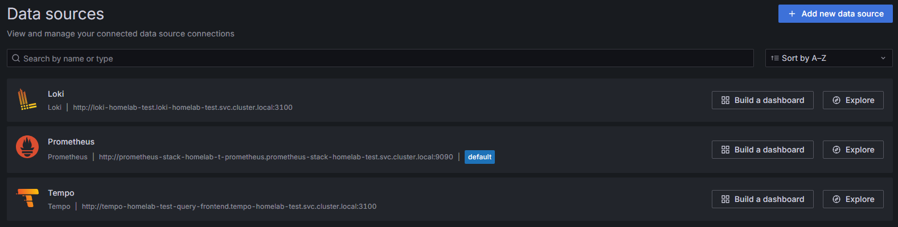

## *K8s - 日誌統一收集與發送*


### *A.　流程說明*
```
Node1
├── Kubelet
├── Pods
└── Promtail ( *DaemonSet ) # /var/log/containers/*

Node2
├── Kubelet
├── Pods
└── Promtail ( *DaemonSet ) # /var/log/containers/*

Node3
├── Kubelet
├── Pods
└── Promtail ( *DaemonSet ) # /var/log/containers/*

    ↓
  Loki
    ↓
 Grafana
```



```
$ kubectl get pods -n promtail -o wide
NAME             READY   STATUS    RESTARTS   AGE    IP           NODE         NOMINATED NODE   READINESS GATES
promtail-4nkxv   1/1     Running   0          104m   10.42.0.29   k3s-node-0   <none>           <none>
promtail-b89dw   1/1     Running   0          104m   10.42.1.66   k3s-node-2   <none>           <none>
promtail-sj8w7   1/1     Running   0          104m   10.42.3.75   k3s-node-1   <none>           <none>

$ kubectl get pods -n loki -o wide
NAME                                           READY   STATUS    RESTARTS   AGE     IP           NODE         NOMINATED NODE   READINESS GATES
loki-backend-0                                 2/2     Running   0          4m42s   10.42.3.82   k3s-node-1   <none>           <none>
loki-backend-1                                 2/2     Running   0          4m41s   10.42.1.76   k3s-node-2   <none>           <none>
loki-backend-2                                 2/2     Running   0          4m41s   10.42.0.35   k3s-node-0   <none>           <none>
loki-canary-h57cr                              1/1     Running   0          4m42s   10.42.0.30   k3s-node-0   <none>           <none>
loki-canary-qbsmg                              1/1     Running   0          4m42s   10.42.3.77   k3s-node-1   <none>           <none>
loki-canary-xj8wh                              1/1     Running   0          4m42s   10.42.1.69   k3s-node-2   <none>           <none>
loki-gateway-664dc8b498-56k7l                  1/1     Running   0          4m42s   10.42.1.71   k3s-node-2   <none>           <none>
loki-grafana-agent-operator-555b65b9f6-l9vsq   1/1     Running   0          4m42s   10.42.1.70   k3s-node-2   <none>           <none>
loki-logs-ldg8c                                2/2     Running   0          4m19s   10.42.1.77   k3s-node-2   <none>           <none>
loki-logs-rmk5j                                2/2     Running   0          4m19s   10.42.0.36   k3s-node-0   <none>           <none>
loki-logs-v85hj                                2/2     Running   0          4m19s   10.42.3.83   k3s-node-1   <none>           <none>
loki-read-84f7654c5f-f86qm                     1/1     Running   0          4m42s   10.42.3.78   k3s-node-1   <none>           <none>
loki-read-84f7654c5f-gppfj                     1/1     Running   0          4m42s   10.42.0.31   k3s-node-0   <none>           <none>
loki-read-84f7654c5f-t8ndt                     1/1     Running   0          4m42s   10.42.1.72   k3s-node-2   <none>           <none>
loki-write-0                                   1/1     Running   0          4m42s   10.42.1.75   k3s-node-2   <none>           <none>
loki-write-1                                   1/1     Running   0          4m41s   10.42.0.34   k3s-node-0   <none>           <none>
loki-write-2                                   1/1     Running   0          4m41s   10.42.3.81   k3s-node-1   <none>           <none>         <none>
```

<br><br><br>