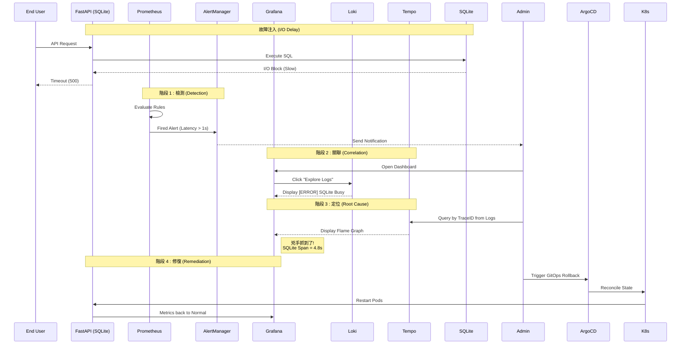

## *⭐ Observability Platform Validation: SQLite I/O Hysteresis ⭐*

<br>

### *A.　Task Design*

<details open>
<summary><b><i>　Task Description </i></b></summary>
<ul>

```
故障注入:
 • 對 FastAPI 應用掛載的 SQLite Volume 注入人工延遲 ( Fault Injection )

預期行為:
 • Detection: Prometheus 觸發延遲告警
 • Correlation: 工程師利用 TraceID 关联 Logs 與 Traces
 • Root Cause: 定位問題點在於 SQLite 層而非應用程式邏輯
 • Recovery: GitOps 自動修復 ( 或手動 Rollback )恢復正常
```

</ul>
</details>

<details open>
<summary><b><i>　Task Implementation Steps </i></b></summary>
<ul>

```
Phase 1: Baseline ( Pre-Incident )
 • 在故障注入前，確認系統處於健康基準線狀態

Phase 2: Detection & Correlation ( Incident Simulation )
 • 此階段開始注入故障。觀察觀測平台如何發出訊號並引導調查

Phase 3: Root Cause Analysis ( Tempo Tracing )
 • 此階段利用分散式追蹤技術，精準定位問題發生的 Span

Phase 4: Remediation & Verification ( Post-Incident )
 • 確認根因後，執行修復操作，並驗證系統恢復
```

</ul>
</details>


<br><br>

#### *★　Phase 1 : Baseline ( Pre-Incident )*

<details>
<summary><b><i>　1.1 Application Overview ( Grafana ) </i></b></summary>
<ul>

```
 • 展示 FastAPI 連接 SQLite 的正常服務狀態
 
 • Request Rate: 穩定
 
 • P99 Latency: 低於 200ms
 
 • SQLite Connections: 正常
 
 • Evidence: Pre-Incident Dashboard
   [截圖: 正常狀態下的 Grafana Dashboard]
```

</ul>
</details>

<details>
<summary><b><i>　1.2 Infrastructure Health ( Grafana ) </i></b></summary>
<ul>

```
 • 展示節點與 Pod 的基礎資源使用率正常
 
 • CPU/Memory: 平穩
 
 • Disk I/O: 平穩
 
 • Evidence: Pre-Incident Node Exporter
   [截圖: 節點資源監控]
```

</ul>
</details>

<br>

#### *★　Phase 2: Detection & Correlation ( Incident Simulation )*

<details>
<summary><b><i>　2.1 Alerting ( AlertManager UI ) </i></b></summary>
<ul>

```
 • 模擬 I/O 壓力導致請求超時，觸發 Prometheus 告警規則
 
 • Evidence: Fired Alert Rule
   [截圖: AlertManager Firing 狀態]
```

</ul>
</details>

<details>
<summary><b><i>　2.2 Metric to Log Correlation ( Grafana Explore ) </i></b></summary>
<ul>

```
 • 展示工程師如何從 Grafana 的 Alert 面板，一鍵跳轉至 Loki 查看該時間段的原始日誌
 
 • 操作路徑：Alert Panel -> "Explore" -> Switch to Logs data source
 
 • 發現: 日誌中出現大量 [SQLITE_BUSY] 或連接超時錯誤
 
 • Evidence: Grafana Explore - Logs correlated with Metrics
   [截圖: Grafana Explore 畫面，展示 Log 與 Metric 重疊]
```

</ul>
</details>

<br>

#### *★　Phase 3: Root Cause Analysis ( Tempo Tracing )*

<details>
<summary><b><i>　3.1 Trace Contextualization </i></b></summary>
<ul>

```
 • 工程師從日誌中提取 TraceID，並在 Tempo 中開啟完整的請求鏈路
 
 • 發現: 單筆請求耗時從 200ms 飆升至 5s+
 
 • Evidence: Tempo Trace View - Anomalous Trace
   [截圖: Tempo 顯示單一長 Trace]
```

</ul>
</details>

<details>
<summary><b><i>　3.2 Flame Graph Analysis ( Root Cause Identification ) </i></b></summary>
<ul>

```
 • 透過火焰圖 (Flame Graph) 視覺化展示，證實延遲並非發生在 FastAPI 業務邏輯，
   而是卡在底層的 SQLite I/O 操作
   
 • 瓶頸 Span: sqlite3.commit 或 execute 佔用了 95% 的時間
 
 • Evidence: Tempo Flame Graph - SQLite I/O Block
   [截圖: 在此處放入顯示 sqlite 呼叫耗時過長的火焰圖]
```

</ul>
</details>

<br>

#### *★　Phase 4: Remediation & Verification ( Post-Incident )*

<details>
<summary><b><i>　4.1 Remediation Action ( ArgoCD ) </i></b></summary>
<ul>

```
 • 執行 GitOps Rollback ( 或修正 PVC 掛載 )，ArgoCD 開始進行狀態調和 ( Reconciliation )
```

</ul>
</details>

<details>
<summary><b><i>　4.2 Verification (Grafana) </i></b></summary>
<ul>

```
 • 驗證修復後的系統指標，P99 Latency 恢復至基準線

 • Evidence: Post-Incident Dashboard ( Recovery Verified )
   [截圖: Grafana Dashboard]
```

</ul>
</details>

<br><br>

### *B.　End-to-End RCA Pipeline Statistics*
| Phase | Metric | Definition | Time Measurement |
|:--|:--:|:--|--:|
| P2. Detection | MTTD | Mean Time To Detect<br>( 從故障注入到 AlertManager 發出通知 ) | - sec |
| P3. Analysis | MTTI | Mean Time To Identify<br>( 從收到告警到在 Tempo 定位 Flame Graph ) | - sec |
| P4. Recovery | MTTR | Mean Time To Recover<br>( 從執行修復指令到 Grafana 指標恢復 ) | - sec |
| Total | TTR | Total Time to Resolution | - sec |

<br>

### *C.　Diagnostic Flow*



<br><br><br>