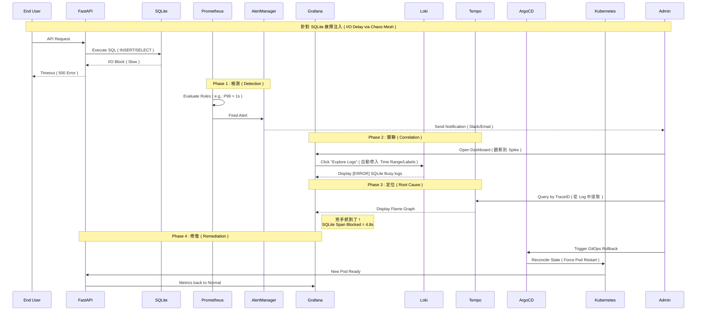
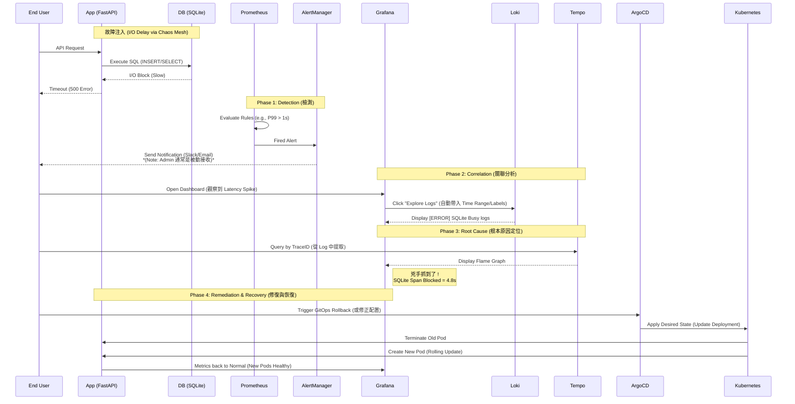

## *⭐ Observability Platform Validation: SQLite I/O Hysteresis ⭐*

<br>

### *A.　Task Design*

<details open>
<summary><b><i>　Task Description </i></b></summary>
<ul>

```
情境模擬:
 • 模擬真實場景：當底層儲存發生異常導致 I/O 延遲時，
   觀測平台如何協助工程師在短時間內完成從「發現告警」到「定位根因」的全過程


故障注入:
 • 工具: Chaos Mesh ( v2.0+ )
 • 對象: FastAPI 應用掛載之 SQLite Volume ( PVC )
 • 手段: 注入 500ms 之網路延遲抖動 ( Jitter )，模擬慢速磁碟 ( Slow Disk ) 行為
   

預期行為:
 • Detection: Prometheus 觸發 P99 Latency 超時告警
 • Correlation: 工程師利用 TraceID 關聯 Logs 與 Traces
 • Root Cause: 定位問題點在於 SQLite I/O Block，而非應用程式業務邏輯
 • Recovery: GitOps 自動觸發狀態調和 ( Reconciliation ) 並重啟 Pod 恢復正常
```

</ul>
</details>

<details open>
<summary><b><i>　Task Implementation Steps </i></b></summary>
<ul>

```
Phase 1: Baseline ( Pre-Incident )
 • 在故障注入前，確認應用程式處於健康基準線狀態

Phase 2: Detection & Correlation ( Incident Simulation )
 • 注入 I/O 延遲，觀察告警觸發與 Grafana 聯動診斷流程

Phase 3: Root Cause Analysis ( Tempo Tracing )
 • 利用分散式追蹤，精準定位耗時過長之 SQLite Span

Phase 4: Remediation & Verification ( Post-Incident )
 • 確認根因後，執行 GitOps 自動修復，驗證系統恢復正常服務水準
```

</ul>
</details>


<br><br>

#### *★　Phase 1 : Baseline ( Pre-Incident )*

<details>
<summary><b><i>　1.1.　Application Overview ( Grafana ) </i></b></summary>
<ul>

```
 • 展示 FastAPI 連接 SQLite 的正常服務狀態
 
 • Request Rate: 穩定 TPS
 
 • P99 Latency: 低於 200ms
 
 • SQLite Connections: 正常建立池化連線
 
 • Evidence: Pre-Incident Dashboard
   [截圖: 正常狀態下的 Grafana Dashboard]
   ( 顯示 Request Rate, Latency, Active Connections )
```

</ul>
</details>

<details>
<summary><b><i>　1.2.　Infrastructure Health ( Grafana ) </i></b></summary>
<ul>

```
 • 展示節點與 Pod 的基礎資源使用率正常
 
 • CPU/Memory: 平穩 ( 無高負載 )
 
 • Disk I/O: 平穩 ( 無異常 Wait )
 
 • Evidence: Pre-Incident Node Exporter
   [截圖: 節點資源監控]
   ( CPU, Memory, Disk IOPS, Latency )
```

</ul>
</details>

<br>

#### *★　Phase 2: Detection & Correlation ( Incident Simulation )*

<details>
<summary><b><i>　2.1.　Alerting ( AlertManager UI ) </i></b></summary>
<ul>

```
 • 模擬 I/O 壓力導致請求超時，觸發 Prometheus 告警規則
 
 • Evidence: Fired Alert Rule
   [截圖: AlertManager Firing 狀態，顯示觸發之告警詳情]
```

</ul>
</details>

<details>
<summary><b><i>　2.2.　Metric to Log Correlation ( Grafana Explore ) </i></b></summary>
<ul>

```
 • 展示如何從 Grafana 的 Alert 面板，一鍵跳轉至 Loki 查看該時間段的原始日誌
 
 • 操作路徑： Alert Panel
            -> Explore
            -> Switch to Loki data source
              ( 自動篩選相同 Label 之 Pod )
 
 • 診斷發現
    • 時間軸吻合：Latency Spike 同時出現大量 ERROR 日誌
    • 關鍵錯誤訊息: 出現 [SQLITE_BUSY] database is locked 或操作超時 Timeout
 
 • Evidence: Grafana Explore - Logs correlated with Metrics
   [截圖: Grafana Explore 畫面，上方為 Metrics Panel，下方為對應時間點之 Loki Logs]
```

</ul>
</details>

<br>

#### *★　Phase 3: Root Cause Analysis ( Tempo Tracing )*

<details>
<summary><b><i>　3.1.　Trace Contextualization </i></b></summary>
<ul>

```
 • 工程師從日誌中提取 TraceID，並在 Grafana Tempo 中貼上 TraceID 檢視完整鏈路
 
 • 診斷發現: 單筆 Request E2E 耗時從 200ms 飆升至 5s+
 
 • Evidence: Tempo Trace View - Anomalous Trace
   [截圖: empo Trace View 顯示單一請求耗時過長]
```

</ul>
</details>

<details>
<summary><b><i>　3.2.　Flame Graph Analysis ( Root Cause Identification ) </i></b></summary>
<ul>

```
 • 透過火焰圖 ( Flame Graph ) 視覺化展示，
   證實延遲並非發生在 FastAPI 業務邏輯，
   而是卡在底層的 SQLite I/O 操作
   
 • 診斷結論
     • 證實延遲非 FastAPI 業務代碼，而是底層 SQLite I/O 操作
     • 瓶頸 Span: sqlite3.commit() 或 execute() 佔據絕大部分執行時間
 
 • Evidence: Tempo Flame Graph - SQLite I/O Block
   [截圖: Tempo Flame Graph 視覺化展示 sqlite3 呼叫耗時]
```

</ul>
</details>

<br>

#### *★　Phase 4: Remediation & Verification ( Post-Incident )*

<details>
<summary><b><i>　4.1.　Remediation Action ( ArgoCD ) </i></b></summary>
<ul>

```
 • 執行 GitOps Rollback 或 修復 PVC 設定
 • ArgoCD 自動偵測狀態不一致 ( Drift Detected ) 並執行 Sync
 • 觀察點: 舊 Pod 終止，新 Pod 重啟 ( Re-deployed )
 
 • Evidence: ArgoCD Sync in Progress
   [截圖: ArgoCD UI 顯示 Syncing 或 Healthy 狀態轉變過程]
```

</ul>
</details>

<details>
<summary><b><i>　4.2.　Verification ( Grafana ) </i></b></summary>
<ul>

```
 • 驗證修復後的系統指標
 
 • P99 Latency: 恢復至基準線 ( < 200ms )
 
 • Request Rate: 恢復正常服務水平
 
 • Evidence: Post-Incident Dashboard ( Recovery Verified )
   [截圖: 恢復正常後的 Grafana Dashboard]
```

</ul>
</details>

<br><br>

### *B.　End-to-End RCA Pipeline Statistics*
| **Phase** | **Metric** | **Definition** | **Time<br>Measurement** |
|:--|:--:|:--|--:|
| *P2. Detection* | *MTTD* | *Mean Time To Detect<br>( 從故障注入到 AlertManager 發出通知 )* | *- sec* |
| *P3. Analysis* | *MTTI* | *Mean Time To Identify<br>( 從收到告警到在 Tempo 定位 Flame Graph )* | *- sec* |
| *P4. Recovery* | *MTTR* | *Mean Time To Recover<br>( 從執行修復指令到 Grafana 指標恢復 )* | *- sec* |
| *Total* | *TTR* | *Total Time to Resolution* | *- sec* |

<br>

### *C.　Diagnostic Flow*




<br><br><br>