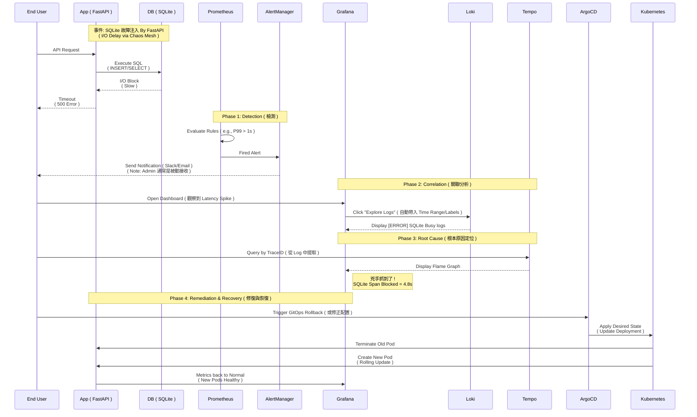
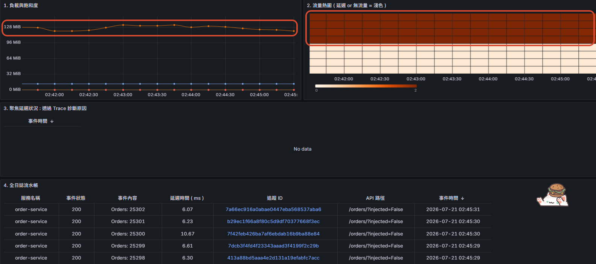
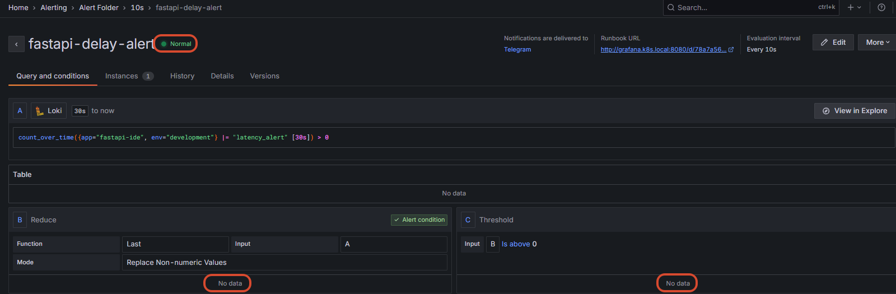
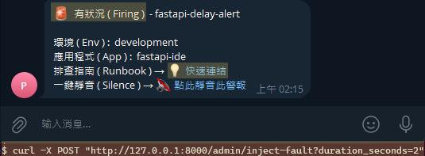
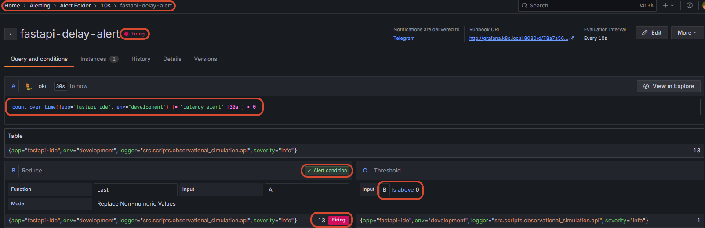
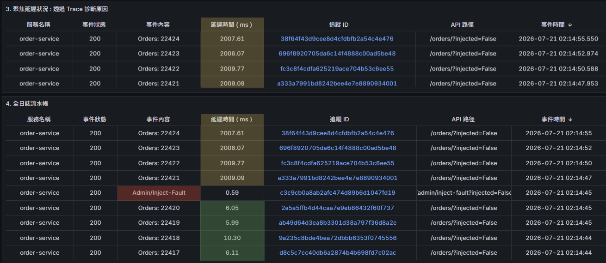
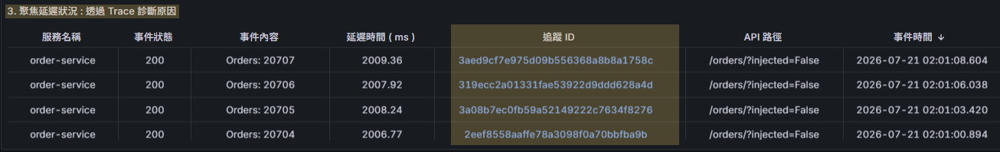
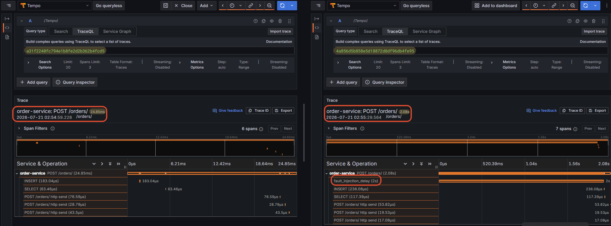
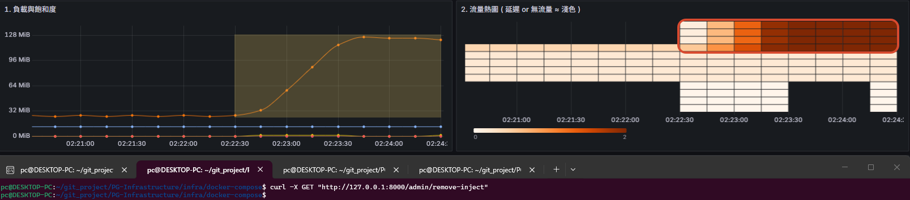
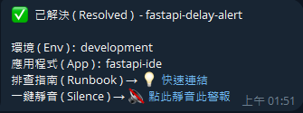

## *⭐ Observability Platform Validation: SQLite I/O Hysteresis ⭐*

<br>

### *A.　Task Design*

<details open>
<summary><b><i>　Task Description </i></b></summary>
<ul>

```
情境模擬:
 • 模擬真實場景：當底層儲存發生異常導致 I/O 延遲時，
   觀測平台如何協助工程師在短時間內完成從「發現告警」到「定位根因」的全過程


故障注入:
 • 工具: Chaos Mesh ( v2.0+ )
 • 對象: FastAPI 應用掛載之 SQLite Volume ( PVC )
 • 手段: 注入 500ms 之網路延遲抖動 ( Jitter )，模擬慢速磁碟 ( Slow Disk ) 行為
   

預期行為:
 • Detection: Prometheus 觸發 P99 Latency 超時告警
 • Correlation: 工程師利用 TraceID 關聯 Logs 與 Traces
 • Root Cause: 定位問題點在於 SQLite I/O Block，而非應用程式業務邏輯
 • Recovery: GitOps 自動觸發狀態調和 ( Reconciliation ) 並重啟 Pod 恢復正常
```

</ul>
</details>

<details open>
<summary><b><i>　Task Implementation Steps </i></b></summary>
<ul>

```
Phase 1: Baseline ( Pre-Incident )
 • 在故障注入前，確認應用程式處於健康基準線狀態


Phase 2: Detection & Correlation ( Incident Simulation )
 • 注入 I/O 延遲，觀察告警觸發與 Grafana 聯動診斷流程


Phase 3: Root Cause Analysis ( Tempo Tracing )
 • 利用分散式追蹤，精準定位耗時過長之 SQLite Span


Phase 4: Remediation & Verification ( Post-Incident )
 • 確認根因後，執行故障解除，驗證系統恢復正常服務水準
```

</ul>
</details>


<br>

### *B.　Diagnostic Flow*
> *Read from Top to Bottom ↓ | Arrows Indicate the Course of Events | Phase Marking" Response Task Design*



<br><br>

#### *★　Phase 1 : Baseline ( Pre-Incident )*

<details>
<summary><b><i>　1.1.　Testing-Prepare </i></b></summary>
<ul>

```
 # 腳本權限問題 chmod 755 ./sh_scripts/xxx.sh
 
 • 1. 打開 k3s 集群臨時通道 ( Prometheus + Loki + Tempo ) 
      + 測試管道狀態   
   make open-pipeline
   
   * 測試管道關閉 ( 一鍵清除所有臨時背景進程 )
     make kill-pipeline
   
 • 2. 啟動 FastAPI => 注入故障入口 + 傳送數據至 Prometheus + Loki + Tempo
   python3 -m uvicorn src.scripts.observational_simulation.api:app --host 0.0.0.0 --port 8000 --reload
   
   * 啟動 Python 無限迴圈 Connection SQLite => 觀察斷線/延遲狀況
     python3 conn.py
     
 • 3. 持續發送請求，每 0.5 秒一次，模擬正常負載
   make load-test
   
 • 4. 檢查是否有任何路徑回應
   curl -v http://127.0.0.1:8000/metrics
   
 • 5. 將 FastAPI 監控配置部署至 Kubernetes 集群 
   kubectl apply -f ./archive/test/fastapi-monitor.yaml
   
   * 移除指令
   kubectl delete -f ./archive/test/fastapi-monitor.yaml
   
   * 確定有沒有成功 ( 出現 fastapi-monitor 服務監控 )
     kubectl get servicemonitor -n observability-homelab-test
 
   * 確認 Prometheus API 存活 ( FastAPI 數據有入庫 ) 
     curl -v http://127.0.0.1:9090/targets
     curl -v http://127.0.0.1:9090/graph
   
   * 確認 Tempo API 存活
     curl -v http://127.0.0.1:4317/v1/traces
   
   * 確認 Loki API 存活
     curl -v http://127.0.0.1:3100/loki/api/v1/labels
     
   * 確認 FastAPI 標籤設置
     kubectl get pod -n observability-homelab-test -l app.kubernetes.io/name=fastapi -o jsonpath='{.items[0].metadata.labels}'
     
 * 故障注入 
   curl -X POST "http://127.0.0.1:8000/admin/inject-fault?duration_seconds=2"
   
 * 取消故障注入
   curl -X GET "http://127.0.0.1:8000/admin/remove-inject"
   
 * 測試健康
   curl -X GET "http://127.0.0.1:8000/health"
```

</ul>
</details>

<details>
<summary><b><i>　1.2.　Infrastructure Health ( Grafana ) </i></b></summary>
<ul>

```
 • 確認指標是否皆正常
   - 熱圖
   - 負載與飽和度
 • Alerting UI 正常無預警
```




</ul>
</details>

<br>

#### *★　Phase 2: Detection & Correlation ( Incident Simulation )*

<details>
<summary><b><i>　2.1.　Alerting ( AlertManager UI ) </i></b></summary>
<ul>

```
 • 模擬 I/O 壓力導致請求超時，觸發 Prometheus 告警規則
 • 狀態注入 : curl -X POST "http://127.0.0.1:8000/admin/inject-fault?duration_seconds=2"
```




</ul>
</details>

<details>
<summary><b><i>　2.2.　Metric to Log Correlation </i></b></summary>
<ul>

```
 • 展示經由日誌偵測到異常事件後，會先在面板出現具體事件
 • 診斷發現
    • 延遲時間從 5-20ms 延長到 2s+
    • 因為是人為設計故障因此回應狀態依舊是 200
```



</ul>
</details>

<br>

#### *★　Phase 3: Root Cause Analysis ( Tempo Tracing )*

<details>
<summary><b><i>　3.1.　Trace Contextualization </i></b></summary>
<ul>

```
 • 從 Loki 日誌中提取 TraceID，並在 Grafana 直接檢視 Trace 鏈路
```



</ul>
</details>

<details>
<summary><b><i>　3.2.　Flame Graph Analysis ( Root Cause Identification ) </i></b></summary>
<ul>

```
 • 透過火焰圖視覺化展示，證實延遲事件發生在 FastAPI 業務邏輯 (已預先標註追蹤的延遲函式)
 • 診斷發現 : 單筆 Request E2E 耗時從 20ms 飆升至 2s+
 • 診斷結論 : 證實若是函示中有確實設計好幾個斷點是能得知延遲具體位置
```




</ul>
</details>

<br>

#### *★　Phase 4: Remediation & Verification ( Post-Incident )*

<details>
<summary><b><i>　4.1.　Remediation Action </i></b></summary>
<ul>

```
 • 取消延遲故障 : 注入移除 API
 • 狀態注入 : curl -X GET "http://127.0.0.1:8000/admin/remove-inject"
 • 觀察點: 熱圖恢復正常，由淺變深色
```



</ul>
</details>

<details>
<summary><b><i>　4.2.　Verification </i></b></summary>
<ul>

```
 • 驗證修復後的指標恢復正常
   - 熱圖
   - 負載與飽和度
 • 接收到報警解除訊號
```



</ul>
</details>

<br><br>

### *C.　End-to-End RCA Pipeline Statistics*

#### *[🎬　Demo Video](https://drive.google.com/file/d/1c4Una19CtaNZ09phAXH8quAlsWBEGjel/view?usp=sharing)*

| **Phase** | **Metric** | **Definition** | **Time<br>Measurement** |
|:--|:--:|:--|--:|
| *P2. Detection* | *MTTD* | *Mean Time To Detect<br>( 從故障注入到 AlertManager 發出通知 )* | *40 sec* |
| *P3. Analysis* | *MTTI* | *Mean Time To Identify<br>( 從收到告警到在 Tempo 定位 Flame Graph )* | *5 sec* |
| *P4. Recovery* | *MTTR* | *Mean Time To Recover<br>( 從執行修復指令到 Grafana 指標恢復 )* | *40 sec* |
| *Total* | *TTR* | *Total Time to Resolution* | *85 sec* |

<br><br><br>