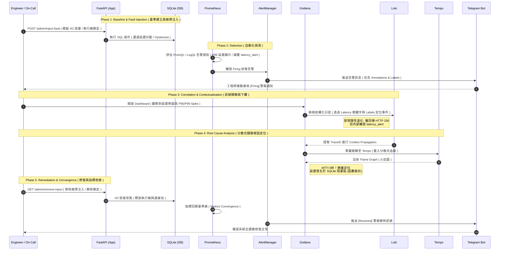

## *⭐ Observability Platform Validation: SQLite I/O Hysteresis ⭐*

<br>

### *A.　Task Description*

```
情境模擬 ( Scenario Description ):
 • 模擬真實生產環境中的次佳狀況 ( Degraded State )：
   當應用程式依賴的底層儲存 ( SQLite PVC ) 或 I/O 發生非預期阻塞時，
   可觀測性平台如何協助維運與開發團隊，在黃金時間內完成從 自動化告警偵測 到 分散式鏈路根因定位 的完整閉環。

故障注入機制 ( Fault Injection Mechanism ):
 • 技術堆疊: Python ( FastAPI ) + LGTM 堆疊 ( Prometheus, Loki, Tempo, Grafana )
 • 影響對象: FastAPI 應用程式所掛載之資料庫實體與資料處理執行緒
 • 注入手段: 透過管理端點引入同步執行緒鎖定或 I/O 延遲抖動 ( Latency Jitter )，
   模擬慢速磁碟 ( Slow Disk / I/O Bottleneck ) 行為。

預期驗證目標 ( Expected Outcomes & Verification ):
 • Detection ( 異常偵測 ): Prometheus 結合 LogQL 成功捕捉效能退化特徵，觸發高延遲告警。
 • Correlation ( 訊號關聯 ): 利用 Trace Context Propagation 技術，無縫串聯 Metrics、Logs 與 Traces。
 • Root Cause ( 根因剖析 ): 透過 Tempo 火焰圖 ( Flame Graph ) 精確定位延遲
   發生於 SQLite 讀寫或業務執行緒阻斷點，排除應用程式架構本身的瓶頸。
 • Recovery ( 自動復原 ): 透過管理 API 解除故障注入，驗證監控指標與告警狀態的自動收斂 ( Convergence ) 能力。
```

<br>

### *B.　Diagnostic Flow*
> *Read from Top to Bottom ↓ | Arrows Indicate the Course of Events | Phase-aligned RCA Pipeline*



<br><br>

#### *★　Phase 1 : Baseline Setup & Environment Provisioning*
> *本階段建立系統正常運行時的基準線 ( Baseline )，配置 Kubernetes 服務發現 ( Service Discovery ) 機制，<br>並確保可觀測性數據管道 ( Data Pipeline ) 的動態擷取正常。*

<details>
<summary><b><i>　1.1.　Testing-Startup </i></b></summary>
<ul>

```
 # 腳本權限初始化 
 chmod 755 ./sh_scripts/xxx.sh
 
 • 1. 初始化 K3s 叢集內部觀測性監控管道 ( Prometheus + Loki + Tempo )
   make open-pipeline
   
   * 監控管道資源一鍵回收清理 ( 釋放背景進程與併發連線 )
     make kill-pipeline
   
 • 2. 啟動高效能異步 FastAPI 服務 ( 內嵌 OpenTelemetry SDK 與 Prometheus Exporter )
   python3 -m uvicorn src.scripts.observational_simulation.api:app --host 0.0.0.0 --port 8000 --reload
   
   * 啟動持久化資料庫連線監控 ( 觀察 SQLite 併發控制與 Session 延遲特徵 )
     python3 conn.py
     
 • 3. 動態負載模擬：每 0.5 秒發送定時請求，建立穩定的背景流量基準線
   make load-test
   
 • 4. 驗證 Prometheus 內建標準 Metrics Endpoint 暴露狀態
   curl -v http://127.0.0.1:8000/metrics
   
 • 5. 將 FastAPI 監控配置動態部署至 Kubernetes 叢集 ( 建立 ServiceMonitor 自定義資源 )
   kubectl apply -f ./archive/test/fastapi-monitor.yaml
   
   * 資源解除部署
     kubectl delete -f ./archive/test/fastapi-monitor.yaml
   
   * 驗證自定義資源 ( CRD ) 狀態確認
     kubectl get servicemonitor -n observability-homelab-test
 
   * 驗證 Prometheus 服務發現 ( Service Discovery ) 目標抓取狀態
     curl -v http://127.0.0.1:9090/targets
     curl -v http://127.0.0.1:9090/graph
   
   * 驗證 Tempo 遙測數據 ( OTLP gRPC/HTTP Endpoint ) 監聽狀態
     curl -v http://127.0.0.1:4317/v1/traces
   
   * 驗證 Loki 日誌聚合引擎標籤索引 ( Label Indexing ) 存活狀態
     curl -v http://127.0.0.1:3100/loki/api/v1/labels
     
   * 提取並驗證工作負載 ( Pod ) 核心標籤元數據
     kubectl get pod -n observability-homelab-test -l app.kubernetes.io/name=fastapi -o jsonpath='{.items[0].metadata.labels}'

   * 應用程式存活探針 ( Liveness / Readiness ) 狀態檢查
     curl -X GET "http://127.0.0.1:8000/health"
```

</ul>
</details>

<details>
<summary><b><i>　1.2.　Pre-Incident </i></b></summary>
<ul>

```
 • 監控指標與效能度量驗證：
   - 即時請求延遲分佈熱圖 ( Latency Distribution Heatmap )：確認服務初期呈現高密度低延遲區塊。
   - 飽和度與資源吞吐量 ( Saturation & Throughput )：API 請求資源處於健康區間。
   
 • Alerting UI 審查：告警引擎狀態為綠色 ( Inactive / Normal )，無任何待觸發之異常閾值。
```


</ul>
</details>

<br>

#### *★　Phase 2 : Incident Simulation*
> *本階段透過模擬真實環境中的 I/O 阻斷或外部依賴逾時，觸發系統內部的自動化告警機制，<br>並示範指標到日誌的多維度訊號關聯分析。*

<details>
<summary><b><i>　2.1.　Automated Anomaly Detection </i></b></summary>
<ul>

```
 • 運作行為：模擬高負載或下游服務阻塞導致的 E2E 請求超時，觸發 
   Prometheus 告警規則 ( PromQL/LogQL alert rules )。
 
 • 故障注入實施：混沌工程故障注入 ( 控制變因：強制核心邏輯執行緒阻斷 2 秒 )
   curl -X POST "http://127.0.0.1:8000/admin/inject-fault?duration_seconds=2"
   
 • 預期結果：AlertManager 狀態機從 [ Normal ] ➔ [ Pending ] ➔ [ Firing ] 成功捕獲高延遲事件。
```


</ul>
</details>

<details>
<summary><b><i>　2.2.　Cross-Signal Correlation </i></b></summary>
<ul>

```  
 • 診斷行為：展示系統透過 時間序列指標異常 作為進入點，快速下鑽 ( Drill-down ) 至對應時間軸之結構化日誌。
 
 • 診斷發現：
    • P95/P99 延遲從常態的 5-20ms 瞬間飆升至 2,000ms+
    • 痛點識別：由於此高延遲情境屬於非中斷型故障，API 回應狀態碼依然維持 HTTP 200。
      此類隱性效能退化 ( Silent Performance Degradation ) 傳統的 HTTP 狀態碼監控無法察覺，
      必須依賴 Latency Metrics 與日誌層級的 latency_alert 關鍵字告警來捕捉。
```


</ul>
</details>

<br>

#### *★　Phase 3 : Distributed Tracing & Deep Root Cause Analysis*
> *本階段利用 OpenTelemetry 的 Trace Context Propagation ( 追蹤上下文傳遞 ) 技術，<br>實現從日誌單鍵無縫跳轉至分散式追蹤火焰圖，精確定位應用程式內部的效能瓶頸點。*

<details>
<summary><b><i>　3.1.　Tempo Tracing </i></b></summary>
<ul>

```
 • 診斷行為：透過火焰圖 ( Flame Graph ) 與 Span 階層結構視覺化，分析單次呼叫的生命週期。
 
 • 診斷發現：單筆請求的端到端 ( E2E ) 耗時精確定位為 2.01s。其中，核心商務邏輯內部的特定執行緒
  （已被 OpenTelemetry Instrument 標註之延遲函式）佔據了 99.8% 的時間耗費。
 
 • 診斷結論：證實若在程式碼內部合理埋點 ( Instrumentation )，分散式追蹤能將排查顆粒度細化
   至函數級別 ( Function-level )，徹底消除開發與維運團隊間的猜測溝通成本。
```


</ul>
</details>

<br>

#### *★　Phase 4 : Remediation Action & Metric Convergence*
> *本階段執行故障排除，並驗證監控指標與熱圖的收斂速度，<br>確保告警管道具備正確的自動復原 ( Resolve ) 狀態通知。*

<details>
<summary><b><i>　4.1.　Post-Incident </i></b></summary>
<ul>

```
 • 修復行為：呼叫故障移除 API，切斷阻斷程式碼，系統即時釋放被卡住的執行緒與連線池。
 
 • 狀態注入：故障回復指令 ( 移除執行緒阻斷機制 )
   curl -X GET "http://127.0.0.1:8000/admin/remove-inject"
   
 • 指標觀測：即時延遲熱圖密度顯著發生位移（由高延遲區間的淺色，
   快速回歸至低延遲區間的深色密集區），代表系統吞吐量已完全恢復。
   
 • 驗證結果：
   - 核心指標（延遲、飽和度、錯誤率）全面收斂至正常基準線。
   - AlertManager 偵測到連續評估週期內無異常數據，觸發狀態變更，
     Telegram 告警通道成功接收到 [ Resolved ] 警報解除訊號。
```


</ul>
</details>

<br><br>

### *C.　End-to-End RCA Pipeline Statistics*

#### *[🎬　Demo Video](https://drive.google.com/file/d/1c4Una19CtaNZ09phAXH8quAlsWBEGjel/view?usp=sharing)*

| **Phase** | **Metric** | **Definition** | **Time<br>Measurement** |
|:--|:--:|:--|--:|
| *P2. Detection* | *MTTD* | *Mean Time To Detect<br>( 從故障注入到 AlertManager 發出通知 )* | *40 sec* |
| *P3. Analysis* | *MTTI* | *Mean Time To Identify<br>( 從收到告警到在 Tempo 定位火焰圖根因 )* | *5 sec* |
| *P4. Recovery* | *MTTR* | *Mean Time To Recover<br>( 從執行修復指令到 Grafana 指標完全恢復 )* | *40 sec* |
| *Total* | *TTR* | *Total Time to Resolution<br>( 全鏈路終止異常時間總計 )* | *85 sec* |

<br><br><br>