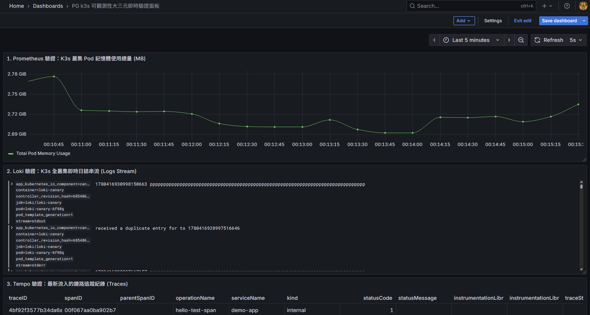

## *K8s - Observability & Alert Manager*


### *A.　流程說明*
```
```



<br>

### *B.　指令檢視觀測內容*
```
kubectl logs -n loki -l app.kubernetes.io/component=read --tail=50 | grep "error"
kubectl logs -n tempo -l app.kubernetes.io/component=query-frontend --tail=50 | grep "error"
```

<br>

### *C.　Tempo 功用*
```
❌ 只有 Loki 的痛苦（線索斷開）：
因為每個 Pod 都是獨立印 Log，當並發量很高、一秒鐘有幾千筆 Log 湧入時，
根本沒辦法把「前端 A 使用者的這一次點擊」，跟「Kafka 的某個事件」
以及「PostgreSQL 的某一條 SQL」精準綁在一起。不知道這 5 秒鐘到底是被卡在 Kafka 還是卡在資料庫。


Tempo 引入了一個叫 Trace ID 的概念。
當 A 使用者點擊的瞬間，系統會產生一個獨一無二的 TraceID=abc123xyz。
當這個請求流經所有服務時，這個 ID 會像接力棒一樣一直傳下去。
在 Tempo (Grafana) 畫面上會看到一張完美的時間瀑布圖（Flame Graph）：


[Gateway: /order] ────────────────────────────────────────── (總共 5.0s)
  ├── [Auth-Service: Check Token] ── (0.1s)
  ├── [Backend-API: Create Order] ────────────────────────── (4.9s)
  │     ├── [PostgreSQL: INSERT Order] ─ (0.02s)  <-- 看到了吧！DB 其實超快
  │     └── [Kafka: Produce Message] ────────────────────── (4.8s) 🔥 兇手抓到了！
```

<br><br><br>