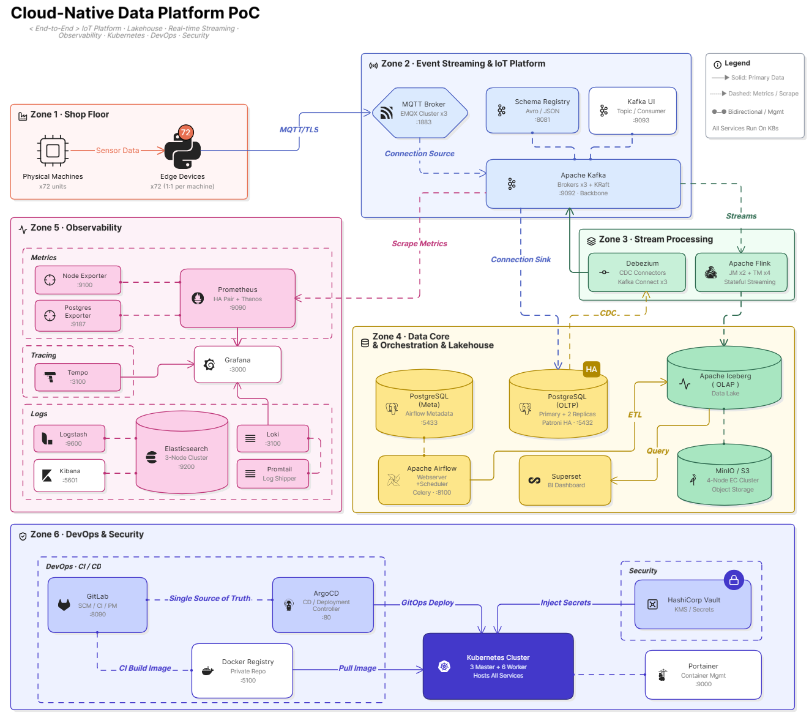
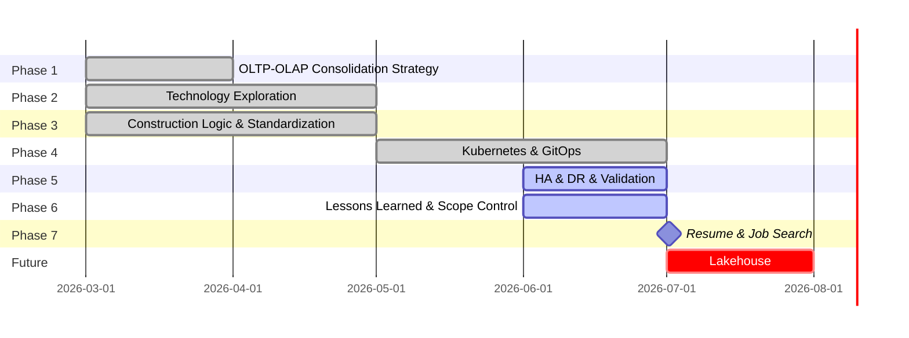

## *⭐ Platform Genesis ⭐*

[//]: # (![PNG]&#40;../assets/png/roadmap_00.png&#41;)


<br>

### *A.　PG Structure*
|*Project Name*|*Responsibilities*|*Tech Stack*|
|--:|:--|:--|
| [Platform Genesis](https://github.com/Junwu0615/Platform-Genesis) | **Homepage :**<br>Construction Records & Quantitative Testing | - |
| [PG-Infrastructure](https://github.com/Junwu0615/PG-Infrastructure) | **IaC & Automation :**<br>Orchestrates environment lifecycles via<br>Terraform, Ansible, and Makefiles. | `GKE` `Kubernetes` `Terraform` `Ansible` `Docker` `Makefile` |
| [PG-APP-Core](https://github.com/Junwu0615/PG-APP-Core) | **Business & Stream Logic :**<br>Core engine for multi-version factory simulations,<br>stream processing, and data infrastructure optimization. | `PG-Shared-Lib` `Python` |
| [PG-Shared-Lib](https://github.com/Junwu0615/PG-Shared-Lib) | **Core Library :**<br>Provides standardized,<br>high-reusability modules across the ecosystem. | `EntryPoint` `Logger` `MqttServer`<br>`KafkaConsumerManager`<br>`KafkaProducerManager` |
| [PG-Edge-Container](https://github.com/Junwu0615/PG-Edge-Container) | **Edge Deployment :**<br>Lightweight IoT units for data acquisition<br>and real-time MQTT/SQLite HA processing. | `PG-APP-Core` `MQTT` `SQLite` |
| [PG-Airflow-DAGs](https://github.com/Junwu0615/PG-Airflow-DAGs) | **Data Orchestration :**<br>Manages ETL pipelines, data lineage,<br>and OLTP-to-OLAP transformations. | `Airflow` `DAGs` |

<br><br>

### *B.　Project Progress*

<details>
<summary><b><i>　b.1.　Simple </i></b></summary>
<ul>

|**Item**|**Description**|**Time**|
|--:|:--|:--:|
| Create Project | - | 2026-03-20 |
| Add `PostgreSQL` | - | 2026-03-20 |
| Add `Airflow` | for `OLAP` | 2026-03-21 |
| 1. PED | DB Role-Based Access Control | 2026-04-01 |
| 2. PED | `Docker Desktop` vs. `WSL2` | 2026-04-04 |
| Add `Monitoring` | - | 2026-04-04 |
| Terraform | Modularization | 2026-04-20 |
| Ansible | Modularization | 2026-04-20 |
| Add `IoT Platform` | `MQTT Broker` + `Apache Kafka` | 2026-04-25 |
| Kubernetes | Beginner : `Minikube` | 2026-05-09 |
| Kubernetes | Advanced : `K3d` | 2026-05-10 |
| Kubernetes | Advanced : `K3s` + `VMware` | 2026-05-10 |
| Build `Hierarchical`<br>`Log Management` | `Loki` + `ELK` | 2026-05-14 |
| Build `GitOps` | `GitLab CI` + `ArgoCD` | 2026-06-05 |
| 7. PED | Deployment Delivery Baseline | 2026-06-13 |
| 8. PED |  Kubernetes Resiliency & Availability Validation | 2026-06-16 |
| 11. PED | End-to-End<br>DevOps Operating Model | 2026-06-17 |
| 12. PED | GitOps Deployment Governance Validation | 2026-06-21|
| Add `HashiCorp Vault` | Enterprise Key Management System | Expected in `202607` |
| 10. PED | Vault Secret<br>Management & Distribution | Expected in `202607` |
| 9. PED | Observability Platform Validation | Expected in `202607` |
| Build `Lakehouse` | - | `TBD` |
| 5. PED | Evolution of Core Data Architecture Business :<br>`Direct Read` vs. `MV` vs. `CDC` | `TBD` |
| 4. PED | Query Efficiency Optimization<br>`Before` vs. `After` | `TBD` |
| 6. PED | Application Workload Performance Analysis | `TBD` |
| 3. PED | OLTP-OLAP Consolidation Strategy | `TBD` |
| Kubernetes | Bottom Layer : `Kubeadm` + `VMware` | `TBD` |
| Kubernetes | Public Cloud : `GKE` | `TBD` |

</ul>
</details>

<details open>
<summary><b><i>　b.2.　Details </i></b></summary>
<ul>

<br>

<details>
<summary><b><i>　b.2.1　Project Journey </i></b></summary>
<ul>

|**Item**|**Description**|**Time**|
|--:|:--|:--:|
| Create Project | - | 2026-03-20 |
| Define Process | - | 2026-03-20 |
| Define Event Story | - | 2026-03-21 |
| Define Project Directory | - | 2026-03-21 |
| Define Table DDL | - | 2026-03-21 |
| Redefine Project Name | `OLTP-OLAP-Unified-DB`<br>to `Platform Genesis` | 2026-05-08 |
| Project Breakdown | `5` Major Categories | 2026-05-08 |
| Architecture Diagram | `VERSION 1.0` | 2026-05-16 |
| Architecture Diagram | `VERSION 2.0` | 2026-06-14 |
| Platform Genesis Sprint | `2026-03` to `2026-07` | 2026-07-XX |
| Pause | After `2026-07` | 2026-07-XX |

</ul>
</details>


<details>
<summary><b><i>　b.2.2　Code </i></b></summary>
<ul>

|**Item**|**Description**|**Time**|
|--:|:--|:--:|
| Create OLTP DDL | 3NF [ 6 ] | 2026-03-21 |
| Script | delete_data.py | 2026-03-24 |
| Script | drop_table.py | 2026-03-24 |
| Script | factory_config.yaml | 2026-03-24 |
| Script | init_factory_data.py | 2026-03-24 |
| Script | simulate_factory_stream.py | 2026-03-24 |
| Single to Batch Insert | batch sending | 2026-03-26 |
| Generate Rigorous<br>Static Data | - | 2026-03-26 |
| Rigorous Calibration<br>of Dynamic Data | 單一機台同時間只允許做一件事 /<br>排隊消化訂單 / 訂單生產週期戳記 | 2026-03-27 |
| Adjusting Contextual | ~~insert machine event :<br>machine_events~~ | 2026-03-28 |
| execute ➔ execute_batch | batch sending + batch submission :<br>不適用於目前模擬方式 | X |
| Adjusting Contextual | insert machine status :<br>machine_status_logs | 2026-03-30 |
| Increase Data Volume | - | 2026-03-30 |
| Create OLAP DDL | Star Schema [ 5 ] | 2026-04-06 |
| Auto Partition | `dags/sql/auto_partition/*` | 2026-04-06 |
| OLTP to OLAP | `dags/sql/*` | 2026-04-06 |
| DAG | Build Coding Style | 2026-04-06 |
| DAG ETL Script | Fan-out Queue Pattern | 2026-04-06 |
| DAG | Try `Param` | 2026-04-07 |
| DAG | Try `Dataset` | 2026-04-08 |
| Docker Compose | Compose Modularization | 2026-04-11 |
| Add Makefile | for `docker-compose` | 2026-04-11 |
| Add Airflow Config UI | `Trigger w/ Config` | 2026-04-18 |
| DAG | update Coding Style | 2026-04-18 |
| Add Makefile | for `terraform + ansible` | 2026-04-19 |
| Terraform | Modularization | 2026-04-20 |
| Ansible | Modularization | 2026-04-20 |
| Simple Simulation | organizing old versions : `v1` | 2026-04-28 |
| API Service logic | - | X |
| Multi-Instance | like real-edge : `v2` | 2026-04-28 |
| MQTT logic | for `cp` | 2026-04-28 |
| Kafka Connect | `source` : Producer  | 2026-04-30 |
| Kafka logic | for `inst` | 2026-05-03 |
| Kafka Connect | `sink` : Consumer | 2026-05-04 |
| Define the Version Number<br>of each service  | settings to `.env` | 2026-05-05 |
| logging logic | mixed ( `ELK` + `logging` ) | 2026-05-06 |
| Encapsulation Entry | app.py | 2026-05-06 |
| logging logic | Logs Correct Paths<br>Based on Module Calls | 2026-05-07 |
| update `v2` logic | Apply the<br>New Underlying Module | 2026-05-07 |
| Import Shared Lib | - | 2026-05-13 |
| Add `SQLite`<br>to Edge scripts  | Improve the HA<br>of Consumer Transactions | 2026-05-13 |
| loki logic | - | 2026-05-14 |
| `IS_KUBERNETES` | Boolean Injection<br>Forced Type Configuration | 2026-05-14 |
| make `v2` Dockerfile | - | 2026-05-14 |
| lint `CI` | Automatic Detection Before Push<br>`.pre-commit-config.yaml` | 2026-05-18 |
| lint `CI` | Syntax Checking `black` `flake8` | 2026-05-18 |
| test `CI` | common tests scripts | 2026-05-18 |
| build `CI` | - | 2026-05-19 |
| deploy `CI` | - | 2026-05-20 |
| DAG | init.py + create_topic.py | Expected in `202607` |
| Python-Tempo Logic | - | Expected in `202607` |
| Grafana Dashboard | `htap_grafana.json` | Expected in `202607` |
| Create MV | Materialized View | `TBD` |
| Analytical Queries | - | `TBD` |
| Security Message :<br>`Message Queue Layer` | Encryption ( `kafka` + `mqtt` ) | `TBD` |
| Security Message :<br>`Software Layer` | Asymmetric encryption | `TBD` |

</ul>
</details>


<details>
<summary><b><i>　b.2.3　Infra </i></b></summary>
<ul>

|**Item**|**Description**|**Time**|
|--:|:--|:--:|
| Add `PostgreSQL` | - | 2026-03-20 |
| Add `Airflow` | for `OLAP` | 2026-03-21 |
| Add `PoWA` | for `Monitoring` | 2026-03-23 |
| Docker Engine | for `WSL2` | 2026-04-03 |
| Add `Monitoring` | `Postgres Exporter` | 2026-04-04 |
| Add `Monitoring` | `Prometheus` | 2026-04-04 |
| Add `Monitoring` | `Grafana` | 2026-04-04 |
| Add `Monitoring` | `Node Exporter` | 2026-04-05 |
| Add `Portainer` | for `Manage Containers` | 2026-04-11 |
| Add `IoT Platform` | `MQTT Broker` | 2026-04-25 |
| Add `IoT Platform` | `Apache Kafka` | 2026-04-25 |
| Add `ELK` | for `Manage Log` | 2026-05-05 |
| Kubernetes | Beginner : `Minikube` | 2026-05-09 |
| Kubernetes | Advanced : `K3d` | 2026-05-10 |
| Kubernetes | Advanced : `K3s` + `VMware` | 2026-05-10 |
| VM | 開源全生命週期自動化堆疊<br>`Terraform` `Ansible` `libvirt` | 2026-05-10 |
| VM | Terraform 安裝基礎設施 | 2026-05-11 |
| VM | 橫向擴展 Node | 2026-05-12 |
| Add `Monitoring` | `Loki` | 2026-05-12 |
| Add `Gitlab` | for `CI` & `Manage Projects` | 2026-05-12 |
| Add `Jenkins` | for `CD` | 2026-05-12 |
| Add `Docker Registry` | for `CI/CD` & `Manage Images` | 2026-05-12 |
| Build `Hierarchical`<br>`Log Management` | `Loki` + `ELK` | 2026-05-14 |
| Build `CD` | `CD` ➔ `Airflow DAGs` | 2026-05-20 |
| VM | Terraform + Ansible `Gateway` | 2026-05-24 |
| Build `WSL2 Homelab` | `Chrome` ➔ `Windows:8080`<br>➔ `WSL2:80` ➔ `ingress-nginx` | 2026-05-25 |
| Update Migration Matrix | `Hybrid deployment` | 2026-05-26 |
| Add `ArgoCD` | for `CD` | 2026-05-28 |
| Build `GitOps` | `GitLab CI` + `ArgoCD` | 2026-06-05 |
| VM | Terraform + Ansible `Multi-Master` | 2026-06-06 |
| Build `CD` | `CD` ➔ `Edge Container` | 2026-06-13 |
| VM | Ansible `Storge 持久化權限路徑` 設定 | 2026-06-16 |
| VM | Ansible `Keepalived`<br>`VRRP 虛擬 IP ( VIP: 10.88.0.99 )` | 2026-06-16 |
| VM | Ansible `Restructuring`  | 2026-06-21 |
| VM | 預載資源避免 Ansible 卡死外網索取資源 | 2026-06-21 |
| Add `HashiCorp Vault` | Enterprise Key Management System | Expected in `202607` |
| Add `Debezium` | Change Data Capture | `TBD` |
| Add `Apache Iceberg` | Data Lake | `TBD` |
| Add `Apache Flink` | Consumer of CDC | `TBD` |
| Add `MinIO` | Object Storage | `TBD` |
| Build `Lakehouse` | - | `TBD` |
| Add `Superset` | for `OLAP` | `TBD` |
| Kubernetes | Bottom Layer : `Kubeadm` + `VMware` | `TBD` |
| Kubernetes | Public Cloud : `GKE` | `TBD` |

</ul>
</details>


<details>
<summary><b><i>　b.2.4　Experience </i></b></summary>
<ul>

|**Item**|**Description**|**Time**|
|--:|:--|:--:|
| PoWA Web Login Failed | ⚠️no reason found yet | 2026-03-23 |
| DB Settings | Permission Settings | 2026-03-23 |
| New Role | Migration User | 2026-03-24 |
| PoWA( Running Normally ) | - | 2026-03-30 |
| Try Again PoWA Web | ⚠️very difficult to deal with | 2026-03-30 |
| Fine-tuning<br>PostgreSQL Settings | `shm-size` | 2026-04-01 |
| Grafana Dashboard | Organize Observation Indicators | 2026-04-05 |
| WSL2 Settings | `.wslconfig` | 2026-04-06 |
| Partition Settings | `default_partition` | 2026-04-06 |
| Terraform | Declaration Config : `Docker Provider` | 2026-04-19 |
| Terraform | Config Transfer : `docker-compose` | 2026-04-19 |
| Ansible | node `init` & `config` | 2026-04-19 |
| Terraform vs. Compose | Experience :<br>`狀態管理差異性 ; 復原配置崩潰 ; 提高 HA` | 2026-04-19 |
| Terraform & Ansible | Experience :<br>`Ansible 如何補足 Terraform 的不足` | 2026-04-19 |
| ELK | Experience : `ELK` | 2026-05-05 |
| Kubernetes | Experience :<br>`Pod` `Node` `Helm` `Kubectl` `Deployment`<br>`Service` `Ingress` `Secret` `ConfigMap`<br>`NameSpaces` `PVC` `SVC` ... | 2026-05-09 |
| Kubernetes | Experience : MiniKube | 2026-05-09 |
| Kubernetes | Experience : Ansible 初始化節點 | 2026-05-10 |
| Kubernetes | Experience : K3d | 2026-05-10 |
| VM | Experience : Manual Create Oracle VM | 2026-05-10 |
| VM | Experience : 以 Ping 自動喚醒 VM 防止深度睡眠 | X |
| Kubernetes | Experience : 簡化 kubectl 指令 | 2026-05-12 |
| Kubernetes | Experience : `k9s` | 2026-05-12 |
| CI/CD | Experience : Git-Runner | 2026-05-19 |
| CI/CD | 採用 `tar` 流處理對 Airflow 容器<br>以兩側`記憶體對接灌入達成熱更新` | 2026-05-20 |
| Kubernetes | Experience :<br>Win ➔ `Portproxy` ➔ WSL2 | 2026-05-25 |
| Kubernetes | Experience : `ingress-nginx` | 2026-05-25 |
| Kubernetes | Experience : `OOM Kill` | 2026-05-25 |
| GitOps | update tree `App-of-Apps` | 2026-05-28 |
| GitOps | Experience : `Layered GitOps` | 2026-05-29 |
| GitOps | Build : `Observability` `Grafana` | 2026-05-30 |
| GitOps | Build : `Observability` `Prometheus` | 2026-05-30 |
| GitOps | Build : `Observability` `Prometheus Stack` | 2026-05-30 |
| GitOps | Build : `Observability` `Promtail` | 2026-05-31 |
| Helm Chart | `Helm Values 渲染大坑` ➔ 退至穩定版 | 2026-05-31 |
| GitOps | Build : `Observability` `Loki` | 2026-05-31 |
| Kubernetes | Experience : `Fluent Bit ( DaemonSet )` | 2026-05-31 |
| GitOps | Build : `Observability` `Tempo` | 2026-06-01 |
| Helm Chart | `values 渲染大法` | 2026-06-03 |
| GitOps | Build : `Databases` `Postgresql` | 2026-06-03 |
| GitOps | Experience : `ApplicationSet` | 2026-06-05 |
| GitOps | update tree `Automated Multi-Tenant`<br>`Environment Provisioning` | 2026-06-05 |
| GitOps | Ingress-Nginx `切換 Namespace 環境坑` | 2026-06-06 |
| Kubernetes | 親和/反親合標籤設置 | 2026-06-06 |
| GitOps | Build : `Observability` `Postgres Exporter` | 2026-06-07 |
| GitOps | Build : `Platform` `Registry` | 2026-06-07 |
| Helm Chart | Vanishing 6H `Bitnami 腳本底層對底線 _ 敏感性` | 2026-06-08 |
| GitOps | Build : `PG-Apps` `cp` | 2026-06-10 |
| GitOps | Build : `PG-Apps` `inst` | 2026-06-10 |
| GitOps | Build : `Storage` `nfs` | 2026-06-13 |
| Kubernetes | Experience : NFS 儲存機制 ( SQLite ) | 2026-06-13 |
| Kubernetes | Experience : `HPA 擴展/縮容` | 2026-06-15 |
| GitOps | Experience : `無限套娃動態死鎖` | 2026-06-15 |
| Kubernetes | Experience : Master Control Plane<br>`dqlite ( Distributed SQLite / Raft 共識協定 )` | 2026-06-16 |
| Kubernetes + VM | Experience : Master Control Plane<br>`控制面組件租約選舉 ( Lease Re-election )` | 2026-06-17 |
| GitOps | Build : `Security` `Vault` | Expected in `202607` |
| GitOps | Maintain 2 repo ( `CI` + `CD` ) | `TBD` |

</ul>
</details>


<details open>
<summary><b><i>　b.2.5　Platform Engineering Deliverables ( PED ) </i></b></summary>
<ul>

|**Item**|**Description**|**Time**|
|--:|:--|:--:|
| DB Role-Based<br>Access Control | [PED-1](./docs/DB-RBAC.md)　➔　<br>How can database access be governed securely across teams and environments ? | 2026-04-01 |
| Database<br>Environment Benchmark | [PED-2](./docs/Database-Environment-Benchmark.md)　➔　`Docker Desktop` vs. `WSL2`<br>How does the runtime environment impact database performance and resource efficiency ? | 2026-04-04 |
| OLTP-OLAP<br>Consolidation Strategy | [PED-3](./docs/OLTP-OLAP-Consolidation-Strategy.md)　➔　<br>How can analytical workloads be consolidated while minimizing infrastructure cost ? | `TBD` |
| Database Query<br>Performance Optimization | [PED-4](./docs/Database-Query-Performance-Optimization.md)　➔　`Before` vs. `After`<br>How much performance improvement can be achieved through query optimization ? | `TBD` |
| Evolution of Core<br>Data Architecture | [PED-5](./docs/Evolution-of-Core-Data-Architecture.md)　➔　`Direct Read` vs. `MV` vs. `CDC`<br>How should data access architecture evolve as business scale and complexity increase ? | `TBD` |
| Application Workload<br>Performance Analysis | [PED-6](./docs/Application-Workload-Performance-Analysis.md)　➔　<br>How can observability data reveal performance bottlenecks and capacity limits ? | `TBD` |
| Deployment Delivery Baseline | [PED-7](./docs/Deployment-Delivery-Baseline.md)　➔　<br>How does GitOps improve deployment efficiency and operational consistency ? | 2026-06-13 |
| Kubernetes Resiliency<br>& Availability Validation |  [PED-8](./docs/K8s-Resiliency-Availability-Validation.md)　➔　<br>How resilient is Kubernetes under node, workload, network, and control-plane failures ? | 2026-06-16 |
| Observability Platform Validation | [PED-9](./docs/Observability-Platform-Validation.md)　➔　`Logging` `Metrics` `Tracing` `Alert Manager`<br>How can metrics, logs, traces, and alerts accelerate operational visibility and troubleshooting ? | Expected in `202607` |
| Vault Secret<br>Management & Distribution | [PED-10](./docs/Vault.md)　➔　<br>How can secrets be managed, distributed, and rotated securely across Kubernetes workloads ? | Expected in `202607` |
| End-to-End<br>DevOps Operating Model | [PED-11](./docs/End-to-End-DevOps-Operating-Model.md)　➔　`PR` `Code Review` `TEST` `STAGE` `PROD`<br>How can development, delivery, operations, and recovery be integrated into a unified platform workflow ? | 2026-06-17 |
| GitOps Deployment<br>Governance Validation  | [PED-12](./docs/GitOps-Deployment-Governance-Validation.md)　➔　<br>How can GitOps enforce deployment governance, drift control, and operational traceability ? | 2026-06-21 |

</ul>
</details>


</ul>
</details>


<br><br>


### *C.　Implement*

<details open>
<summary><b><i>　Service Support Form </i></b></summary>
<ul>

> ##### 已實現 ( ✔ )
> ##### 已棄用 ( ✘ )
> ##### 未實現 ( - )
> ##### 不遷移 ( * ) ➔ 記憶體 OOM Kill ( 折衷打退回為 Docker Compose )
> ##### 不遷移 ( △ ) ➔ 省作業時間 ( 部分與重型服務 Docker Compose 綑綁 )

|**Service**|**Docker**|**Terraform<br>( Docker )**|**MiniKube**|**K3d**|**K3s**|**K3s<br>Migration**|**Kubeadm**|**GKE**|
|--:|:--:|:--:|:--:|:--:|:--:|:--:|:--:|:--:|
| **PostgreSQL** | ✔ | - | ✔ | ✔ | ✔ | ✔ | - | - |
| **PgAdmin** | ✔ | ✘ | ✘ | ✘ | ✘ | ✘ | ✘ | ✘ |
| **PoWA** | ✘ | ✘ | ✘ | ✘ | ✘ | ✘ | ✘ | ✘ |
| **Apache Airflow** | ✔ | - | - | - | - | * | - | - |
| **Superset** | ✔ | - | - | - | - | * | - | - |
| **MQTT Broker** | ✔ | - | - | - | - | △ | - | - |
| **Apache Kafka** | ✔ | - | - | - | - | * | - | - |
| **Kafka UI** | ✔ | - | - | - | - | △ | - | - |
| **Schema Registry** | ✔ | - | - | - | - | △ | - | - |
| **Debezium** | ✔ | - | - | - | - | △ | - | - |
| **MinIO** | ✔ | - | - | - | - | △ | - | - |
| **Apache Iceberg** | ✔ | - | - | - | - | * | - | - |
| **Apache Flink** | ✔ | - | - | - | - | * | - | - |
| **Postgres Exporter** | ✔ | ✔ | - | - | - | ✔ | - | - |
| **Node Exporter** | ✔ | ✔ | - | - | - | ✔ | - | - |
| **Prometheus** | ✔ | ✔ | - | - | - | ✔ | - | - |
| **Grafana** | ✔ | ✔ | - | - | - | ✔ | - | - |
| **Loki** | ✔ | - | - | - | - | ✔ | - | - |
| **Promtail** | ✔ | - | - | - | - | ✔ | - | - |
| **Tempo** | ✘ | - | - | - | - | ✔ | - | - |
| **Elasticsearch** | ✔ | - | - | - | - | * | - | - |
| **Logstash** | ✔ | - | - | - | - | * | - | - |
| **Kibana** | ✔ | - | - | - | - | * | - | - |
| **Gitlab** | ✔ | - | - | - | - | * | - | - |
| **Jenkins** | ✘ | ✘ | ✘ | ✘ | ✘ | ✘ | ✘ | ✘ |
| **ArgoCD** | ✘ | - | - | - | - | ✔ | - | - |
| **Harbor** | ✘ | ✘ | ✘ | ✘ | ✘ | ✘ | ✘ | ✘ |
| **Docker Registry** | ✔ | - | - | - | - | ✔ | - | - |
| **Docker Registry UI** | ✘ | ✘ | ✘ | ✘ | ✘ | ✘ | ✘ | ✘ |
| **Portainer** | ✔ | ✔ | - | - | ✔ | ✔ | - | - |
| **HashiCorp Vault** | ✔ | - | - | - | - | ✔ | - | - |

</ul>
</details>

<details>
<summary><b><i>　Tree </i></b></summary>
<ul>

```bash
tree -I 'venv|.git|__pycache__|docs|logs|assets|kafka_data|charts'

.
├── ⭐ PG-APP-Core
│   ├── LICENSE
│   ├── README.md
│   ├── requirements.txt
│   ├── src
│   │   ├── __init__.py
│   │   ├── core
│   │   │   ├── __init__.py
│   │   │   ├── models
│   │   │   │   ├── __init__.py
│   │   │   │   ├── simulator.py
│   │   │   │   └── sink_format.py
│   │   │   ├── v1
│   │   │   │   ├── __init__.py
│   │   │   │   ├── factory_config.yaml
│   │   │   │   ├── init_factory_data.py
│   │   │   │   └── simulate_factory_stream.py
│   │   │   └── v2
│   │   │       ├── __init__.py
│   │   │       ├── api
│   │   │       │   └── __init__.py
│   │   │       ├── cp
│   │   │       │   ├── __init__.py
│   │   │       │   └── main.py
│   │   │       ├── factory_config.yaml
│   │   │       ├── inst
│   │   │       │   ├── __init__.py
│   │   │       │   └── main.py
│   │   │       └── scripts
│   │   │           ├── __init__.py
│   │   │           ├── create_topic.py
│   │   │           ├── init.py
│   │   │           └── topics_config.json
│   │   └── scripts
│   │       ├── __init__.py
│   │       ├── generic_benchmark
│   │       │   ├── dashboard_benchmark.sql
│   │       │   └── olap_benchmark.sql
│   │       └── sql
│   │           ├── auto_partition.py
│   │           ├── delete_data.py
│   │           └── drop_table.py
│   └── tests
│       ├── test_generic_configs.py
│       ├── test_generic_imports.py
│       └── test_generic_syntax.py
├── ⭐ PG-Airflow-DAGs
│   ├── Dockerfile
│   ├── LICENSE
│   ├── README.md
│   ├── dags
│   │   ├── OP_SQL.py
│   │   ├── WF_AUTO_PARTITION.py
│   │   ├── WF_A_DATASET.py
│   │   ├── WF_B_DATASET.py
│   │   ├── WF_CREATE_TABLE.py
│   │   ├── WF_C_DATASET.py
│   │   ├── __init__.py
│   │   ├── configs
│   │   │   ├── __init__.py
│   │   │   ├── constants.py
│   │   │   └── dag_config.py
│   │   ├── sql
│   │   │   ├── __init__.py
│   │   │   ├── auto_partition
│   │   │   │   ├── fact_production.sql
│   │   │   │   ├── machine_status_logs.sql
│   │   │   │   └── production_records.sql
│   │   │   ├── dim_date.sql
│   │   │   ├── dim_machine.sql
│   │   │   ├── dim_product.sql
│   │   │   ├── fact_machine_status.sql
│   │   │   ├── fact_production.sql
│   │   │   └── models
│   │   │       ├── olap
│   │   │       │   ├── dim_date.sql
│   │   │       │   ├── dim_machine.sql
│   │   │       │   ├── dim_product.sql
│   │   │       │   ├── fact_machine_status.sql
│   │   │       │   └── fact_production.sql
│   │   │       └── oltp
│   │   │           ├── machine.sql
│   │   │           ├── machine_events.sql
│   │   │           ├── machine_status_logs.sql
│   │   │           ├── product.sql
│   │   │           ├── production_orders.sql
│   │   │           └── production_records.sql
│   │   └── utils
│   │       ├── __init__.py
│   │       └── dag_tool.py
│   ├── requirements.txt
│   └── tests
│       └── test_dag_integrity.py
├── ⭐ PG-Edge-Container
│   ├── LICENSE
│   ├── Makefile
│   ├── README.md
│   ├── cp
│   │   ├── Dockerfile
│   │   ├── data
│   │   └── src ( copy `PG-APP-Core` )
│   └── inst
│       ├── Dockerfile
│       ├── data
│       └── src ( copy `PG-APP-Core` )
├── ⭐ PG-Infrastructure
│   ├── LICENSE
│   ├── README.md
│   └── infra
│       ├── docker-compose
│       │   ├── Makefile
│       │   ├── ansible
│       │   │   ├── inventory.ini
│       │   │   ├── playbook.yml
│       │   │   └── roles
│       │   │       └── monitoring
│       │   │           ├── handlers
│       │   │           │   └── main.yml
│       │   │           ├── tasks
│       │   │           │   └── main.yml
│       │   │           ├── templates
│       │   │           │   └── prometheus.yml.j2
│       │   │           └── vars
│       │   │               └── main.yml
│       │   ├── docker
│       │   │   ├── airflow
│       │   │   │   ├── config
│       │   │   │   ├── dags ( copy `PG-Airflow-DAGs` )
│       │   │   │   ├── deploy_dags.sh
│       │   │   │   ├── docker-compose.yaml
│       │   │   │   └── plugins
│       │   │   ├── elk
│       │   │   │   ├── docker-compose.yaml
│       │   │   │   ├── elasticsearch.yaml
│       │   │   │   └── logstash
│       │   │   │       ├── logstash.yaml
│       │   │   │       └── pipeline
│       │   │   │           └── logstash.conf
│       │   │   ├── gitlab
│       │   │   │   ├── config
│       │   │   │   ├── data
│       │   │   │   └── docker-compose.yaml
│       │   │   ├── iot-platform
│       │   │   │   ├── config
│       │   │   │   │   ├── connectors
│       │   │   │   │   │   ├── sink
│       │   │   │   │   │   │   ├── sink-inst-prod-orders.json
│       │   │   │   │   │   │   ├── sink-inst-prod-records.json
│       │   │   │   │   │   │   └── sink-inst-status-logs.json
│       │   │   │   │   │   ├── sink-k8s
│       │   │   │   │   │   │   ├── sink-inst-prod-orders.json
│       │   │   │   │   │   │   ├── sink-inst-prod-records.json
│       │   │   │   │   │   │   └── sink-inst-status-logs.json
│       │   │   │   │   │   └── source
│       │   │   │   │   │       └── source-cp-mach-order.json
│       │   │   │   │   ├── mosquitto.conf
│       │   │   │   │   └── passwd
│       │   │   │   ├── dockerfile
│       │   │   │   │   └── Dockerfile.kafka
│       │   │   │   ├── kafka-compose.yaml
│       │   │   │   └── mqtt-compose.yaml
│       │   │   ├── jenkins
│       │   │   │   └── docker-compose.yaml
│       │   │   ├── monitoring
│       │   │   │   ├── docker-compose.yaml
│       │   │   │   ├── htap_grafana.json
│       │   │   │   ├── loki-config.yaml
│       │   │   │   ├── prometheus.yaml
│       │   │   │   └── promtail-config.yaml
│       │   │   ├── portainer
│       │   │   │   └── docker-compose.yaml
│       │   │   ├── postgresql
│       │   │   │   ├── Dockerfile
│       │   │   │   ├── docker-compose.yaml
│       │   │   │   └── init
│       │   │   │       └── init.sql
│       │   │   ├── powa
│       │   │   │   ├── Dockerfile
│       │   │   │   ├── docker-compose.yaml
│       │   │   │   └── init
│       │   │   │       └── powa.sql
│       │   │   └── registry
│       │   │       └── docker-compose.yaml
│       │   ├── docker-compose.yaml
│       │   ├── gitlab-runner
│       │   │   └── config.toml
│       │   ├── terraform
│       │   │   ├── main.tf
│       │   │   ├── modules
│       │   │   │   ├── docker_container
│       │   │   │   │   ├── main.tf
│       │   │   │   │   ├── outputs.tf
│       │   │   │   │   └── variables.tf
│       │   │   │   ├── monitoring
│       │   │   │   │   ├── main.tf
│       │   │   │   │   ├── outputs.tf
│       │   │   │   │   └── variables.tf
│       │   │   │   └── portainer
│       │   │   │       ├── main.tf
│       │   │   │       ├── outputs.tf
│       │   │   │       └── variables.tf
│       │   │   ├── outputs.tf
│       │   │   ├── terraform.tfvars
│       │   │   └── variables.tf
│       │   └── wsl2
│       ├── gke ( `TBD` )
│       ├── k3d ( `omission` )
│       ├── k3s ( `omission` )
│       ├── k3s_migration
│       │   ├── Makefile
│       │   ├── archive
│       │   │   ├── grafana
│       │   │   │   └── test-dashboard.json
│       │   │   ├── ingress-settings
│       │   │   │   ├── k8s-http-proxy.service
│       │   │   │   ├── k8s-https-proxy.service
│       │   │   │   ├── portainer-agent-proxy.service
│       │   │   │   └── postgresql-proxy.service
│       │   │   ├── k9s-fav
│       │   │   │   └── homelab-test.yaml
│       │   │   ├── scripts
│       │   │   │   └── vm-power.sh
│       │   │   ├── test ( `omission` )
│       │   │   └── win_hosts
│       │   ├── bootstrap
│       │   │   ├── ansible
│       │   │   │   ├── ansible.cfg
│       │   │   │   ├── group_vars
│       │   │   │   │   └── all.yml
│       │   │   │   ├── inventory.ini
│       │   │   │   └── playbooks
│       │   │   │       ├── deploy_k3s.yml
│       │   │   │       ├── gateway.yml
│       │   │   │       ├── init_nodes.yml
│       │   │   │       ├── power_manage.yml
│       │   │   │       ├── site.yml
│       │   │   │       └── templates
│       │   │   │           └── registries.yml.j2
│       │   │   └── terraform
│       │   │       ├── cloud_init.cfg
│       │   │       ├── env_tfvars
│       │   │       │   └── homelab-test.tfvars
│       │   │       ├── inventory.tftpl
│       │   │       ├── main.tf
│       │   │       ├── outputs.tf
│       │   │       ├── terraform.tfstate
│       │   │       ├── terraform.tfstate.backup
│       │   │       └── variables.tf
│       │   ├── infra-live
│       │   │   ├── README.md
│       │   │   ├── argocd
│       │   │   │   ├── applications
│       │   │   │   │   ├── databases
│       │   │   │   │   │   └── postgresql-appset.yaml
│       │   │   │   │   ├── observability
│       │   │   │   │   │   ├── grafana-appset.yaml
│       │   │   │   │   │   ├── loki-appset.yaml
│       │   │   │   │   │   ├── prometheus-stack-appset.yaml
│       │   │   │   │   │   ├── promtail-appset.yaml
│       │   │   │   │   │   └── tempo-appset.yaml
│       │   │   │   │   ├── other
│       │   │   │   │   │   └── kustomization.yaml
│       │   │   │   │   ├── pg-apps
│       │   │   │   │   │   ├── cp-appset.yaml
│       │   │   │   │   │   └── inst-appset.yaml
│       │   │   │   │   ├── platform
│       │   │   │   │   │   ├── harbor-appset.yaml
│       │   │   │   │   │   ├── ingress-nginx-appset.yaml
│       │   │   │   │   │   └── registry-appset.yaml
│       │   │   │   │   ├── security
│       │   │   │   │   │   └── vault-appset.yaml
│       │   │   │   │   └── storage
│       │   │   │   │       └── nfs-storage-appset.yaml
│       │   │   │   ├── kustomization.yaml
│       │   │   │   ├── projects
│       │   │   │   │   ├── databases.yaml
│       │   │   │   │   ├── observability.yaml
│       │   │   │   │   ├── pg-apps.yaml
│       │   │   │   │   ├── platform.yaml
│       │   │   │   │   ├── security.yaml
│       │   │   │   │   └── storage.yaml
│       │   │   │   └── root-app.yaml
│       │   │   ├── bootstrap
│       │   │   │   └── cluster
│       │   │   │       ├── argocd
│       │   │   │       │   ├── ingress.yaml
│       │   │   │       │   ├── namespace.yaml
│       │   │   │       │   ├── repo-secret.yaml
│       │   │   │       │   └── values.yaml
│       │   │   │       ├── cert-manager
│       │   │   │       │   ├── cluster-issuer.yaml
│       │   │   │       │   ├── namespace.yaml
│       │   │   │       │   └── values.yaml
│       │   │   │       ├── ingress-nginx
│       │   │   │       │   ├── namespace.yaml
│       │   │   │       │   └── values.yaml
│       │   │   │       ├── scripts
│       │   │   │       │   └── bootstrap-cluster.sh
│       │   │   │       └── sealed-secrets
│       │   │   │           ├── namespace.yaml
│       │   │   │           └── values.yaml
│       │   │   ├── charts
│       │   │   │   ├── databases
│       │   │   │   │   └── postgresql
│       │   │   │   │       ├── Chart.lock
│       │   │   │   │       ├── Chart.yaml
│       │   │   │   │       ├── charts
│       │   │   │   │       ├── templates
│       │   │   │   │       │   ├── postgres-init-configmap.yaml
│       │   │   │   │       │   └── secret.yaml
│       │   │   │   │       └── values
│       │   │   │   │           └── common.yaml
│       │   │   │   ├── observability
│       │   │   │   │   ├── grafana
│       │   │   │   │   │   ├── Chart.lock
│       │   │   │   │   │   ├── Chart.yaml
│       │   │   │   │   │   ├── charts
│       │   │   │   │   │   └── values
│       │   │   │   │   │       └── common.yaml
│       │   │   │   │   ├── loki
│       │   │   │   │   │   ├── Chart.lock
│       │   │   │   │   │   ├── Chart.yaml
│       │   │   │   │   │   ├── charts
│       │   │   │   │   │   └── values
│       │   │   │   │   │       └── common.yaml
│       │   │   │   │   ├── prometheus
│       │   │   │   │   │   ├── Chart.yaml
│       │   │   │   │   │   └── values
│       │   │   │   │   │       └── common.yaml
│       │   │   │   │   ├── prometheus-stack
│       │   │   │   │   │   ├── Chart.lock
│       │   │   │   │   │   ├── Chart.yaml
│       │   │   │   │   │   ├── charts
│       │   │   │   │   │   └── values
│       │   │   │   │   │       └── common.yaml
│       │   │   │   │   ├── promtail
│       │   │   │   │   │   ├── Chart.lock
│       │   │   │   │   │   ├── Chart.yaml
│       │   │   │   │   │   ├── charts
│       │   │   │   │   │   └── values
│       │   │   │   │   │       └── common.yaml
│       │   │   │   │   └── tempo
│       │   │   │   │       ├── Chart.lock
│       │   │   │   │       ├── Chart.yaml
│       │   │   │   │       ├── charts
│       │   │   │   │       │       └── values.yaml
│       │   │   │   │       ├── templates
│       │   │   │   │       │   └── ingress.yaml
│       │   │   │   │       └── values
│       │   │   │   │           └── common.yaml
│       │   │   │   ├── pg-apps
│       │   │   │   │   ├── cp
│       │   │   │   │   │   ├── Chart.yaml
│       │   │   │   │   │   ├── templates
│       │   │   │   │   │   │   └── deployment.yaml
│       │   │   │   │   │   └── values
│       │   │   │   │   │       └── common.yaml
│       │   │   │   │   └── inst
│       │   │   │   │       ├── Chart.yaml
│       │   │   │   │       ├── templates
│       │   │   │   │       │   └── deployment.yaml
│       │   │   │   │       └── values
│       │   │   │   │           └── common.yaml
│       │   │   │   ├── platform
│       │   │   │   │   ├── harbor
│       │   │   │   │   │   ├── Chart.lock
│       │   │   │   │   │   ├── Chart.yaml
│       │   │   │   │   │   ├── charts
│       │   │   │   │   │   └── values
│       │   │   │   │   │       └── common.yaml
│       │   │   │   │   ├── ingress-nginx
│       │   │   │   │   │   ├── Chart.lock
│       │   │   │   │   │   ├── Chart.yaml
│       │   │   │   │   │   ├── charts
│       │   │   │   │   │   └── values
│       │   │   │   │   │       └── common.yaml
│       │   │   │   │   └── registry
│       │   │   │   │       ├── Chart.yaml
│       │   │   │   │       ├── output.log
│       │   │   │   │       ├── templates
│       │   │   │   │       │   ├── deployment.yaml
│       │   │   │   │       │   ├── ingress.yaml
│       │   │   │   │       │   ├── pvc.yaml
│       │   │   │   │       │   └── service.yaml
│       │   │   │   │       └── values
│       │   │   │   │           └── common.yaml
│       │   │   │   ├── security
│       │   │   │   │   └── vault
│       │   │   │   │       └── values
│       │   │   │   │           └── common.yaml
│       │   │   │   └── storage
│       │   │   │       └── nfs-storage
│       │   │   │           ├── Chart.yaml
│       │   │   │           ├── templates
│       │   │   │           │   ├── pv.yaml
│       │   │   │           │   └── pvc.yaml
│       │   │   │           └── values
│       │   │   │               └── common.yaml
│       │   │   ├── environments
│       │   │   │   ├── homelab-prod
│       │   │   │   │   ├── cp-values.yaml
│       │   │   │   │   ├── grafana-values.yaml
│       │   │   │   │   ├── ingress-nginx-values.yaml
│       │   │   │   │   ├── inst-values.yaml
│       │   │   │   │   ├── loki-values.yaml
│       │   │   │   │   ├── nfs-storage-values.yaml
│       │   │   │   │   ├── postgresql-values.yaml
│       │   │   │   │   ├── prometheus-stack-values.yaml
│       │   │   │   │   ├── prometheus-values.yaml
│       │   │   │   │   ├── promtail-values.yaml
│       │   │   │   │   ├── registry-values.yaml
│       │   │   │   │   ├── tempo-values.yaml
│       │   │   │   │   └── vault-values.yaml
│       │   │   │   ├── homelab-stage
│       │   │   │   │   ├── cp-values.yaml
│       │   │   │   │   ├── grafana-values.yaml
│       │   │   │   │   ├── ingress-nginx-values.yaml
│       │   │   │   │   ├── inst-values.yaml
│       │   │   │   │   ├── loki-values.yaml
│       │   │   │   │   ├── nfs-storage-values.yaml
│       │   │   │   │   ├── postgresql-values.yaml
│       │   │   │   │   ├── prometheus-stack-values.yaml
│       │   │   │   │   ├── prometheus-values.yaml
│       │   │   │   │   ├── promtail-values.yaml
│       │   │   │   │   ├── registry-values.yaml
│       │   │   │   │   ├── tempo-values.yaml
│       │   │   │   │   └── vault-values.yaml
│       │   │   │   └── homelab-test
│       │   │   │       ├── cp-values.yaml
│       │   │   │       ├── grafana-values.yaml
│       │   │   │       ├── ingress-nginx-values.yaml
│       │   │   │       ├── inst-values.yaml
│       │   │   │       ├── loki-values.yaml
│       │   │   │       ├── nfs-storage-values.yaml
│       │   │   │       ├── postgresql-values.yaml
│       │   │   │       ├── prometheus-stack-values.yaml
│       │   │   │       ├── prometheus-values.yaml
│       │   │   │       ├── promtail-values.yaml
│       │   │   │       ├── registry-values.yaml
│       │   │   │       ├── tempo-values.yaml
│       │   │   │       └── vault-values.yaml
│       │   │   ├── official-values.yaml
│       │   │   ├── output.yaml
│       │   │   ├── policies
│       │   │   │   ├── deny-privileged-pods.yaml
│       │   │   │   └── network-isolation.yaml
│       │   │   └── templates
│       │   │       ├── app-deployment.yaml
│       │   │       └── ingress-template.yaml
│       │   └── output.yaml
│       ├── kubeadm ( `TBD` )
│       └── minikube ( `omission` )
├── ⭐ PG-Shared-Lib
│   ├── LICENSE
│   ├── README.md
│   ├── requirements.txt
│   ├── setup.cfg
│   ├── setup.py
│   ├── shared
│   │   ├── __init__.py
│   │   ├── configs
│   │   │   ├── __init__.py
│   │   │   ├── constant.py
│   │   │   └── settings.py
│   │   ├── modules
│   │   │   ├── __init__.py
│   │   │   ├── entry.py
│   │   │   ├── kafka_consumer.py
│   │   │   ├── kafka_producer.py
│   │   │   ├── log.py
│   │   │   └── mqtt.py
│   │   └── utils
│   │       ├── __init__.py
│   │       ├── env_config.py
│   │       ├── postgres_tools.py
│   │       └── tools.py
│   └── shared.egg-info ( `omission` )
└── ⭐ Platform-Genesis
    ├── LICENSE
    ├── Makefile
    └── README.md
```

</ul>
</details>

<br><br>

### *D.　Lessons Learned & Evolution*
> *Platform Genesis began as an attempt to address a practical data*
> *infrastructure challenge: consolidating OLTP and OLAP workloads*
> *into a unified architecture.*
>
> *As the project evolved, the scope naturally expanded beyond data*
> *engineering into infrastructure automation, Kubernetes operations,*
> *GitOps workflows, observability, secret management, and reliability*
> *validation.*
>
> *Through continuous implementation and validation, the project*
> *gradually shifted from technology exploration toward architecture*
> *convergence and operational standardization.*
>
> *The most important lesson learned was that building individual*
> *components is relatively straightforward; integrating them into a*
> *maintainable, highly available, and operationally sustainable*
> *platform is significantly more challenging.*
>
> *As a result, the current focus has shifted from expanding the*
> *technology stack to improving reliability, reducing operational*
> *complexity, and establishing production-oriented engineering*
> *practices.*

<br>

> *⛏　Platform Genesis v1.0　[ Platform Foundation Release • Status: In Progress ]*
>
> *🚀　Platform Genesis v2.0　[ Data Platform & Lakehouse Expansion • Status: Future Work ]*

[//]: # (> *⛏　Platform Genesis v1.0　[ Platform Foundation Release　•　Status: Feature Completed Jul 2026 ]*)


<br>

<div align="left">

|*Category*| *Service & Tech Stack*|
|--:|:--|
|*Data Core*|   <br>  |
|*Orchestration* |   |
|*Event Streaming* |    |
|*Lakehouse* |     |
|*Monitoring* |     |
|*Log Management*|    |
|*Cloud & Infra*|      |
|*DevOps & Security* |       |
|*Other*| <a href='https://github.com/Junwu0615/Platform Genesis'>     |

</div>

<br>

[//]: # (> &#40; Mar 2026 – Jul 2026 &#41;)
> ##### *Platform Engineering Learning Sprint ( Mar 2026 – Present )*



> ##### *Self-built platform engineering environment focused on infrastructure automation, Kubernetes operations, GitOps delivery, observability, and reliability engineering.*
>
> ##### *The project evolved from an OLTP/OLAP data platform initiative into a platform engineering practice emphasizing automation, governance, recovery, and operational standardization.*

<br><br><br>