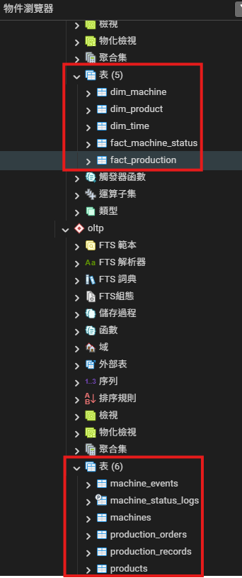

### *A.1.　Table Description*
- #### *OLTP*
  |**Name**|**Description**|**Remark**|
  |--:|:--:|:--:|
  | machine_events | 記錄機台運行過程中的各類事件，例如故障、維修、警報、重新啟動等事件，用於追蹤設備歷史行為。 | 用於事件追蹤與維修分析 |
  | machine_status_logs | 持續記錄機台狀態變化，例如 RUNNING、IDLE、DOWN 等，形成時間序列資料。 | 依 event_time 進行時間分區 ( Partition Table ) |
  | machines | 儲存機台基本資訊，例如機台編號、機台名稱、機台型號、所屬產線等。 | 機台主資料表 |
  | production_orders | 記錄生產訂單資訊，例如訂單編號、生產產品、目標產量、開始時間與結束時間。 | 生產排程與訂單管理 |
  | production_records | 記錄實際生產結果，例如某台機台在某時間段生產的產品與產量。 | 生產履歷資料 |
  | products | 儲存產品基本資訊，例如產品名稱、產品型號與規格。 | 產品主資料表 |

  ```
  products
     │
     │ product_id
     │
     ▼
  production_orders
     │
     │ order_id
     │
     ▼
  production_records
     ▲
     │
     │  machine_id
     │
  machines ————▶ machine_events
     │
     └──────── machine_status_logs
  ```

- #### *OLAP*
  |**Name**|**Description**|**Remark**|
  |--:|:--:|:--:|
  | dim_machine | 機台維度表，提供機台相關屬性，例如機台名稱、型號、產線等，用於分析時的維度資訊。 | Dimension Table |
  | dim_product | 產品維度表，包含產品名稱、產品類型與其他產品屬性，用於分析生產狀況。 | Dimension Table |
  | dim_time | 時間維度表，將時間拆分為年、月、日、小時等欄位，方便進行時間分析。 | 常見 OLAP 維度 |
  | fact_machine_status | 機台狀態事實表，記錄機台在各時間點的運行狀態統計資料，例如運行時間、停機時間等。 | Fact Table |
  | fact_production | 生產事實表，記錄機台生產產品的統計資料，例如產量、生產時間等。 | Fact Table |

  ```
  olap
   │
   ├── dim_machine
   ├── dim_product
   ├── dim_time
   │
   ├── fact_machine_status
   └── fact_production

  # ------------------------ Star Schema ------------------------ #
  
                             dim_machine
                                  │
                                  │  machine_key
                                  │  
            time_key              ▼
  dim_time ──────────▶ fact_machine_status
                                  │
                                  │
                             dim_product
                                  │
                                  │  product_key
                                  │
                                  ▼
                           fact_production
  ```

<br>

### *A.2.　Table Description*
- #### *a.　Define Table DDL*
  - #### *1.　OLTP*
    - #### *1.1.　1NF*
    - #### *1.2.　2NF*
    - #### *1.3.　3NF*
  - #### *2.　OLAP*
    - #### *2.1.　Star Schema*
      - #### *Fact Table*
      - #### *Dimension Table*
    - #### *2.2.　Snowflake Schema*
      - #### *Fact Table*
      - #### *Dimension Table*
      - #### *Sub-Dimension Table ... etc.*
    - #### *2.3.　Wide Table*
- #### *b.　Check Define Table List*
  - #### *1.　OLTP*
    - #### *是否有主鍵 ? ( PK ) 唯一識別一筆資料*
    - #### *是否有外鍵 ? ( FK ) 強制資料一致*
    - #### *是否有 index ? ( PK / FK / 常用查詢條件 )*
    - #### *是否有 transaction ? ( ACID )*
    - #### *是否有適當的 normal form ? ( 1NF / 2NF / 3NF )*
    - #### *是否避免資料冗餘 ?*
  - #### *2.　OLAP*
    - #### *是否有 fact table ?*
    - #### *是否有 dimension ?*
    - #### *是否避免複雜 join ?*
    - #### *是否支援時間分析 ?*
    - #### *是否能快速做 aggregation ?*
    
<br>

### *B.　Settings Schema Mode*
```
CREATE SCHEMA IF NOT EXISTS oltp;
CREATE SCHEMA IF NOT EXISTS olap;
```


<br>

### *C.　權限設置*
| 角色層級 | 帳號 | LOGIN | 核心能力 | 風險程度 |
| :--: | :--: | :--: | :--: | :--: |
| superuser | `postgres / pguser` | ✔ | 系統維護、DB 配置、建立資料庫 | 🔴 極高 |
| deployment | `migration_user` | ✔ | schema migration、DDL 部署 | 🟡 中 |
| owner | `oltp_owner` / `olap_owner` | ❌ | 擁有 schema / table / view | 🟡 中 |
| user | `oltp_user` / `olap_user` | ✔ | CRUD 資料操作 | 🟢 低 |

- ### *C.1.　Create Role*
  - #### *C.1.1.　OLTP Role*
    ```
    -- oltp_owner: 擁有者權限 + 不允許登入
    CREATE ROLE oltp_owner NOLOGIN;
    
    -- oltp_user: 讀/寫權限
    CREATE ROLE oltp_user LOGIN PASSWORD 'oltp_pwd';
    ```
  - #### *C.1.2.　OLTP Role*
    ```
    CREATE ROLE migration_user LOGIN PASSWORD 'xxx';
    -- olap_owner: 擁有者權限 + 不允許登入
    CREATE ROLE olap_owner NOLOGIN;
    
    -- olap_user: 只讀權限
    CREATE ROLE olap_user LOGIN PASSWORD 'olap_pwd';
    ```
  - #### *C.1.3.　Migration Role*
    ```
    -- migration_user: 允許使用 owner 權限
    CREATE ROLE migration_user LOGIN PASSWORD 'migration_pwd';
    ```
- ### *C.2.　Schema 權限隔離*
  - #### *C.2.1.　OLTP Role*
    ```
    -- 1. 確保 oltp_owner 為 oltp schema 擁有者
    ALTER SCHEMA oltp OWNER TO oltp_owner;
  
    -- 2. 確保 oltp_user 只能在 oltp schema 讀/寫資料，但不能改結構
    GRANT USAGE ON SCHEMA oltp TO oltp_user;
    -- 針對表格
    GRANT SELECT, INSERT, UPDATE, DELETE ON ALL TABLES IN SCHEMA oltp TO oltp_user;
    -- 針對序號
    GRANT USAGE, SELECT ON ALL SEQUENCES IN SCHEMA oltp TO oltp_user;
    
    -- 3. 設定未來新建表格的預設權限
    -- 針對表格： 確保以後新創的表, oltp_user 都能讀寫
    ALTER DEFAULT PRIVILEGES FOR ROLE oltp_owner IN SCHEMA oltp
    GRANT SELECT, INSERT, UPDATE, DELETE ON TABLES TO oltp_user;
  
    -- 針對序號： 確保以後新創的自增 ID, oltp_user 都能使用
    ALTER DEFAULT PRIVILEGES FOR ROLE oltp_owner IN SCHEMA oltp
    GRANT USAGE, SELECT ON SEQUENCES TO oltp_user;
    ```
  - #### *C.2.2.　OLAP Role*
    ```
    -- 1. 確保 olap_owner 為 olap schema 擁有者
    ALTER SCHEMA olap OWNER TO olap_owner;
  
    -- 2. 確保 olap_user 只能在 olap schema 讀/寫資料，但不能改結構
    GRANT USAGE ON SCHEMA olap TO olap_user;
    -- 針對表格
    GRANT SELECT, INSERT, UPDATE, DELETE ON ALL TABLES IN SCHEMA olap TO olap_user;
    -- 針對序號
    GRANT USAGE, SELECT ON ALL SEQUENCES IN SCHEMA olap TO olap_user;
  
    -- 3. 設定未來新建物件的預設權限
    -- 針對表格： 確保以後新創的表, olap_user 都能讀寫
    ALTER DEFAULT PRIVILEGES FOR ROLE olap_owner IN SCHEMA olap
    GRANT SELECT, INSERT, UPDATE, DELETE ON TABLES TO olap_user;
  
    -- 針對序號： 確保以後新創的自增 ID, olap_user 都能使用
    ALTER DEFAULT PRIVILEGES FOR ROLE olap_owner IN SCHEMA olap
    GRANT USAGE, SELECT ON SEQUENCES TO olap_user;
  
    -- 4. 確保 olap_user 只能在 oltp schema 讀取資料
    GRANT USAGE ON SCHEMA oltp TO olap_user;
    GRANT SELECT ON ALL TABLES IN SCHEMA oltp TO olap_user;
    ```
  - #### *C.2.3.　Remove Public Role 預設權限*
    ```
    GRANT oltp_owner TO migration_user;
    GRANT olap_owner TO migration_user;
    ```
  - #### *C.2.4.　Remove Public Role 預設權限*
    ```
    REVOKE ALL ON SCHEMA oltp FROM PUBLIC;
    REVOKE ALL ON SCHEMA olap FROM PUBLIC;
    ```

- ### *C.3.　設定 Default Schema*
  ```
  ALTER ROLE oltp_owner
  SET search_path = oltp;
  
  ALTER ROLE oltp_user
  SET search_path = oltp;
  
  ALTER ROLE olap_owner
  SET search_path = olap;
  
  ALTER ROLE olap_user
  SET search_path = olap;
  ```

- ### *C.4.　設定使用者資源使用上限 ( 避免屎 SQL 拖垮整個實例 )*
  - #### *⭐ C.4.1.　Query 執行時間限制*
    ```
    -- 避免使用者寫出無限迴圈的 SQL，或是拖垮整個實例的 SQL
    -- statement_timeout: query 最長執行時間 → 自動 kill query
  
    ALTER ROLE oltp_user
    SET statement_timeout = '10s';
  
    ALTER ROLE olap_user
    SET statement_timeout = '60s';
    ```

  - #### *C.4.2.　Query planning 限制*
    ```
    -- lock_timeout: 等鎖最長時間 → 直接失敗
  
    ALTER ROLE oltp_user
    SET lock_timeout = '3s';
  
    ALTER ROLE olap_user
    SET lock_timeout = '10s';
    ```

  - #### *C.4.3.　idle 連線限制*
    ```
    -- idle_in_transaction_session_timeout: 忘記 commit 的 session → kill session
  
    ALTER ROLE oltp_user
    SET idle_in_transaction_session_timeout = '30s';
  
    ALTER ROLE olap_user
    SET idle_in_transaction_session_timeout = '60s';
    ```

  - #### *⭐ C.4.4.　Memory 限制*
    ```
    -- 避免一個 query 吃爆 RAM 
    -- 最常拖垮系統的原因就是 work_mem 設定過大 → 大量資料排序/聚合 → 吃爆記憶體 → 整個實例當掉
  
    ALTER ROLE oltp_user
    SET work_mem = '8MB';
  
    ALTER ROLE olap_user
    SET work_mem = '64MB';
    ```

  - #### *C.4.5.　Parallel query 限制*
    ```
    -- Parallel 只有在 large scan / aggregation 才有用
  
    ALTER ROLE oltp_user
    SET max_parallel_workers_per_gather = 0;
  
    ALTER ROLE olap_user
    SET max_parallel_workers_per_gather = 2;
    ```

  - #### *⭐ C.4.6.　連線數限制*
    ```
    -- 直接限制 user 連線數
  
    ALTER ROLE oltp_user
    CONNECTION LIMIT 50;
  
    ALTER ROLE olap_user
    CONNECTION LIMIT 5;
    ```

  - #### *⭐ C.4.7.　temp file 限制*
    ```
    -- temp_file_limit: query 可用 disk 上限
    -- 避免 query 做大量 sort / hash 吃爆磁碟空間, 導致整個實例當掉 
  
    ALTER ROLE oltp_user
    SET temp_file_limit = '0.5GB';
  
    ALTER ROLE olap_user
    SET temp_file_limit = '2GB';
    ```

<br>

### *D.　Create Table & Index Settings*
- ### *D.1.　Create Table List*
  ```
  oltp.machine_events
  oltp.machine_status_logs
  oltp.machines
  oltp.production_orders
  oltp.production_records
  oltp.products
  
  olap.dim_machine
  olap.dim_product
  olap.dim_time
  olap.fact_machine_status
  olap.fact_production
  ```
  

- ### *D.2.　Index 加速查詢*
  ```
  # 索引是透過「空間換取時間」，讓資料庫從漫無目的的搜尋，進化為有邏輯的快速定位。
    # 創建目的: 為常見查詢模式服務
    # 優: 大幅提升查詢效率，尤其在大量資料中；
    # 缺: 會佔用額外儲存空間，且在寫入資料時可能會降低性能。
   
  # 有無 INDEX 差異對於查詢效率的影響 ( 1000 W rows )：
    # 有: 直接定位 ( 0.02 s )
    # 無: 掃描整個 partition ( 8 s )
  
  # 其他
    # INDEX 定義順序有差
      # 快: (machine_id, event_time) : 先定位 machine_id，再掃時間範圍
      # 慢: (event_time, machine_id) : 先掃整段時間，再過濾 machine
    # 拆分區間
      # 按日: metadata overhead
      # 按月是最折衷作法
      # 按年: table 太大
  
  X -> oltp.products # product_id SERIAL PRIMARY KEY 已經建立
  idx_machines_line -> oltp.machines
  idx_orders_product -> oltp.production_orders
  idx_production_machine_time -> oltp.production_records
  idx_events_machine_time -> oltp.machine_events
  idx_status_machine_time -> oltp.machine_status_logs
  ```

<br>

### *E.　建立物化檢視表 ( Materialized View, MV )*

<br>

### *F.　常見查詢*
- ### *Migration User : 建表時要切換角色*
  ```
  SET ROLE oltp_owner;
  
  CREATE TABLE oltp.products (...);
  ```
- ### *OLAP : 每台機器運行時間*
  ```
  SELECT
      m.machine_name,
      t.year,
      t.month,
      COUNT(*)
  FROM olap.fact_machine_status f
  JOIN olap.dim_machine m
  ON 1=1
    AND f.machine_key = m.machine_key
  JOIN olap.dim_time t
  ON 1=1
    AND f.time_key = t.time_key
  WHERE 1=1
    AND f.status = 'RUNNING'
  GROUP BY m.machine_name, t.year, t.month;
  ```
- ### *OLAP : 每個產品產量*
  ```
  SELECT
      p.product_name,
      SUM(quantity)
  FROM olap.fact_production f
  JOIN olap.dim_product p
  ON 1=1
    AND f.product_key = p.product_key
  GROUP BY p.product_name;
  ```